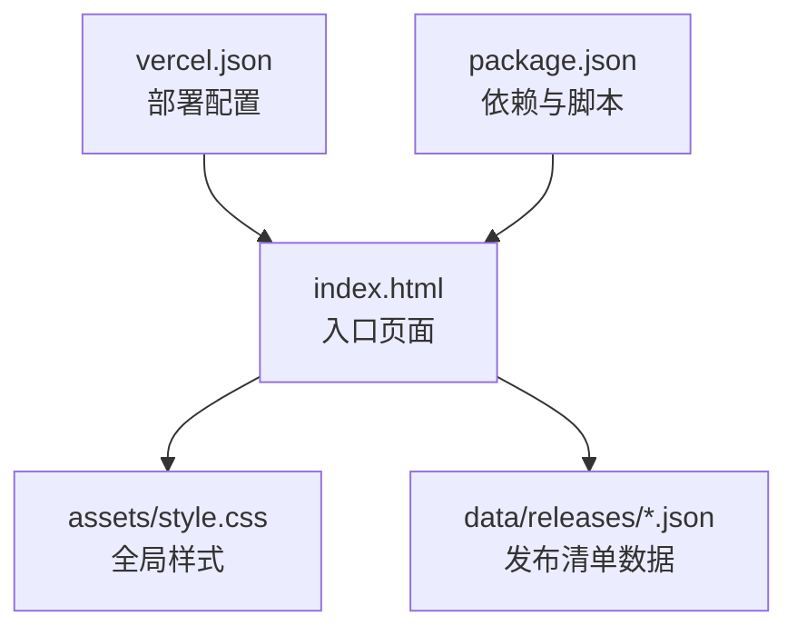
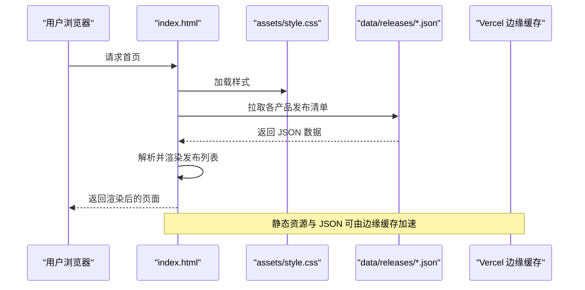
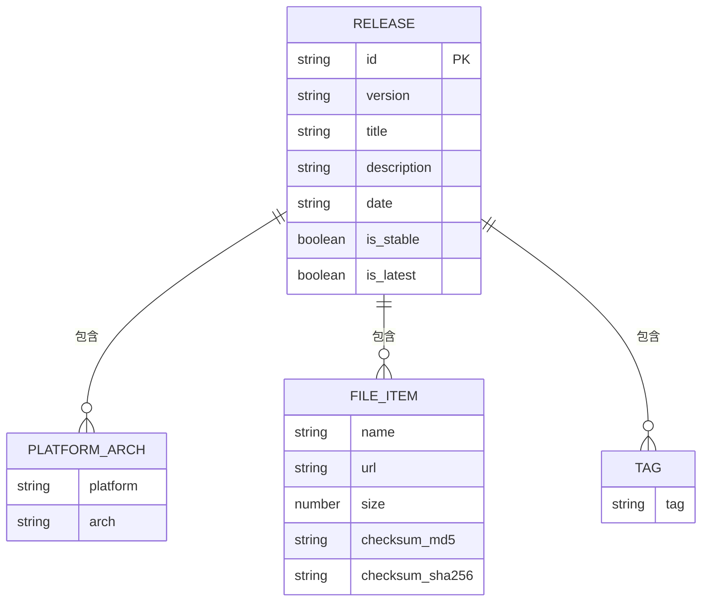
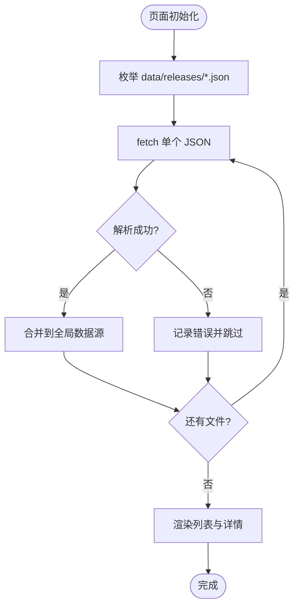
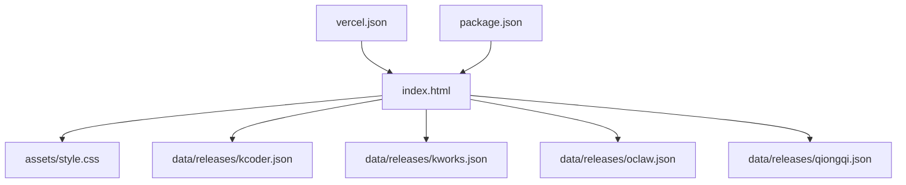

# API 参考

<cite>
**本文引用的文件**   
- [README.md](file://README.md)
- [index.html](file://index.html)
- [package.json](file://package.json)
- [vercel.json](file://vercel.json)
- [assets/style.css](file://assets/style.css)
- [data/releases/kcoder.json](file://data/releases/kcoder.json)
- [data/releases/kworks.json](file://data/releases/kworks.json)
- [data/releases/oclaw.json](file://data/releases/oclaw.json)
- [data/releases/qiongqi.json](file://data/releases/qiongqi.json)
</cite>

## 目录
1. [简介](#简介)
2. [项目结构](#项目结构)
3. [核心组件](#核心组件)
4. [架构总览](#架构总览)
5. [详细组件分析](#详细组件分析)
6. [依赖分析](#依赖分析)
7. [性能考虑](#性能考虑)
8. [故障排查指南](#故障排查指南)
9. [结论](#结论)
10. [附录](#附录)

## 简介
本 API 参考文档面向 KReleaseWeb 项目的开发者与维护者，聚焦于数据格式规范、配置文件结构与字段定义、扩展接口说明、数据模型与关系、数据访问模式与缓存策略、版本管理与迁移策略等。目标是帮助读者快速理解并正确集成或扩展该项目。

## 项目结构
KReleaseWeb 采用“静态站点 + 数据驱动”的轻量架构：前端页面通过读取 data/releases 下的 JSON 发布清单渲染界面；样式由 assets/style.css 提供；部署配置位于 vercel.json；包管理信息在 package.json；根 README 提供项目说明。

图表来源
- [index.html:1-200](file://index.html#L1-L200)
- [assets/style.css:1-200](file://assets/style.css#L1-L200)
- [vercel.json:1-200](file://vercel.json#L1-L200)
- [package.json:1-200](file://package.json#L1-L200)

章节来源
- [README.md:1-200](file://README.md#L1-L200)
- [index.html:1-200](file://index.html#L1-L200)
- [package.json:1-200](file://package.json#L1-L200)
- [vercel.json:1-200](file://vercel.json#L1-L200)
- [assets/style.css:1-200](file://assets/style.css#L1-L200)

## 核心组件
- 发布清单数据（JSON）：每个产品一个 JSON 文件，存放该产品的发布记录集合。文件名即产品标识，便于按产品维度组织数据。
- 前端渲染层：index.html 负责加载并发布数据，结合样式展示。
- 样式系统：assets/style.css 提供主题与布局样式，支持通过覆盖规则实现自定义外观。
- 部署配置：vercel.json 用于平台级路由、缓存与构建行为控制。
- 依赖与脚本：package.json 描述依赖项与可执行脚本，便于本地开发与自动化流程。

章节来源
- [index.html:1-200](file://index.html#L1-L200)
- [assets/style.css:1-200](file://assets/style.css#L1-L200)
- [vercel.json:1-200](file://vercel.json#L1-L200)
- [package.json:1-200](file://package.json#L1-L200)

## 架构总览
整体为“数据驱动的前端渲染”架构：静态 HTML 作为入口，运行时读取 data/releases 下的 JSON 清单，生成发布列表与详情视图。样式与交互逻辑由 index.html 与 assets/style.css 共同完成。部署到 Vercel 后，可通过 CDN 缓存提升访问性能。

图表来源
- [index.html:1-200](file://index.html#L1-L200)
- [assets/style.css:1-200](file://assets/style.css#L1-L200)
- [vercel.json:1-200](file://vercel.json#L1-L200)

## 详细组件分析

### 发布清单数据模型（JSON）
- 文件位置与命名
  - 路径：data/releases/<product>.json
  - 命名约定：<product> 为小写英文字母、数字或连字符组成的产品标识，需唯一且稳定。
- 顶层结构
  - 数组类型：每个 JSON 文件是一个发布记录数组，元素顺序即为展示顺序（建议从新到旧）。
- 单条发布记录字段定义
  - id: string，必填，唯一标识一条发布记录，建议使用语义化版本或时间戳+短哈希。
  - version: string，必填，人类可读的版本号，遵循语义化版本（如 1.2.3）。
  - title: string，必填，发布标题，用于列表展示。
  - description: string，可选，发布说明摘要，支持 Markdown 片段。
  - date: string，必填，发布日期，ISO 8601 格式（如 2024-01-01T00:00:00Z）。
  - platform: array<string>，可选，目标平台列表，如 ["windows","macos","linux"]。
  - arch: array<string>，可选，架构列表，如 ["x64","arm64"]。
  - files: array<object>，可选，下载文件清单，对象包含：
    - name: string，必填，显示名称。
    - url: string，必填，下载地址，建议使用绝对 URL。
    - size: number，可选，文件大小（字节）。
    - checksum: object，可选，校验信息，包含：
      - md5: string，可选，MD5 值。
      - sha256: string，可选，SHA-256 值。
  - tags: array<string>，可选，标签列表，用于筛选与分类。
  - changelog_url: string，可选，变更日志链接。
  - is_stable: boolean，可选，是否稳定版，默认 false。
  - is_latest: boolean，可选，是否最新版本，默认 false。
- 约束与验证规则
  - 必填字段缺失将导致渲染异常或过滤失败。
  - version 应遵循语义化版本，避免使用非标准前缀。
  - date 必须为 ISO 8601 字符串，否则排序可能异常。
  - files.url 必须为有效 URL，否则下载不可用。
  - 同一 product 下 id 必须唯一，避免重复条目。
- 示例与图示
  - 请参考以下文件中的实际数据结构以了解字段组合与取值范围：
    - [data/releases/kcoder.json](file://data/releases/kcoder.json)
    - [data/releases/kworks.json](file://data/releases/kworks.json)
    - [data/releases/oclaw.json](file://data/releases/oclaw.json)
    - [data/releases/qiongqi.json](file://data/releases/qiongqi.json)

图表来源
- [data/releases/kcoder.json:1-200](file://data/releases/kcoder.json#L1-L200)
- [data/releases/kworks.json:1-200](file://data/releases/kworks.json#L1-L200)
- [data/releases/oclaw.json:1-200](file://data/releases/oclaw.json#L1-L200)
- [data/releases/qiongqi.json:1-200](file://data/releases/qiongqi.json#L1-L200)

章节来源
- [data/releases/kcoder.json:1-200](file://data/releases/kcoder.json#L1-L200)
- [data/releases/kworks.json:1-200](file://data/releases/kworks.json#L1-L200)
- [data/releases/oclaw.json:1-200](file://data/releases/oclaw.json#L1-L200)
- [data/releases/qiongqi.json:1-200](file://data/releases/qiongqi.json#L1-L200)

### 前端渲染与数据访问模式
- 数据加载
  - 页面启动时遍历 data/releases 目录，逐个 fetch 对应 JSON 文件。
  - 对返回数据进行解析与合并，形成全局发布数据源。
- 渲染流程
  - 根据当前筛选条件（平台、架构、标签、稳定性）过滤数据。
  - 生成列表项与详情页内容，绑定事件处理下载与跳转。
- 错误处理
  - 网络错误或 JSON 解析失败时，记录错误并降级展示（跳过该文件或提示重试）。
  - 字段缺失时进行容错处理，确保 UI 不崩溃。

图表来源
- [index.html:1-200](file://index.html#L1-L200)

章节来源
- [index.html:1-200](file://index.html#L1-L200)

### 样式系统与自定义
- 样式文件
  - assets/style.css 提供基础布局、卡片样式、按钮与响应式适配。
- 自定义方式
  - 通过覆盖 CSS 变量或类名实现主题定制。
  - 新增产品时可复用现有样式，必要时扩展新的选择器。
- 最佳实践
  - 保持样式模块化，避免全局污染。
  - 使用一致的命名约定，便于维护与协作。

章节来源
- [assets/style.css:1-200](file://assets/style.css#L1-L200)

### 部署与缓存策略
- 部署配置
  - vercel.json 定义路由、重定向与构建参数，确保静态资源与 JSON 数据被正确分发。
- 缓存策略
  - 静态资源（HTML/CSS/JS）与 JSON 数据可启用长期缓存，配合版本号或指纹更新。
  - 对于频繁更新的发布清单，建议设置较短的缓存过期时间或使用 ETag。
- 版本管理
  - 通过文件名或查询参数引入版本标识，确保客户端获取最新数据。

章节来源
- [vercel.json:1-200](file://vercel.json#L1-L200)

### 依赖与脚本
- 包管理
  - package.json 描述依赖项与脚本命令，便于本地安装与运行。
- 脚本用途
  - 开发服务器、构建与打包、测试与校验等。
- 扩展建议
  - 新增工具链时，在 scripts 中统一注册，并在 README 中补充使用说明。

章节来源
- [package.json:1-200](file://package.json#L1-L200)

## 依赖分析
- 内部依赖
  - index.html 依赖 assets/style.css 与 data/releases/*.json。
  - 无后端服务，纯前端静态站点。
- 外部依赖
  - 浏览器原生 fetch 与 DOM API。
  - 部署平台 Vercel 的边缘缓存与路由能力。

图表来源
- [index.html:1-200](file://index.html#L1-L200)
- [assets/style.css:1-200](file://assets/style.css#L1-L200)
- [vercel.json:1-200](file://vercel.json#L1-L200)
- [package.json:1-200](file://package.json#L1-L200)
- [data/releases/kcoder.json:1-200](file://data/releases/kcoder.json#L1-L200)
- [data/releases/kworks.json:1-200](file://data/releases/kworks.json#L1-L200)
- [data/releases/oclaw.json:1-200](file://data/releases/oclaw.json#L1-L200)
- [data/releases/qiongqi.json:1-200](file://data/releases/qiongqi.json#L1-L200)

章节来源
- [index.html:1-200](file://index.html#L1-L200)
- [assets/style.css:1-200](file://assets/style.css#L1-L200)
- [vercel.json:1-200](file://vercel.json#L1-L200)
- [package.json:1-200](file://package.json#L1-L200)

## 性能考虑
- 减少请求数量
  - 合并多个产品的发布清单为一个 JSON，降低网络往返。
- 压缩与缓存
  - 启用 Gzip/Brotli 压缩，合理设置 Cache-Control 与 ETag。
- 懒加载与分页
  - 对大量发布记录采用分页或虚拟滚动，提升首屏性能。
- 预取与预连接
  - 对常用下载地址与资源进行预连接，缩短首次交互延迟。

## 故障排查指南
- 常见问题
  - JSON 解析失败：检查字段类型与必填项是否符合数据模型。
  - 渲染空白：确认 data/releases 目录下存在对应产品 JSON 文件。
  - 下载链接无效：校验 files[].url 是否为可达地址。
- 定位方法
  - 打开浏览器控制台查看网络请求与错误堆栈。
  - 使用在线 JSON 校验器验证清单文件格式。
- 恢复步骤
  - 修正 JSON 结构后重新部署。
  - 清理浏览器缓存或强制刷新以确保获取最新数据。

## 结论
KReleaseWeb 通过简洁的数据驱动架构实现了多产品发布清单的统一展示与维护。遵循本文档的数据模型与扩展指南，可以快速添加新产品、定制样式与优化性能。建议在团队内建立数据提交规范与自动化校验流程，保障数据质量与版本兼容性。

## 附录

### 扩展接口说明
- 添加新产品
  - 在 data/releases 下新增 <product>.json，遵循数据模型定义。
  - 如需新增产品元信息，可在 index.html 中扩展产品映射表。
- 自定义样式
  - 在 assets/style.css 中追加或覆盖样式规则。
  - 使用 CSS 变量统一管理主题色与间距。
- 扩展现有功能
  - 在 index.html 中增加筛选、搜索与导出能力。
  - 引入第三方库时需更新 package.json 与构建脚本。

### 数据生命周期与版本管理
- 生命周期
  - 创建：新增发布记录，填写必填字段。
  - 审核：校验 JSON 结构与字段约束。
  - 发布：提交至仓库并触发部署。
  - 归档：标记历史版本为非最新，保留变更记录。
- 版本策略
  - 使用语义化版本管理 release.version。
  - 通过 is_latest 与 is_stable 控制展示优先级。
  - 变更日志通过 changelog_url 指向外部文档。

### 数据迁移与兼容性
- 向后兼容
  - 新增可选字段不影响旧数据渲染。
  - 移除字段需评估影响并提供迁移脚本。
- 迁移步骤
  - 编写数据转换脚本，批量更新旧结构到新模型。
  - 在 CI 中加入数据校验任务，防止不合格数据进入主分支。