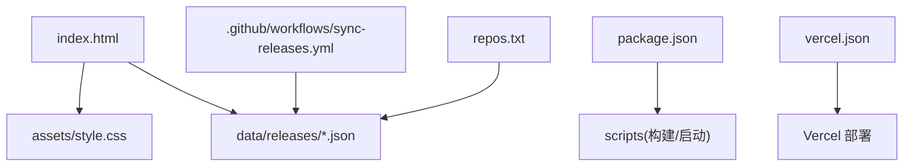
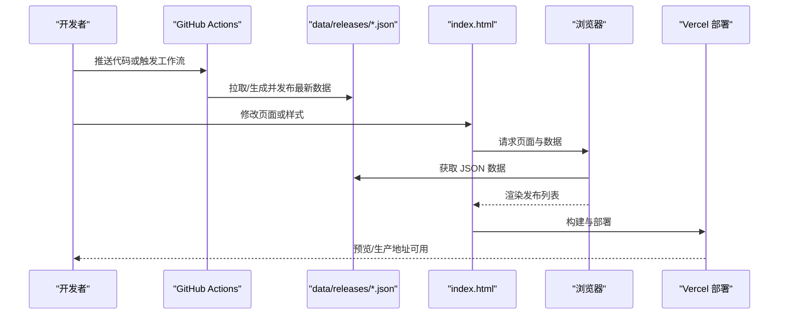
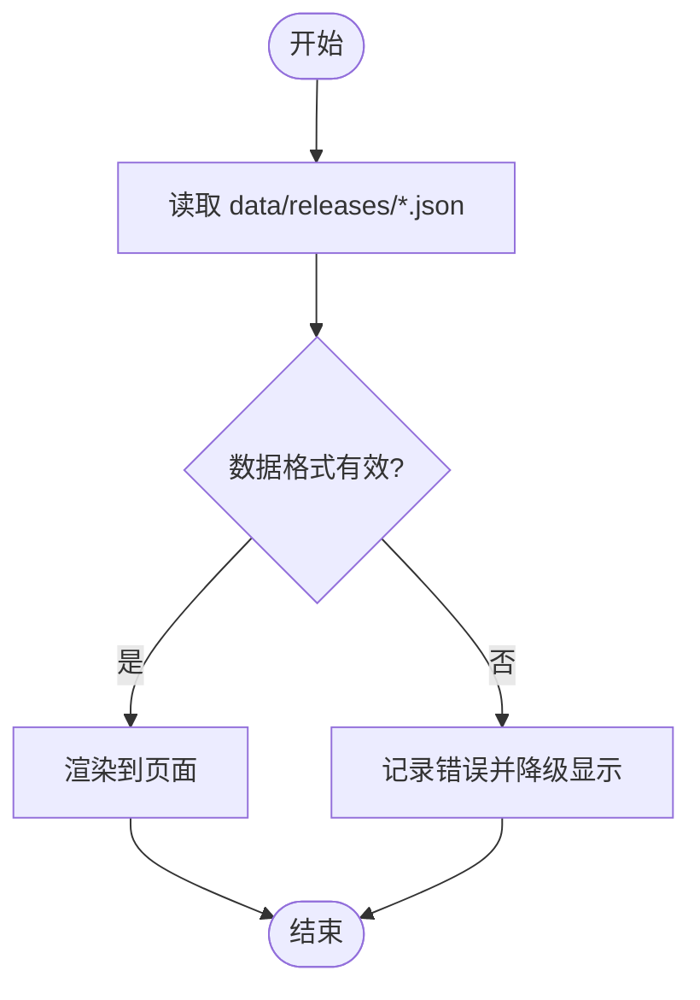
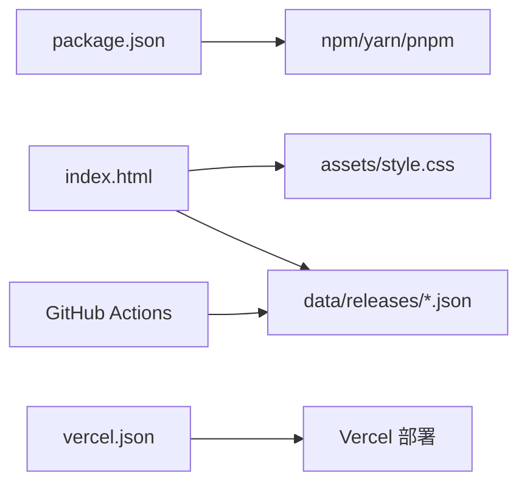

# 开发指南

<cite>
**本文引用的文件**   
- [README.md](file://README.md)
- [package.json](file://package.json)
- [index.html](file://index.html)
- [assets/style.css](file://assets/style.css)
- [data/releases/kcoder.json](file://data/releases/kcoder.json)
- [data/releases/kworks.json](file://data/releases/kworks.json)
- [data/releases/oclaw.json](file://data/releases/oclaw.json)
- [data/releases/qiongqi.json](file://data/releases/qiongqi.json)
- [repos.txt](file://repos.txt)
- [vercel.json](file://vercel.json)
- [.github/workflows/sync-releases.yml](file://.github/workflows/sync-releases.yml)
</cite>

## 目录
1. [简介](#简介)
2. [项目结构](#项目结构)
3. [核心组件](#核心组件)
4. [架构总览](#架构总览)
5. [详细组件分析](#详细组件分析)
6. [依赖分析](#依赖分析)
7. [性能考虑](#性能考虑)
8. [故障排查指南](#故障排查指南)
9. [结论](#结论)
10. [附录](#附录)

## 简介
本指南面向 KReleaseWeb 项目的贡献者与开发者，目标是帮助你在本地快速搭建开发环境、理解代码组织方式、掌握开发与提交流程，并提供调试与性能优化建议。KReleaseWeb 是一个静态站点型应用，通过数据驱动的方式展示多个产品的发布版本信息，部署在 Vercel 上，并通过 GitHub Actions 自动化同步发布数据。

## 项目结构
仓库采用“按职责分层 + 资源集中”的组织方式：
- 根目录
  - index.html：站点入口页面，承载整体布局与脚本加载逻辑
  - package.json：Node.js 包管理与脚本定义（如构建、启动等）
  - repos.txt：外部仓库清单或配置（用于生成或校验数据来源）
  - vercel.json：Vercel 部署配置（路由、重定向、环境变量等）
  - .github/workflows/sync-releases.yml：GitHub Actions 工作流，负责定时或触发式同步发布数据
- assets/
  - style.css：全局样式与主题
  - platforms/：平台相关样式或资源（如有）
- data/releases/
  - kcoder.json、kworks.json、oclaw.json、qiongqi.json：各产品线的发布数据源
- projects/：预留目录，可用于存放项目级资源或子模块

图表来源
- [index.html:1-200](file://index.html#L1-L200)
- [assets/style.css:1-200](file://assets/style.css#L1-L200)
- [data/releases/kcoder.json:1-200](file://data/releases/kcoder.json#L1-L200)
- [data/releases/kworks.json:1-200](file://data/releases/kworks.json#L1-L200)
- [data/releases/oclaw.json:1-200](file://data/releases/oclaw.json#L1-L200)
- [data/releases/qiongqi.json:1-200](file://data/releases/qiongqi.json#L1-L200)
- [package.json:1-200](file://package.json#L1-L200)
- [repos.txt:1-200](file://repos.txt#L1-L200)
- [vercel.json:1-200](file://vercel.json#L1-L200)
- [.github/workflows/sync-releases.yml:1-200](file://.github/workflows/sync-releases.yml#L1-L200)

章节来源
- [README.md:1-200](file://README.md#L1-L200)
- [package.json:1-200](file://package.json#L1-L200)
- [index.html:1-200](file://index.html#L1-L200)
- [assets/style.css:1-200](file://assets/style.css#L1-L200)
- [data/releases/kcoder.json:1-200](file://data/releases/kcoder.json#L1-L200)
- [data/releases/kworks.json:1-200](file://data/releases/kworks.json#L1-L200)
- [data/releases/oclaw.json:1-200](file://data/releases/oclaw.json#L1-L200)
- [data/releases/qiongqi.json:1-200](file://data/releases/qiongqi.json#L1-L200)
- [repos.txt:1-200](file://repos.txt#L1-L200)
- [vercel.json:1-200](file://vercel.json#L1-L200)
- [.github/workflows/sync-releases.yml:1-200](file://.github/workflows/sync-releases.yml#L1-L200)

## 核心组件
- 入口页面（index.html）
  - 负责站点骨架、导航与内容区域挂载点
  - 引入全局样式与必要的脚本
  - 作为数据渲染的宿主容器
- 样式系统（assets/style.css）
  - 提供全局主题、排版与响应式适配
  - 可拆分为模块化样式以增强可维护性
- 数据层（data/releases/*.json）
  - 每个 JSON 对应一个产品线，包含版本号、发布日期、下载链接等结构化字段
  - 由前端读取并渲染为列表或卡片
- 构建与运行（package.json）
  - 定义 Node.js 脚本，如本地开发服务器启动、构建产物输出等
- 部署与自动化（vercel.json、.github/workflows/sync-releases.yml）
  - vercel.json 控制部署行为（如 SPA 路由回退、环境变量注入）
  - GitHub Actions 定时拉取上游仓库或 API，更新 data/releases 下的数据文件

章节来源
- [index.html:1-200](file://index.html#L1-L200)
- [assets/style.css:1-200](file://assets/style.css#L1-L200)
- [data/releases/kcoder.json:1-200](file://data/releases/kcoder.json#L1-L200)
- [data/releases/kworks.json:1-200](file://data/releases/kworks.json#L1-L200)
- [data/releases/oclaw.json:1-200](file://data/releases/oclaw.json#L1-L200)
- [data/releases/qiongqi.json:1-200](file://data/releases/qiongqi.json#L1-L200)
- [package.json:1-200](file://package.json#L1-L200)
- [vercel.json:1-200](file://vercel.json#L1-L200)
- [.github/workflows/sync-releases.yml:1-200](file://.github/workflows/sync-releases.yml#L1-L200)

## 架构总览
KReleaseWeb 采用“数据驱动 + 静态渲染”的轻量架构：
- 数据源：data/releases/*.json 提供结构化发布数据
- 视图层：index.html 作为页面模板，结合 CSS 进行样式呈现
- 运行时：浏览器端直接读取 JSON 数据并渲染（或通过构建工具预渲染）
- 自动化：GitHub Actions 定期更新数据文件，保证站点数据时效性
- 部署：Vercel 托管静态站点，支持自定义域名与缓存策略

图表来源
- [.github/workflows/sync-releases.yml:1-200](file://.github/workflows/sync-releases.yml#L1-L200)
- [data/releases/kcoder.json:1-200](file://data/releases/kcoder.json#L1-L200)
- [data/releases/kworks.json:1-200](file://data/releases/kworks.json#L1-L200)
- [data/releases/oclaw.json:1-200](file://data/releases/oclaw.json#L1-L200)
- [data/releases/qiongqi.json:1-200](file://data/releases/qiongqi.json#L1-L200)
- [index.html:1-200](file://index.html#L1-L200)
- [vercel.json:1-200](file://vercel.json#L1-L200)

## 详细组件分析

### 入口页面（index.html）
- 职责
  - 定义站点结构与语义化标签
  - 挂载内容区域与交互入口
  - 引入样式与脚本资源
- 关键流程
  - 页面加载后初始化 UI
  - 从 data/releases/*.json 拉取数据
  - 将数据映射到 DOM 节点完成渲染
- 扩展点
  - 新增产品线时，可在页面中增加对应的数据绑定区域
  - 可通过条件渲染实现多语言或主题切换

章节来源
- [index.html:1-200](file://index.html#L1-L200)

### 样式系统（assets/style.css）
- 职责
  - 统一字体、颜色、间距与布局
  - 提供响应式断点与组件基础样式
- 组织建议
  - 按模块拆分（如 header、card、list）提升可维护性
  - 使用 CSS 变量管理主题色与尺寸常量

章节来源
- [assets/style.css:1-200](file://assets/style.css#L1-L200)

### 数据模型（data/releases/*.json）
- 字段约定（示例说明，具体以实际文件为准）
  - version：版本号
  - date：发布日期
  - platform：目标平台
  - download：下载地址
  - notes：更新说明
- 数据流转
  - GitHub Actions 更新 JSON 文件
  - 前端读取 JSON 并渲染
- 校验与容错
  - 建议在读取后进行必要的数据校验与空值处理

图表来源
- [data/releases/kcoder.json:1-200](file://data/releases/kcoder.json#L1-L200)
- [data/releases/kworks.json:1-200](file://data/releases/kworks.json#L1-L200)
- [data/releases/oclaw.json:1-200](file://data/releases/oclaw.json#L1-L200)
- [data/releases/qiongqi.json:1-200](file://data/releases/qiongqi.json#L1-L200)

章节来源
- [data/releases/kcoder.json:1-200](file://data/releases/kcoder.json#L1-L200)
- [data/releases/kworks.json:1-200](file://data/releases/kworks.json#L1-L200)
- [data/releases/oclaw.json:1-200](file://data/releases/oclaw.json#L1-L200)
- [data/releases/qiongqi.json:1-200](file://data/releases/qiongqi.json#L1-L200)

### 构建与运行（package.json）
- 作用
  - 定义 Node.js 脚本（如 dev、build、start）
  - 管理依赖与插件（如静态服务器、打包器）
- 常用命令
  - 安装依赖：npm install
  - 本地开发：npm run dev
  - 构建产物：npm run build
  - 启动服务：npm start

章节来源
- [package.json:1-200](file://package.json#L1-L200)

### 部署与自动化（vercel.json、.github/workflows/sync-releases.yml）
- vercel.json
  - 配置 SPA 路由回退、静态资源缓存、环境变量注入
- GitHub Actions
  - 定时任务或手动触发，拉取上游仓库或调用 API，生成/更新 data/releases/*.json
  - 提交变更并触发 Vercel 重新构建

章节来源
- [vercel.json:1-200](file://vercel.json#L1-L200)
- [.github/workflows/sync-releases.yml:1-200](file://.github/workflows/sync-releases.yml#L1-L200)

### 外部仓库清单（repos.txt）
- 作用
  - 列出需要同步的仓库或数据源
  - 供自动化脚本解析，批量拉取与合并数据
- 使用建议
  - 保持清单整洁，避免重复与无效条目
  - 配合 Actions 脚本实现增量更新

章节来源
- [repos.txt:1-200](file://repos.txt#L1-L200)

## 依赖分析
- 运行时依赖
  - 浏览器原生能力（Fetch/XMLHttpRequest）用于读取 JSON
  - 可选：构建工具（如 Vite/Webpack）用于开发体验与产物优化
- 构建与部署依赖
  - Node.js 与 npm/yarn/pnpm
  - Vercel CLI（可选）
  - GitHub Actions Runner（云端）
- 外部集成
  - GitHub 仓库与 API
  - Vercel 平台

图表来源
- [package.json:1-200](file://package.json#L1-L200)
- [index.html:1-200](file://index.html#L1-L200)
- [assets/style.css:1-200](file://assets/style.css#L1-L200)
- [data/releases/kcoder.json:1-200](file://data/releases/kcoder.json#L1-L200)
- [data/releases/kworks.json:1-200](file://data/releases/kworks.json#L1-L200)
- [data/releases/oclaw.json:1-200](file://data/releases/oclaw.json#L1-L200)
- [data/releases/qiongqi.json:1-200](file://data/releases/qiongqi.json#L1-L200)
- [vercel.json:1-200](file://vercel.json#L1-L200)
- [.github/workflows/sync-releases.yml:1-200](file://.github/workflows/sync-releases.yml#L1-L200)

章节来源
- [package.json:1-200](file://package.json#L1-L200)
- [vercel.json:1-200](file://vercel.json#L1-L200)
- [.github/workflows/sync-releases.yml:1-200](file://.github/workflows/sync-releases.yml#L1-L200)

## 性能考虑
- 资源加载
  - 压缩与合并 CSS/JS，启用 HTTP 缓存头
  - 按需加载与懒加载图片与第三方库
- 数据访问
  - 对 JSON 数据做分页或增量更新，减少首屏体积
  - 使用浏览器缓存与 Service Worker 提升离线体验
- 渲染优化
  - 避免频繁 DOM 操作，使用文档片段或虚拟列表
  - 合理设置 CSS 动画与过渡，减少重排重绘
- 部署优化
  - 利用 Vercel 的 CDN 与边缘缓存
  - 配置合适的缓存策略与版本化文件名

[本节为通用指导，不直接分析具体文件]

## 故障排查指南
- 本地无法启动
  - 检查 Node.js 版本是否符合要求
  - 确认依赖已安装且无冲突
  - 查看终端报错日志定位问题
- 页面空白或数据未渲染
  - 打开浏览器控制台查看网络请求与 JS 错误
  - 验证 data/releases/*.json 路径与格式是否正确
  - 检查 CORS 与跨域限制（本地开发通常无需跨域）
- 构建失败
  - 清理 node_modules 后重装依赖
  - 检查构建脚本参数与环境变量
- 部署异常
  - 查看 Vercel 构建日志与部署详情
  - 核对 vercel.json 配置项与分支规则

章节来源
- [package.json:1-200](file://package.json#L1-L200)
- [index.html:1-200](file://index.html#L1-L200)
- [data/releases/kcoder.json:1-200](file://data/releases/kcoder.json#L1-L200)
- [data/releases/kworks.json:1-200](file://data/releases/kworks.json#L1-L200)
- [data/releases/oclaw.json:1-200](file://data/releases/oclaw.json#L1-L200)
- [data/releases/qiongqi.json:1-200](file://data/releases/qiongqi.json#L1-L200)
- [vercel.json:1-200](file://vercel.json#L1-L200)

## 结论
KReleaseWeb 以简洁的静态站点架构实现了多产品线发布信息的集中展示与维护。通过规范化的数据文件与自动化工作流，团队可以高效协作并保持站点数据的实时性与一致性。遵循本指南的流程与建议，新贡献者可以快速上手，老成员也能更高效地迭代与优化。

## 附录

### 本地开发环境搭建
- 前置要求
  - Node.js：建议使用 LTS 版本（参考 package.json 中的引擎约束）
  - 包管理器：npm、yarn 或 pnpm（任选其一）
- 安装依赖
  - 在项目根目录执行包管理器安装命令
- 启动本地服务
  - 使用 package.json 中定义的脚本启动开发服务器
  - 打开浏览器访问本地地址进行调试
- 构建与预览
  - 执行构建脚本生成静态资源
  - 使用本地静态服务器预览构建结果

章节来源
- [package.json:1-200](file://package.json#L1-L200)

### 代码结构与职责分工
- HTML 页面结构
  - index.html 作为入口，承载页面骨架与资源引用
- CSS 样式组织
  - assets/style.css 统一管理样式，可按模块进一步拆分
- JavaScript 逻辑分离
  - 当前仓库未包含独立 JS 文件；如需复杂交互，建议新增 src/js 目录并按功能划分模块
- 数据与配置
  - data/releases/*.json 提供结构化数据
  - repos.txt 维护外部数据源清单
  - vercel.json 控制部署行为

章节来源
- [index.html:1-200](file://index.html#L1-L200)
- [assets/style.css:1-200](file://assets/style.css#L1-L200)
- [data/releases/kcoder.json:1-200](file://data/releases/kcoder.json#L1-L200)
- [data/releases/kworks.json:1-200](file://data/releases/kworks.json#L1-L200)
- [data/releases/oclaw.json:1-200](file://data/releases/oclaw.json#L1-L200)
- [data/releases/qiongqi.json:1-200](file://data/releases/qiongqi.json#L1-L200)
- [repos.txt:1-200](file://repos.txt#L1-L200)
- [vercel.json:1-200](file://vercel.json#L1-L200)

### 开发工作流程
- 代码修改
  - 在本地分支进行修改，遵循命名规范（如 feature/xxx、fix/xxx）
- 测试验证
  - 本地启动服务验证功能与兼容性
  - 检查控制台与网络面板，确保无错误与警告
- 提交规范
  - 使用清晰的提交信息（类型 + 简短描述）
  - 关联相关 Issue 或 PR
- 代码审查
  - 发起 Pull Request，等待团队成员评审
  - 根据反馈迭代修改直至合并

[本节为通用流程指导，不直接分析具体文件]

### 贡献指南
- 报告问题
  - 在 Issues 中详细描述复现步骤、预期与实际结果
  - 附上截图、日志与浏览器环境信息
- 提交改进建议
  - 先创建 Issue 讨论方案，再提交 PR
  - 提供变更动机与影响范围
- 参与社区贡献
  - 遵守行为准则与贡献规范
  - 积极回复评论与评审意见

[本节为通用社区指导，不直接分析具体文件]

### 调试方法与技巧
- 浏览器控制台
  - 查看 Console 错误与警告
  - 使用 Network 面板检查资源加载与请求状态
- 源码映射
  - 若使用构建工具，开启 Source Map 便于定位问题
- 日志输出
  - 在关键路径添加临时日志，逐步缩小问题范围
- 数据校验
  - 打印 data/releases/*.json 的结构与关键字段，确保符合预期

章节来源
- [index.html:1-200](file://index.html#L1-L200)
- [data/releases/kcoder.json:1-200](file://data/releases/kcoder.json#L1-L200)
- [data/releases/kworks.json:1-200](file://data/releases/kworks.json#L1-L200)
- [data/releases/oclaw.json:1-200](file://data/releases/oclaw.json#L1-L200)
- [data/releases/qiongqi.json:1-200](file://data/releases/qiongqi.json#L1-L200)