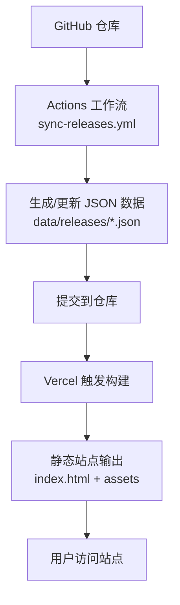
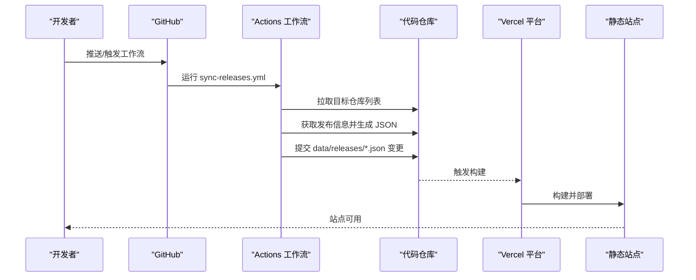
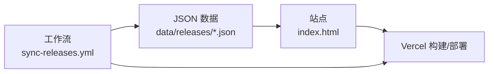

# 故障排除

<cite>
**本文引用的文件**   
- [README.md](file://README.md)
- [package.json](file://package.json)
- [index.html](file://index.html)
- [vercel.json](file://vercel.json)
- [.github/workflows/sync-releases.yml](file://.github/workflows/sync-releases.yml)
- [repos.txt](file://repos.txt)
- [data/releases/kcoder.json](file://data/releases/kcoder.json)
- [data/releases/kworks.json](file://data/releases/kworks.json)
- [data/releases/oclaw.json](file://data/releases/oclaw.json)
- [data/releases/qiongqi.json](file://data/releases/qiongqi.json)
</cite>

## 目录
1. [简介](#简介)
2. [项目结构](#项目结构)
3. [核心组件](#核心组件)
4. [架构总览](#架构总览)
5. [详细组件分析](#详细组件分析)
6. [依赖分析](#依赖分析)
7. [性能考虑](#性能考虑)
8. [故障排除指南](#故障排除指南)
9. [结论](#结论)
10. [附录](#附录)

## 简介
本故障排除文档面向 KReleaseWeb 项目的维护者与使用者，聚焦于以下典型问题与排障方法：
- GitHub Actions 工作流执行失败（数据同步异常）
- 静态站点部署错误（Vercel 构建/发布阶段）
- 数据源不一致或版本信息缺失
- 页面加载缓慢、资源未压缩或缓存策略不当
- 灾难恢复与数据备份策略
- 版本升级注意事项与迁移指南

目标是提供一套可操作的自助排障工具包，帮助快速定位并解决问题。

## 项目结构
KReleaseWeb 是一个以静态网站为核心的发布聚合展示系统，关键目录与文件职责如下：
- .github/workflows/sync-releases.yml：GitHub Actions 工作流，负责从仓库元数据拉取并发布更新
- data/releases/*.json：本地缓存的发布清单数据，供前端渲染使用
- index.html：站点入口页面
- vercel.json：Vercel 部署配置（重定向、路由等）
- package.json：Node 环境依赖与脚本定义
- repos.txt：待同步的目标仓库列表
- README.md：项目说明与使用说明

图表来源
- [.github/workflows/sync-releases.yml](file://.github/workflows/sync-releases.yml)
- [vercel.json](file://vercel.json)
- [index.html](file://index.html)

章节来源
- [README.md](file://README.md)
- [package.json](file://package.json)
- [index.html](file://index.html)
- [vercel.json](file://vercel.json)
- [.github/workflows/sync-releases.yml](file://.github/workflows/sync-releases.yml)
- [repos.txt](file://repos.txt)

## 核心组件
- 数据同步工作流：通过 GitHub Actions 定时或手动触发，读取目标仓库列表，拉取发布信息并写入 data/releases/*.json，随后提交变更。
- 静态站点：由 Vercel 托管，基于 index.html 与 assets 目录构建，读取 data/releases/*.json 渲染发布列表。
- 部署配置：vercel.json 控制路由与构建行为；package.json 提供 Node 环境与脚本。

章节来源
- [.github/workflows/sync-releases.yml](file://.github/workflows/sync-releases.yml)
- [data/releases/kcoder.json](file://data/releases/kcoder.json)
- [data/releases/kworks.json](file://data/releases/kworks.json)
- [data/releases/oclaw.json](file://data/releases/oclaw.json)
- [data/releases/qiongqi.json](file://data/releases/qiongqi.json)
- [index.html](file://index.html)
- [vercel.json](file://vercel.json)
- [package.json](file://package.json)

## 架构总览
整体流程为“数据同步 -> 仓库提交 -> 静态构建 -> 站点发布”。当任一环节失败，将导致站点数据陈旧或构建失败。

图表来源
- [.github/workflows/sync-releases.yml](file://.github/workflows/sync-releases.yml)
- [vercel.json](file://vercel.json)
- [index.html](file://index.html)

## 详细组件分析

### 数据同步工作流（GitHub Actions）
- 触发方式：通常为 push 或 schedule，具体取决于工作流定义。
- 主要步骤：
  - 检出代码与设置 Node 环境
  - 读取 repos.txt 中的目标仓库
  - 调用 GitHub API 或仓库元数据获取发布信息
  - 生成/更新 data/releases/*.json
  - 提交变更并触发后续构建

常见问题与排查要点：
- 权限不足：需要仓库读写权限与必要的 Secrets（如令牌）。检查工作流中使用的凭据是否有效且具备所需范围。
- 网络超时：外部 API 请求可能因网络波动失败，建议增加重试逻辑与超时参数。
- 数据格式校验：生成的 JSON 必须满足前端期望的结构，否则会导致站点渲染异常。
- 并发冲突：多实例同时提交可能导致合并冲突，需确保串行化或处理冲突。

章节来源
- [.github/workflows/sync-releases.yml](file://.github/workflows/sync-releases.yml)
- [repos.txt](file://repos.txt)
- [data/releases/kcoder.json](file://data/releases/kcoder.json)
- [data/releases/kworks.json](file://data/releases/kworks.json)
- [data/releases/oclaw.json](file://data/releases/oclaw.json)
- [data/releases/qiongqi.json](file://data/releases/qiongqi.json)

### 静态站点与部署（Vercel）
- 入口页面：index.html 负责加载数据与渲染界面。
- 构建配置：vercel.json 指定构建命令、重写规则与环境变量。
- 依赖管理：package.json 定义 Node 版本与依赖项。

常见问题与排查要点：
- 构建失败：检查 Node 版本与依赖是否匹配；确认构建命令正确；查看 Vercel 构建日志。
- 运行时错误：浏览器控制台报错通常指向 JSON 数据缺失或字段不匹配；核对 data/releases/*.json 结构与内容。
- 部署后白屏：确认 index.html 路径与资源引用正确；检查 Vercel 的重写与路由配置。

章节来源
- [index.html](file://index.html)
- [vercel.json](file://vercel.json)
- [package.json](file://package.json)

### 数据模型与一致性
- 数据文件：data/releases/*.json 存储各项目的发布信息，供前端消费。
- 一致性要求：
  - 字段完整：版本号、发布时间、下载链接等关键字段不可缺失。
  - 类型一致：时间戳、布尔值、数组等类型需统一。
  - 命名规范：文件名与内部标识保持一致，避免前端映射错误。

建议：
- 在工作流中加入 JSON Schema 校验步骤，防止脏数据入库。
- 在站点侧加入容错渲染逻辑，对缺失字段进行降级显示。

章节来源
- [data/releases/kcoder.json](file://data/releases/kcoder.json)
- [data/releases/kworks.json](file://data/releases/kworks.json)
- [data/releases/oclaw.json](file://data/releases/oclaw.json)
- [data/releases/qiongqi.json](file://data/releases/qiongqi.json)

## 依赖分析
- 外部依赖：
  - GitHub API：用于获取仓库信息与发布信息
  - Vercel 平台：用于构建与部署静态站点
- 内部依赖：
  - 工作流依赖 repos.txt 与 data/releases/*.json
  - 站点依赖 index.html 与 data/releases/*.json

图表来源
- [.github/workflows/sync-releases.yml](file://.github/workflows/sync-releases.yml)
- [index.html](file://index.html)
- [vercel.json](file://vercel.json)

章节来源
- [package.json](file://package.json)
- [vercel.json](file://vercel.json)
- [.github/workflows/sync-releases.yml](file://.github/workflows/sync-releases.yml)

## 性能考虑
- 静态资源优化：
  - 启用 gzip/br 压缩（Vercel 默认支持）
  - 图片与字体使用现代格式（WebP、WOFF2）
  - 拆分大文件，按需加载
- 缓存策略：
  - 为静态资源设置长期缓存头
  - 对 HTML 使用短缓存或无缓存，保证及时更新
- 首屏优化：
  - 减少 DOM 节点与样式计算
  - 预加载关键资源
  - 使用懒加载非关键资源

[本节为通用指导，无需特定文件来源]

## 故障排除指南

### 一、GitHub Actions 工作流执行失败
常见症状：
- 工作流状态为失败或超时
- data/releases/*.json 未更新或内容不完整

排查步骤：
- 检查工作流日志：定位失败步骤与错误堆栈
- 验证凭据与权限：确认令牌具备仓库读写与 API 访问范围
- 检查网络与速率限制：GitHub API 有速率限制，必要时退避重试
- 校验 JSON 输出：确保字段与类型符合前端预期
- 处理合并冲突：若多实例并行提交，需串行化或自动解决冲突

参考定位：
- 工作流定义与步骤顺序
- repos.txt 目标仓库列表有效性
- data/releases/*.json 数据结构一致性

章节来源
- [.github/workflows/sync-releases.yml](file://.github/workflows/sync-releases.yml)
- [repos.txt](file://repos.txt)
- [data/releases/kcoder.json](file://data/releases/kcoder.json)
- [data/releases/kworks.json](file://data/releases/kworks.json)
- [data/releases/oclaw.json](file://data/releases/oclaw.json)
- [data/releases/qiongqi.json](file://data/releases/qiongqi.json)

### 二、数据同步异常
常见症状：
- 站点显示旧版本或缺失项目
- JSON 字段缺失导致渲染异常

排查步骤：
- 对比最新仓库标签与 data/releases/*.json 内容
- 在工作流中增加数据校验步骤（Schema 校验）
- 对缺失字段进行降级处理，避免站点崩溃
- 记录同步时间戳与来源，便于回溯

章节来源
- [.github/workflows/sync-releases.yml](file://.github/workflows/sync-releases.yml)
- [data/releases/kcoder.json](file://data/releases/kcoder.json)
- [data/releases/kworks.json](file://data/releases/kworks.json)
- [data/releases/oclaw.json](file://data/releases/oclaw.json)
- [data/releases/qiongqi.json](file://data/releases/qiongqi.json)

### 三、部署错误（Vercel）
常见症状：
- 构建失败或部署后白屏
- 路由/重定向异常

排查步骤：
- 查看 Vercel 构建日志，定位 Node 版本或依赖问题
- 检查 vercel.json 的路由与重写规则
- 确认 index.html 与资源路径正确
- 清理缓存并重新部署

章节来源
- [vercel.json](file://vercel.json)
- [index.html](file://index.html)
- [package.json](file://package.json)

### 四、页面加载缓慢
常见症状：
- 首屏加载时间长
- 资源体积过大

排查步骤：
- 使用浏览器开发者工具的性能面板分析瓶颈
- 启用资源压缩与缓存
- 拆分与懒加载非关键资源
- 评估 CDN 与边缘缓存效果

[本节为通用指导，无需特定文件来源]

### 五、监控与告警
建议措施：
- 工作流监控：对 Actions 失败发送通知（邮件/Slack/DingTalk）
- 站点健康检查：定期访问站点并校验关键接口/页面可用性
- 数据一致性巡检：定时比对 data/releases/*.json 与源仓库差异
- 指标采集：构建时长、失败率、站点响应时间

[本节为通用指导，无需特定文件来源]

### 六、灾难恢复与数据备份
策略建议：
- 定期备份 data/releases/*.json 与配置文件（vercel.json、package.json）
- 保留历史版本快照，便于回滚
- 建立最小可用站点模板，快速重建
- 制定恢复演练计划，确保团队熟悉流程

[本节为通用指导，无需特定文件来源]

### 七、已知问题与临时解决方案
- 已知问题：
  - 工作流偶发超时：可通过重试与退避策略缓解
  - JSON 字段缺失：前端增加容错渲染
  - 构建依赖版本漂移：锁定 Node 与依赖版本
- 临时方案：
  - 手动触发工作流补数据
  - 临时禁用受影响项目，优先保障其他项目可见性
  - 使用缓存加速构建

[本节为通用指导，无需特定文件来源]

### 八、版本升级与迁移指南
注意事项：
- 升级 Node 版本时，确保 package.json 与工作流环境一致
- 修改 vercel.json 前，先在预览分支验证
- 变更 data/releases/*.json 结构时，同步更新前端解析逻辑
- 升级依赖后，运行完整性测试与回归检查

[本节为通用指导，无需特定文件来源]

## 结论
通过系统化地梳理工作流、数据、构建与部署各环节的潜在风险点，并结合监控、告警与备份策略，可以显著提升 KReleaseWeb 的稳定性和可维护性。建议在团队内推广本排障手册，形成标准化的问题发现与处置流程。

[本节为总结性内容，无需特定文件来源]

## 附录

### 常用调试技巧
- 工作流日志：逐步骤检查输出与错误信息
- 浏览器控制台：查看网络请求与 JS 错误
- 性能面板：分析首屏与资源加载瓶颈
- 数据校验：编写简单脚本校验 JSON 结构

[本节为通用指导，无需特定文件来源]