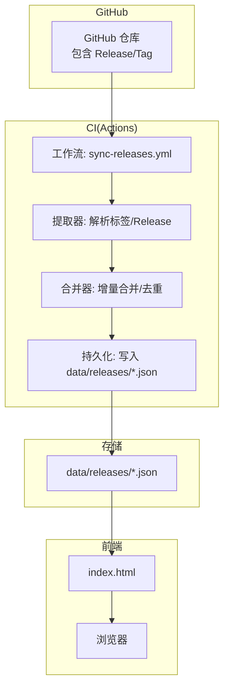
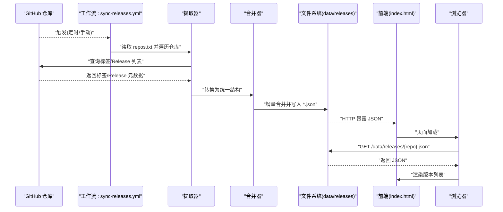
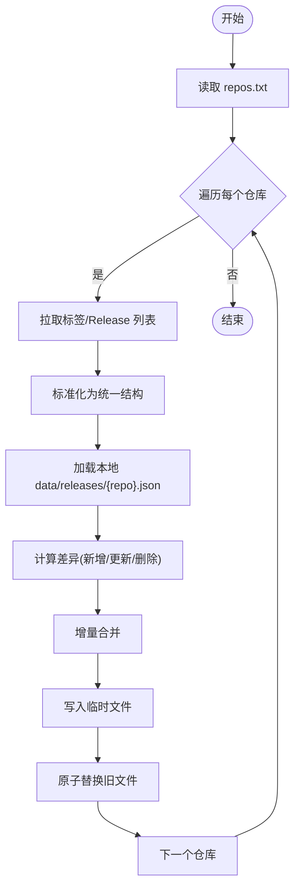
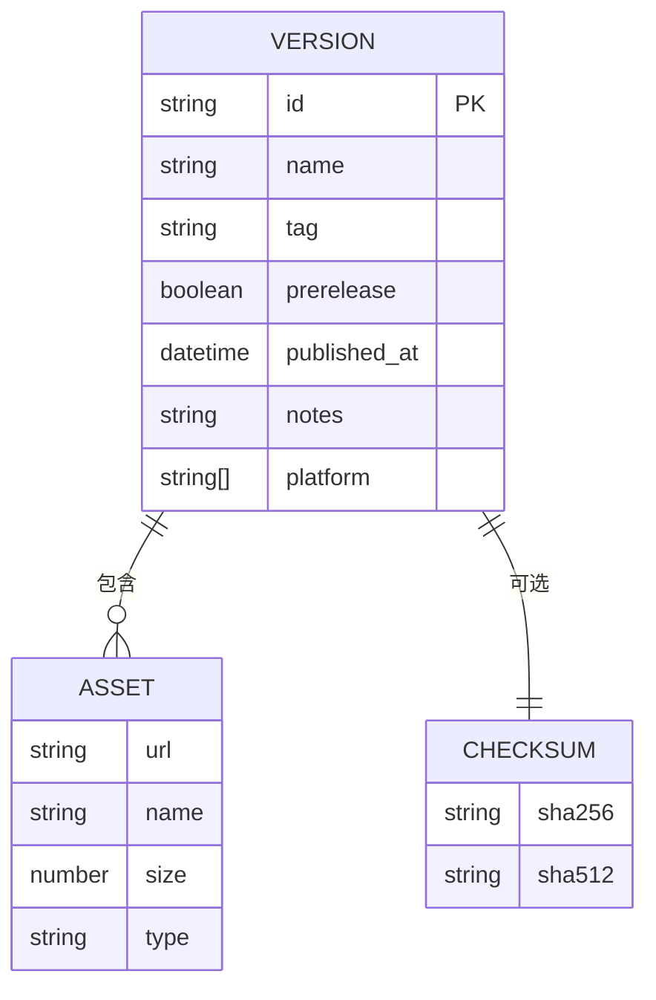
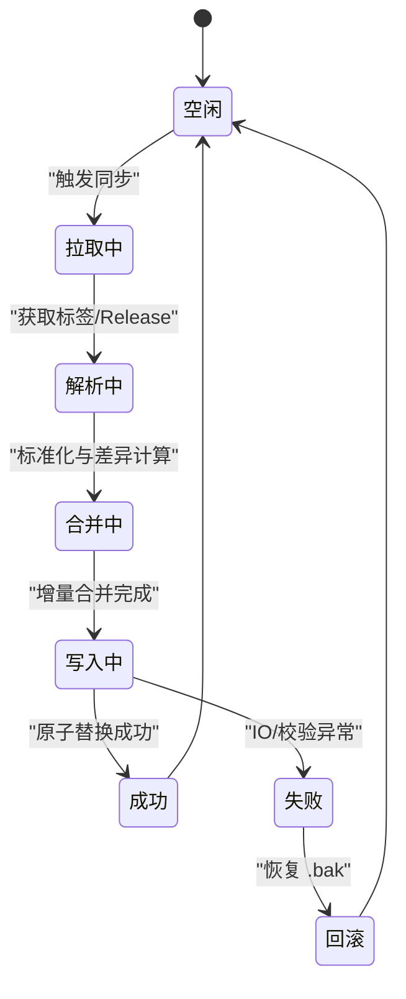
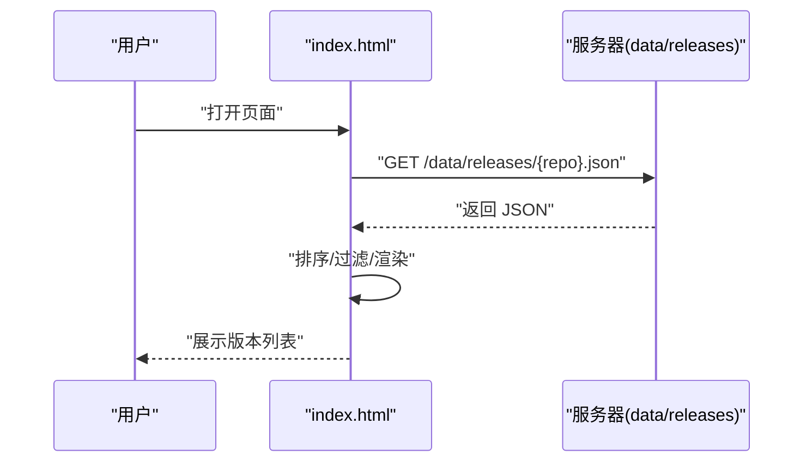
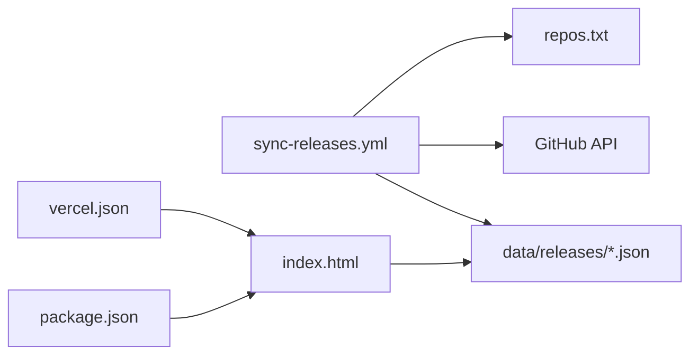

# 数据流设计

<cite>
**本文引用的文件**   
- [sync-releases.yml](file://.github/workflows/sync-releases.yml)
- [index.html](file://index.html)
- [package.json](file://package.json)
- [vercel.json](file://vercel.json)
- [repos.txt](file://repos.txt)
- [README.md](file://README.md)
- [kcoder.json](file://data/releases/kcoder.json)
- [kworks.json](file://data/releases/kworks.json)
- [oclaw.json](file://data/releases/oclaw.json)
- [qiongqi.json](file://data/releases/qiongqi.json)
</cite>

## 目录
1. [简介](#简介)
2. [项目结构](#项目结构)
3. [核心组件](#核心组件)
4. [架构总览](#架构总览)
5. [详细组件分析](#详细组件分析)
6. [依赖分析](#依赖分析)
7. [性能考虑](#性能考虑)
8. [故障排查指南](#故障排查指南)
9. [结论](#结论)
10. [附录](#附录)

## 简介
本文件面向 KReleaseWeb 的数据流设计与实现，覆盖从 GitHub 仓库版本标签获取、GitHub Actions 数据处理与持久化，到前端页面渲染展示的完整链路。文档同时给出数据格式规范（版本信息的 JSON 结构定义、字段含义与校验规则）、同步机制（定时触发、增量更新、冲突解决与回滚）、一致性保证与错误恢复策略，并提供数据流图与状态转换图以直观展示数据在各阶段的形态变化。

## 项目结构
KReleaseWeb 采用“静态站点 + 数据驱动”的轻量架构：
- 工作流定义位于 .github/workflows/sync-releases.yml，负责拉取远端仓库的发布标签并生成/更新 data/releases/*.json。
- 静态资源与页面位于根目录 index.html，通过浏览器加载 data/releases/*.json 进行渲染。
- vercel.json 用于部署配置；package.json 提供元信息；repos.txt 维护待同步的目标仓库清单。
- data/releases 目录存放各仓库的版本数据 JSON 文件，作为单一事实来源供前端消费。

图表来源
- [sync-releases.yml](file://.github/workflows/sync-releases.yml)
- [index.html](file://index.html)
- [kcoder.json](file://data/releases/kcoder.json)
- [kworks.json](file://data/releases/kworks.json)
- [oclaw.json](file://data/releases/oclaw.json)
- [qiongqi.json](file://data/releases/qiongqi.json)

章节来源
- [README.md](file://README.md)
- [package.json](file://package.json)
- [vercel.json](file://vercel.json)
- [repos.txt](file://repos.txt)

## 核心组件
- 工作流组件（GitHub Actions）
  - 职责：按周期或手动触发，读取目标仓库列表，拉取标签/Release，解析为统一结构，增量合并后落盘。
  - 关键输入：repos.txt（仓库清单）、GitHub Token（鉴权）。
  - 关键输出：data/releases/*.json（版本数据）。
- 数据层（JSON 文件）
  - 职责：承载版本元数据，作为前后端共享的事实源。
  - 位置：data/releases/{repo}.json。
- 前端渲染（index.html）
  - 职责：在浏览器中按需加载对应 repo 的 JSON，组装 UI 展示。
  - 数据来源：相对路径 /data/releases/{repo}.json。

章节来源
- [sync-releases.yml](file://.github/workflows/sync-releases.yml)
- [index.html](file://index.html)
- [repos.txt](file://repos.txt)
- [kcoder.json](file://data/releases/kcoder.json)
- [kworks.json](file://data/releases/kworks.json)
- [oclaw.json](file://data/releases/oclaw.json)
- [oclaw.json](file://data/releases/oclaw.json)
- [qiongqi.json](file://data/releases/qiongqi.json)

## 架构总览
下图展示了端到端数据流转：从 GitHub 仓库到 Actions 处理，再到 JSON 持久化与前端渲染。

图表来源
- [sync-releases.yml](file://.github/workflows/sync-releases.yml)
- [index.html](file://index.html)
- [repos.txt](file://repos.txt)
- [kcoder.json](file://data/releases/kcoder.json)
- [kworks.json](file://data/releases/kworks.json)
- [oclaw.json](file://data/releases/oclaw.json)
- [qiongqi.json](file://data/releases/qiongqi.json)

## 详细组件分析

### 工作流与数据提取（GitHub Actions）
- 触发方式
  - 定时触发：通过 cron 表达式周期性执行。
  - 手动触发：支持 workflow_dispatch 事件。
- 输入清单
  - repos.txt：每行一个仓库标识（owner/repo），用于批量同步。
- 处理流程
  - 克隆/访问目标仓库。
  - 拉取标签与 Release 列表。
  - 将每个版本条目标准化为统一结构。
  - 增量合并：对比本地已有 JSON，仅新增/变更写入。
  - 原子落盘：先写临时文件再替换，避免部分写入导致损坏。
- 鉴权与安全
  - 使用 GITHUB_TOKEN 或自定义 Secret 进行 API 访问。
  - 敏感信息不进入日志。

图表来源
- [sync-releases.yml](file://.github/workflows/sync-releases.yml)
- [repos.txt](file://repos.txt)
- [kcoder.json](file://data/releases/kcoder.json)
- [kworks.json](file://data/releases/kworks.json)
- [oclaw.json](file://data/releases/oclaw.json)
- [qiongqi.json](file://data/releases/qiongqi.json)

章节来源
- [sync-releases.yml](file://.github/workflows/sync-releases.yml)
- [repos.txt](file://repos.txt)

### 数据模型与格式规范
- 文件命名
  - data/releases/{repo}.json，其中 {repo} 与 repos.txt 中的仓库标识一一对应。
- 顶层结构
  - 数组类型：每个元素为一个版本对象。
- 版本对象字段建议
  - id: string，唯一标识（建议使用 tag 名称或 release_id）。
  - name: string，显示名称（如 v1.2.3）。
  - tag: string，Git 标签名。
  - prerelease: boolean，是否为预发布。
  - published_at: string，ISO 8601 时间戳。
  - assets: array，资产列表，每项包含 url、name、size、type 等。
  - notes: string，说明文本（Markdown 片段）。
  - platform: string[]，支持平台（如 ["windows","macos","linux"]）。
  - checksums: object，可选，包含 sha256/sha512 等哈希值。
- 约束与校验规则
  - id/name/tag 非空且不可重复。
  - published_at 符合 ISO 8601。
  - assets 至少包含一个有效下载链接时视为有效版本。
  - platform 枚举限定于已知集合。
  - 文件大小 size 为非负整数。
- 兼容性策略
  - 新增字段需向后兼容，前端忽略未知字段。
  - 废弃字段保留一段时间并记录迁移说明。

图表来源
- [kcoder.json](file://data/releases/kcoder.json)
- [kworks.json](file://data/releases/kworks.json)
- [oclaw.json](file://data/releases/oclaw.json)
- [qiongqi.json](file://data/releases/qiongqi.json)

章节来源
- [kcoder.json](file://data/releases/kcoder.json)
- [kworks.json](file://data/releases/kworks.json)
- [oclaw.json](file://data/releases/oclaw.json)
- [qiongqi.json](file://data/releases/qiongqi.json)

### 增量更新与冲突解决
- 增量策略
  - 基于 id/tag 去重，仅对新增或变更的版本执行写入。
  - 资产级比对：若 URL/大小/哈希任一变化则标记更新。
- 冲突解决
  - 多分支并发：采用“最后写入胜”+ 原子替换，减少脏读。
  - 版本号冲突：以 tag 为准，禁止覆盖历史 tag 的内容。
- 回滚机制
  - 每次更新前备份上一版 JSON 为 .bak。
  - 失败自动回滚至 .bak，确保数据可用性。
  - 提供一键回滚命令或脚本入口（可在后续扩展）。

图表来源
- [sync-releases.yml](file://.github/workflows/sync-releases.yml)
- [kcoder.json](file://data/releases/kcoder.json)
- [kworks.json](file://data/releases/kworks.json)
- [oclaw.json](file://data/releases/oclaw.json)
- [qiongqi.json](file://data/releases/qiongqi.json)

章节来源
- [sync-releases.yml](file://.github/workflows/sync-releases.yml)

### 前端渲染与缓存
- 数据加载
  - index.html 在页面初始化时根据当前选择项请求 /data/releases/{repo}.json。
- 渲染逻辑
  - 解析 JSON 数组，按时间倒序排列。
  - 过滤平台、预发布开关、搜索关键词。
  - 渲染版本卡片与资产列表。
- 缓存策略
  - 利用浏览器 HTTP 缓存与 ETag/Last-Modified。
  - 可引入短 TTL 的内存缓存以提升二次打开速度。

图表来源
- [index.html](file://index.html)
- [kcoder.json](file://data/releases/kcoder.json)
- [kworks.json](file://data/releases/kworks.json)
- [oclaw.json](file://data/releases/oclaw.json)
- [qiongqi.json](file://data/releases/qiongqi.json)

章节来源
- [index.html](file://index.html)

## 依赖分析
- 外部依赖
  - GitHub API：用于拉取标签/Release。
  - 部署平台（Vercel）：托管静态资源与 JSON。
- 内部依赖
  - 工作流依赖 repos.txt 的格式正确性。
  - 前端依赖 data/releases/*.json 的结构稳定性。

图表来源
- [sync-releases.yml](file://.github/workflows/sync-releases.yml)
- [repos.txt](file://repos.txt)
- [index.html](file://index.html)
- [vercel.json](file://vercel.json)
- [package.json](file://package.json)

章节来源
- [package.json](file://package.json)
- [vercel.json](file://vercel.json)
- [repos.txt](file://repos.txt)

## 性能考虑
- 批处理优化
  - 对 repos.txt 中的仓库并行拉取（注意速率限制）。
- 网络优化
  - 启用 gzip/压缩传输。
  - 合理设置 Cache-Control 与 ETag。
- 数据体积控制
  - 仅保留必要字段，assets 分页或懒加载大文件元数据。
- 前端渲染
  - 虚拟滚动/分页加载长列表。
  - 防抖搜索与节流筛选。

[本节为通用指导，无需代码引用]

## 故障排查指南
- 常见问题
  - 权限不足：检查 GITHUB_TOKEN 权限是否包含读取 releases/tags。
  - 网络超时：增加重试与退避策略。
  - JSON 校验失败：确认字段类型与必填项。
  - 前端无法加载：检查 CORS 与路径是否正确。
- 定位步骤
  - 查看 Actions 运行日志，定位失败阶段。
  - 校验 data/releases/*.json 结构与大小。
  - 使用浏览器开发者工具观察网络请求与响应。
- 恢复措施
  - 使用 .bak 回滚到最近可用版本。
  - 清理缓存并重试同步任务。

章节来源
- [sync-releases.yml](file://.github/workflows/sync-releases.yml)
- [kcoder.json](file://data/releases/kcoder.json)
- [kworks.json](file://data/releases/kworks.json)
- [oclaw.json](file://data/releases/oclaw.json)
- [qiongqi.json](file://data/releases/qiongqi.json)

## 结论
KReleaseWeb 通过 GitHub Actions 将远端仓库的版本信息标准化并增量持久化为 JSON，再由前端按需加载渲染，形成简洁可靠的数据闭环。通过严格的字段规范、增量合并与原子落盘、以及回滚策略，系统在保证一致性与可用性的同时具备良好的可扩展性。后续可进一步增强校验与监控能力，提升鲁棒性与可观测性。

## 附录
- 术语
  - 标签（Tag）：指向特定提交的引用。
  - Release：带有说明与资产的发布包。
  - 增量更新：仅对新增/变更数据进行写入。
  - 原子替换：先写临时文件再替换，避免中间态。
- 参考
  - repos.txt：仓库清单格式示例与约定。
  - data/releases/*.json：实际数据结构样例。