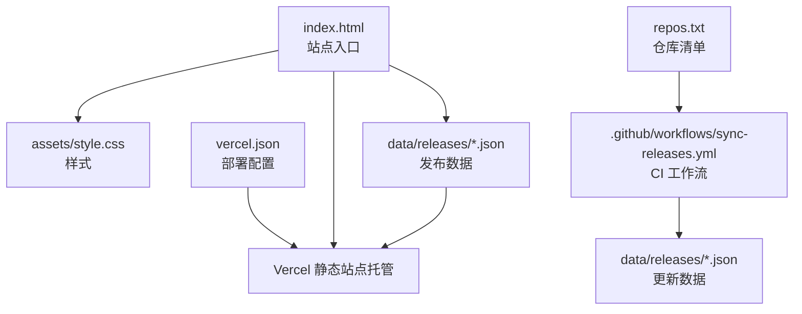
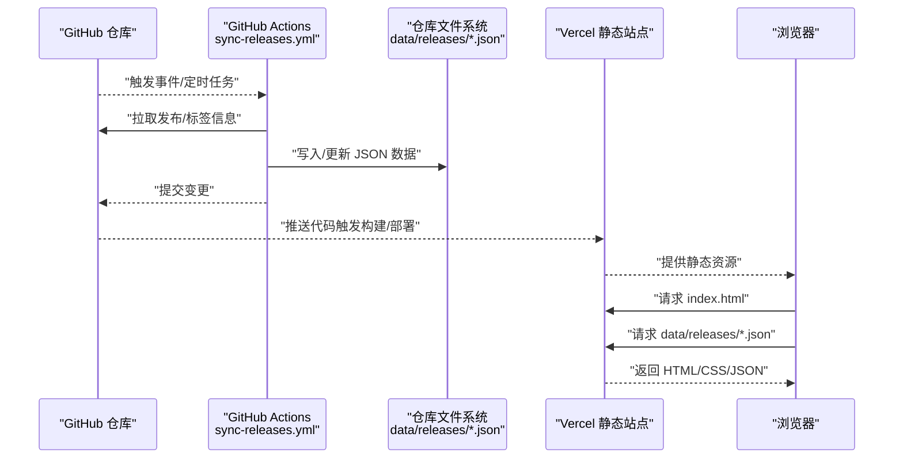
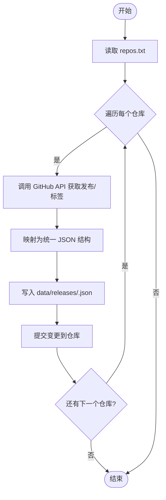
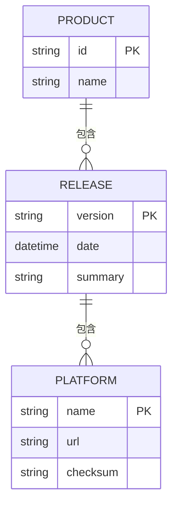
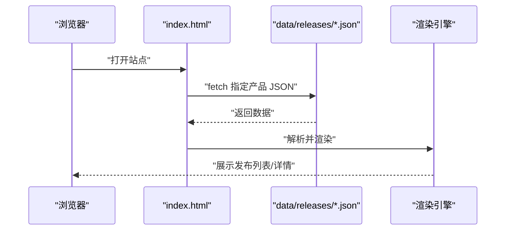
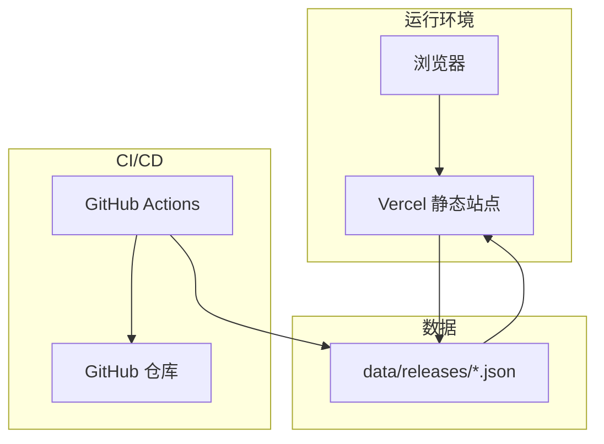

# 架构设计

<cite>
**本文引用的文件**   
- [README.md](file://README.md)
- [index.html](file://index.html)
- [package.json](file://package.json)
- [vercel.json](file://vercel.json)
- [repos.txt](file://repos.txt)
- [.github/workflows/sync-releases.yml](file://.github/workflows/sync-releases.yml)
- [assets/style.css](file://assets/style.css)
- [data/releases/kcoder.json](file://data/releases/kcoder.json)
- [data/releases/kworks.json](file://data/releases/kworks.json)
- [data/releases/oclaw.json](file://data/releases/oclaw.json)
- [data/releases/qiongqi.json](file://data/releases/qiongqi.json)
</cite>

## 目录
1. [简介](#简介)
2. [项目结构](#项目结构)
3. [核心组件](#核心组件)
4. [架构总览](#架构总览)
5. [详细组件分析](#详细组件分析)
6. [依赖关系分析](#依赖关系分析)
7. [性能考虑](#性能考虑)
8. [故障排查指南](#故障排查指南)
9. [结论](#结论)
10. [附录](#附录)

## 简介
本文件为 KReleaseWeb 项目的架构设计文档，聚焦于以下目标：
- 描述系统的高层设计：静态站点架构模式、配置驱动设计模式与模块化数据架构。
- 说明各组件职责与交互关系：GitHub Actions 工作流负责自动化同步；JSON 数据文件作为数据层；HTML/CSS 负责界面展示。
- 解释技术决策与权衡：为何选择 Vercel 托管、为何使用 JSON 而非数据库，以及轻量级架构的优势。
- 提供系统上下文图与组件分解图，完整呈现从 GitHub 仓库到 GitHub Actions，再到 JSON 数据文件，最终到静态网站的端到端数据流向。
- 记录基础设施要求、第三方依赖与版本兼容性。

## 项目结构
KReleaseWeb 采用“纯静态 + 配置驱动”的极简结构，便于在任意静态站点托管平台（如 Vercel）上零构建部署。

- 顶层入口与配置
  - index.html：站点主页面，承载渲染逻辑与样式引用。
  - vercel.json：Vercel 部署配置，定义路由、重定向或构建参数（若需要）。
  - package.json：声明式依赖与脚本（用于本地开发或可选的构建步骤）。
  - repos.txt：仓库清单或元数据源，供工作流或脚本读取以生成数据。
  - README.md：项目说明与使用说明。

- 数据层
  - data/releases/*.json：按产品维度划分的发布数据文件，作为静态站点的唯一数据源。

- 资源层
  - assets/style.css：全局样式。
  - assets/platforms/*：平台相关资源（图标、主题等）。

图表来源
- [index.html:1-200](file://index.html#L1-L200)
- [assets/style.css:1-200](file://assets/style.css#L1-L200)
- [.github/workflows/sync-releases.yml:1-200](file://.github/workflows/sync-releases.yml#L1-L200)
- [vercel.json:1-200](file://vercel.json#L1-L200)
- [repos.txt:1-200](file://repos.txt#L1-L200)

章节来源
- [README.md:1-200](file://README.md#L1-L200)
- [index.html:1-200](file://index.html#L1-L200)
- [package.json:1-200](file://package.json#L1-L200)
- [vercel.json:1-200](file://vercel.json#L1-L200)
- [repos.txt:1-200](file://repos.txt#L1-L200)
- [.github/workflows/sync-releases.yml:1-200](file://.github/workflows/sync-releases.yml#L1-L200)
- [assets/style.css:1-200](file://assets/style.css#L1-L200)

## 核心组件
- 静态站点入口（index.html）
  - 职责：加载样式与数据，渲染发布列表与详情，处理用户交互。
  - 特点：无服务端渲染，所有逻辑在前端完成；通过 fetch 读取 data/releases/*.json。

- 数据层（data/releases/*.json）
  - 职责：以产品为粒度组织发布信息（版本号、发布时间、下载链接、变更日志等）。
  - 特点：结构化、易读、可被 CI 直接写入，无需数据库。

- 自动化同步（.github/workflows/sync-releases.yml）
  - 职责：定时或触发式拉取上游仓库发布/标签信息，转换为 JSON 并写入 data/releases/*.json，提交至仓库。
  - 输入：repos.txt 中的仓库清单与认证凭据。
  - 输出：更新的 JSON 数据文件。

- 部署配置（vercel.json）
  - 职责：定义 Vercel 上的静态站点行为（如 SPA 路由回退、缓存策略等）。
  - 特点：零构建或最小化构建，快速部署。

- 样式与资源（assets/style.css, assets/platforms/*）
  - 职责：统一视觉风格与平台差异化资源。

章节来源
- [index.html:1-200](file://index.html#L1-L200)
- [data/releases/kcoder.json:1-200](file://data/releases/kcoder.json#L1-L200)
- [data/releases/kworks.json:1-200](file://data/releases/kworks.json#L1-L200)
- [data/releases/oclaw.json:1-200](file://data/releases/oclaw.json#L1-L200)
- [data/releases/qiongqi.json:1-200](file://data/releases/qiongqi.json#L1-L200)
- [.github/workflows/sync-releases.yml:1-200](file://.github/workflows/sync-releases.yml#L1-L200)
- [vercel.json:1-200](file://vercel.json#L1-L200)
- [assets/style.css:1-200](file://assets/style.css#L1-L200)

## 架构总览
下图展示了从 GitHub 仓库到 GitHub Actions，再到 JSON 数据文件，最后到静态站点的端到端流程。

图表来源
- [.github/workflows/sync-releases.yml:1-200](file://.github/workflows/sync-releases.yml#L1-L200)
- [vercel.json:1-200](file://vercel.json#L1-L200)
- [index.html:1-200](file://index.html#L1-L200)

## 详细组件分析

### 组件一：GitHub Actions 同步工作流
- 触发条件
  - 支持定时触发（cron）或手动触发，确保数据周期性更新。
- 输入
  - repos.txt：仓库清单，包含目标仓库地址、命名空间、分支等信息。
  - 认证凭据：用于访问私有仓库或 API 限流的令牌。
- 处理流程
  - 解析 repos.txt，遍历每个仓库。
  - 调用 GitHub API 获取最新 Release/Tag 信息。
  - 将结果映射为统一的 JSON 结构，写入 data/releases/<product>.json。
  - 提交变更并触发后续部署。
- 错误处理
  - 网络重试、API 限流等待、权限校验失败告警。
  - 对异常仓库进行隔离，避免影响其他产品数据更新。

图表来源
- [.github/workflows/sync-releases.yml:1-200](file://.github/workflows/sync-releases.yml#L1-L200)
- [repos.txt:1-200](file://repos.txt#L1-L200)

章节来源
- [.github/workflows/sync-releases.yml:1-200](file://.github/workflows/sync-releases.yml#L1-L200)
- [repos.txt:1-200](file://repos.txt#L1-L200)

### 组件二：数据层（JSON 文件）
- 设计原则
  - 按产品维度拆分文件，降低耦合，提升可读性与可维护性。
  - 字段标准化：版本号、发布时间、平台、下载链接、变更摘要等。
- 数据结构示例（示意）
  - releases: 数组，每项包含 version、date、platforms、notes 等。
- 更新机制
  - 由工作流自动更新，人工也可在 PR 中修正。
- 前端消费
  - 通过 fetch 异步加载对应 JSON，渲染列表与详情。

图表来源
- [data/releases/kcoder.json:1-200](file://data/releases/kcoder.json#L1-L200)
- [data/releases/kworks.json:1-200](file://data/releases/kworks.json#L1-L200)
- [data/releases/oclaw.json:1-200](file://data/releases/oclaw.json#L1-L200)
- [data/releases/qiongqi.json:1-200](file://data/releases/qiongqi.json#L1-L200)

章节来源
- [data/releases/kcoder.json:1-200](file://data/releases/kcoder.json#L1-L200)
- [data/releases/kworks.json:1-200](file://data/releases/kworks.json#L1-L200)
- [data/releases/oclaw.json:1-200](file://data/releases/oclaw.json#L1-L200)
- [data/releases/qiongqi.json:1-200](file://data/releases/qiongqi.json#L1-L200)

### 组件三：静态站点入口（index.html）
- 职责
  - 加载样式与数据，渲染产品列表与发布信息。
  - 处理分页、搜索、筛选等交互。
- 数据消费
  - 根据 URL 参数或导航状态决定加载哪个 data/releases/*.json。
  - 错误边界：当 JSON 缺失或格式异常时，显示友好提示。
- 性能优化
  - 按需加载 JSON，避免一次性加载全部数据。
  - 利用浏览器缓存与 CDN 缓存策略。

图表来源
- [index.html:1-200](file://index.html#L1-L200)
- [data/releases/kcoder.json:1-200](file://data/releases/kcoder.json#L1-L200)

章节来源
- [index.html:1-200](file://index.html#L1-L200)

### 组件四：部署配置（vercel.json）
- 作用
  - 定义静态站点根目录、SPA 路由回退、缓存头、环境变量等。
- 关键项
  - routes：将客户端路由回退到 index.html。
  - headers：设置静态资源缓存策略。
  - env：注入必要的环境变量（如默认语言、特性开关）。

章节来源
- [vercel.json:1-200](file://vercel.json#L1-L200)

### 组件五：样式与资源（assets/style.css, assets/platforms/*）
- 职责
  - 提供一致的 UI 风格与平台差异化资源。
- 扩展点
  - 新增平台只需添加资源与少量 CSS 类名，无需改动核心逻辑。

章节来源
- [assets/style.css:1-200](file://assets/style.css#L1-L200)

## 依赖关系分析
- 运行时依赖
  - 浏览器原生能力：fetch、DOM API。
  - 静态资源：CSS、JSON。
- 构建与部署
  - Vercel：静态站点托管与边缘缓存。
  - GitHub Actions：自动化数据同步。
- 外部服务
  - GitHub API：获取发布/标签信息。

图表来源
- [vercel.json:1-200](file://vercel.json#L1-L200)
- [.github/workflows/sync-releases.yml:1-200](file://.github/workflows/sync-releases.yml#L1-L200)
- [index.html:1-200](file://index.html#L1-L200)

章节来源
- [package.json:1-200](file://package.json#L1-L200)
- [vercel.json:1-200](file://vercel.json#L1-L200)
- [.github/workflows/sync-releases.yml:1-200](file://.github/workflows/sync-releases.yml#L1-L200)

## 性能考虑
- 静态站点优势
  - 零后端、低延迟、全球 CDN 加速。
  - 资源可缓存，首屏加载快。
- 数据加载优化
  - 按产品分文件，按需加载，减少单次响应体积。
  - 合理设置 Cache-Control，提高重复访问速度。
- 渲染优化
  - 避免在主线程执行重型计算，必要时使用 Web Worker。
  - 列表虚拟化与懒加载，提升大数据量下的滚动性能。
- 可观测性
  - 接入前端监控与错误上报，定位渲染与数据问题。

[本节为通用指导，不直接分析具体文件]

## 故障排查指南
- 常见问题
  - JSON 格式错误：检查 data/releases/*.json 的语法与字段完整性。
  - 404 路由：确认 vercel.json 的 SPA 回退规则生效。
  - 跨域问题：静态站点通常不存在跨域，但若引入外部资源需正确配置 CORS。
- 调试建议
  - 浏览器开发者工具查看网络请求与缓存命中情况。
  - 检查工作流日志，确认 API 调用与文件写入是否成功。
  - 验证 repos.txt 的仓库清单与权限是否正确。

章节来源
- [vercel.json:1-200](file://vercel.json#L1-L200)
- [.github/workflows/sync-releases.yml:1-200](file://.github/workflows/sync-releases.yml#L1-L200)
- [index.html:1-200](file://index.html#L1-L200)

## 结论
KReleaseWeb 采用“静态站点 + 配置驱动 + 模块化数据”的轻量架构，具备以下优势：
- 简单可靠：无数据库与复杂后端，故障面小，易于维护。
- 低成本：Vercel 免费额度足以支撑中小规模流量，且具备全球 CDN。
- 高可用：GitHub Actions 保障数据持续更新，静态资源就近分发。
- 可扩展：新增产品仅需增加 JSON 文件与少量前端路由逻辑。

[本节为总结性内容，不直接分析具体文件]

## 附录

### 技术决策与权衡
- 为什么选择 Vercel
  - 零构建/最小化构建，部署便捷。
  - 内置边缘缓存与 HTTPS，开箱即用。
  - 与 GitHub 深度集成，推送即部署。
- 为什么使用 JSON 而非数据库
  - 数据结构简单、更新频率可控，适合用 CI 批量生成。
  - 避免数据库运维成本与连接池、事务等复杂性。
  - 静态站点可直接读取，减少网络往返与鉴权开销。
- 权衡
  - 不适合高频写操作与强一致性场景；但发布数据属于低频写、高频读，契合该方案。

[本节为概念性讨论，不直接分析具体文件]

### 基础设施要求
- 仓库
  - GitHub 仓库，包含源码、数据与工作流。
- 权限
  - GitHub Actions 需具备读取仓库与 API 访问权限（私有仓库需 Token）。
- 托管
  - Vercel 账号与绑定仓库，启用自动部署。

[本节为通用要求，不直接分析具体文件]

### 第三方依赖与版本兼容性
- 浏览器
  - 现代浏览器（ES6+、Fetch API）。
- Node.js（可选）
  - 仅用于本地脚本或可选构建步骤，参见 package.json。
- Vercel
  - 遵循其静态站点规范与运行时限制。

章节来源
- [package.json:1-200](file://package.json#L1-L200)