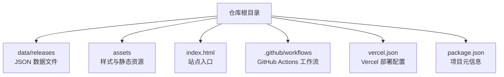
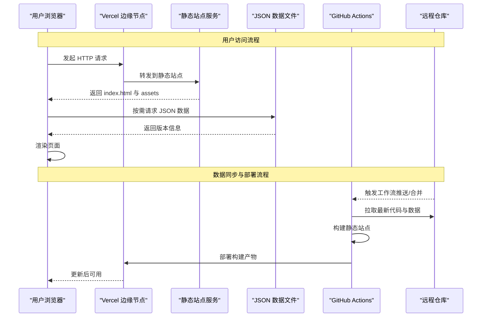
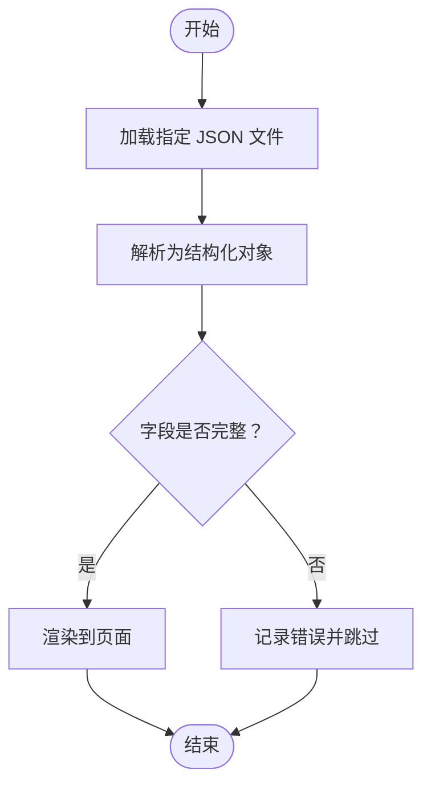
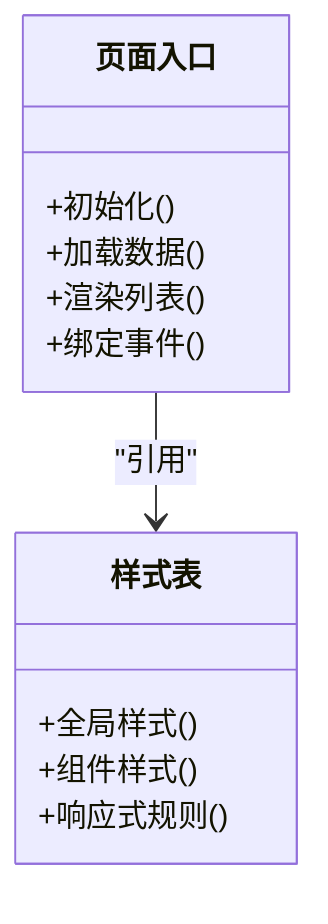
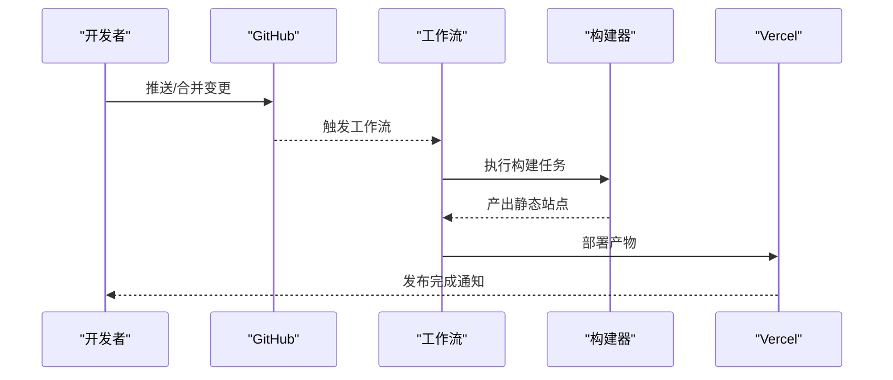
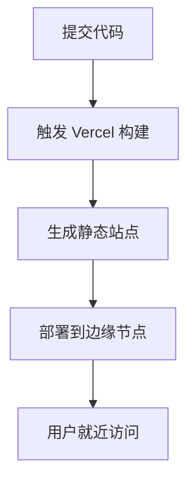
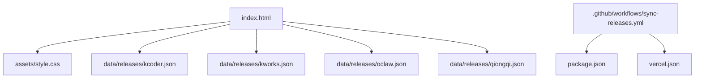

# 系统概览

<cite>
**本文引用的文件**   
- [README.md](file://README.md)
- [index.html](file://index.html)
- [package.json](file://package.json)
- [vercel.json](file://vercel.json)
- [assets/style.css](file://assets/style.css)
- [data/releases/kcoder.json](file://data/releases/kcoder.json)
- [data/releases/kworks.json](file://data/releases/kworks.json)
- [data/releases/oclaw.json](file://data/releases/oclaw.json)
- [data/releases/qiongqi.json](file://data/releases/qiongqi.json)
- [.github/workflows/sync-releases.yml](file://.github/workflows/sync-releases.yml)
</cite>

## 目录
1. [简介](#简介)
2. [项目结构](#项目结构)
3. [核心组件](#核心组件)
4. [架构总览](#架构总览)
5. [详细组件分析](#详细组件分析)
6. [依赖分析](#依赖分析)
7. [性能考虑](#性能考虑)
8. [故障排查指南](#故障排查指南)
9. [结论](#结论)
10. [附录](#附录)

## 简介
本系统为 KReleaseWeb，采用“纯静态站点 + 配置驱动 + 模块化数据管理”的架构模式。其核心设计理念是：以 JSON 配置文件作为单一事实来源，集中维护多个产品的版本信息；前端通过 HTML/CSS 渲染展示层；借助 GitHub Actions 自动化同步与构建流程；最终在 Vercel 等静态托管平台进行全球分发与快速访问。相比传统后端架构，该方案具备部署简单、扩展成本低、可观测性强、运维开销小等优势。

## 项目结构
仓库采用按职责分层的目录组织方式：
- data/releases：存放各产品版本的 JSON 数据文件，作为系统的唯一数据源
- assets：静态资源（样式、图标等）
- index.html：站点入口页面，负责加载并渲染数据
- vercel.json：Vercel 部署配置
- .github/workflows/sync-releases.yml：GitHub Actions 工作流，用于自动化同步与构建
- package.json：项目元信息与脚本定义

图表来源
- [index.html](file://index.html)
- [assets/style.css](file://assets/style.css)
- [data/releases/kcoder.json](file://data/releases/kcoder.json)
- [data/releases/kworks.json](file://data/releases/kworks.json)
- [data/releases/oclaw.json](file://data/releases/oclaw.json)
- [data/releases/qiongqi.json](file://data/releases/qiongqi.json)
- [.github/workflows/sync-releases.yml](file://.github/workflows/sync-releases.yml)
- [vercel.json](file://vercel.json)
- [package.json](file://package.json)

章节来源
- [README.md](file://README.md)
- [index.html](file://index.html)
- [package.json](file://package.json)
- [vercel.json](file://vercel.json)
- [assets/style.css](file://assets/style.css)
- [data/releases/kcoder.json](file://data/releases/kcoder.json)
- [data/releases/kworks.json](file://data/releases/kworks.json)
- [data/releases/oclaw.json](file://data/releases/oclaw.json)
- [data/releases/qiongqi.json](file://data/releases/qiongqi.json)
- [.github/workflows/sync-releases.yml](file://.github/workflows/sync-releases.yml)

## 核心组件
- 数据层（JSON 文件）
  - 每个产品对应一个 JSON 文件，集中描述版本号、发布说明、下载链接等字段
  - 优点：结构化、易维护、便于自动化处理与校验
- 展示层（HTML/CSS）
  - 入口页面负责读取 JSON 数据并渲染到 DOM
  - 样式文件统一控制视觉表现与响应式布局
- 自动化层（GitHub Actions）
  - 触发条件通常为推送或合并分支
  - 执行步骤包括拉取最新数据、构建静态站点、生成产物并部署至 Vercel

章节来源
- [data/releases/kcoder.json](file://data/releases/kcoder.json)
- [data/releases/kworks.json](file://data/releases/kworks.json)
- [data/releases/oclaw.json](file://data/releases/oclaw.json)
- [data/releases/qiongqi.json](file://data/releases/qiongqi.json)
- [index.html](file://index.html)
- [assets/style.css](file://assets/style.css)
- [.github/workflows/sync-releases.yml](file://.github/workflows/sync-releases.yml)

## 架构总览
KReleaseWeb 采用三层架构：数据层、展示层、自动化层。整体流程如下：
- 用户访问：浏览器请求站点入口，加载样式与脚本，按需获取 JSON 数据并渲染
- 数据同步：当上游仓库或本地提交变更时，GitHub Actions 自动拉取数据、构建静态站点并部署
- 部署分发：Vercel 提供边缘缓存与全球加速，确保低延迟访问

图表来源
- [index.html](file://index.html)
- [assets/style.css](file://assets/style.css)
- [data/releases/kcoder.json](file://data/releases/kcoder.json)
- [data/releases/kworks.json](file://data/releases/kworks.json)
- [data/releases/oclaw.json](file://data/releases/oclaw.json)
- [data/releases/qiongqi.json](file://data/releases/qiongqi.json)
- [.github/workflows/sync-releases.yml](file://.github/workflows/sync-releases.yml)
- [vercel.json](file://vercel.json)

## 详细组件分析

### 数据层：JSON 版本文件
- 设计目标
  - 将多产品的版本信息解耦为独立文件，避免单点膨胀
  - 使用统一的字段约定，便于前端解析与展示
- 关键职责
  - 存储版本号、发布日期、说明文本、下载链接等
  - 支持增量更新与回滚（通过 Git 历史）
- 复杂度与优化
  - 时间复杂度：O(1) 读取单个文件；批量聚合 O(n)
  - 空间复杂度：线性于文件数量与内容大小
  - 建议：对大文件启用压缩与 CDN 缓存

图表来源
- [data/releases/kcoder.json](file://data/releases/kcoder.json)
- [data/releases/kworks.json](file://data/releases/kworks.json)
- [data/releases/oclaw.json](file://data/releases/oclaw.json)
- [data/releases/qiongqi.json](file://data/releases/qiongqi.json)

章节来源
- [data/releases/kcoder.json](file://data/releases/kcoder.json)
- [data/releases/kworks.json](file://data/releases/kworks.json)
- [data/releases/oclaw.json](file://data/releases/oclaw.json)
- [data/releases/qiongqi.json](file://data/releases/qiongqi.json)

### 展示层：入口页面与样式
- 入口页面
  - 负责初始化 UI、加载 JSON 数据、渲染列表与详情
  - 通过事件绑定实现交互（如筛选、排序、复制链接）
- 样式文件
  - 统一主题、排版与响应式适配
  - 提供可复用的组件样式（卡片、按钮、表格等）
- 性能要点
  - 减少重排与重绘，优先使用 CSS 动画
  - 按需加载与懒渲染大数据集

图表来源
- [index.html](file://index.html)
- [assets/style.css](file://assets/style.css)

章节来源
- [index.html](file://index.html)
- [assets/style.css](file://assets/style.css)

### 自动化层：GitHub Actions 工作流
- 触发策略
  - 基于推送或合并事件，保证数据变更后立即构建与部署
- 执行步骤
  - 拉取代码与数据
  - 安装依赖与构建静态站点
  - 部署到 Vercel
- 价值
  - 零人工干预，降低出错概率
  - 标准化构建环境，提升一致性

图表来源
- [.github/workflows/sync-releases.yml](file://.github/workflows/sync-releases.yml)

章节来源
- [.github/workflows/sync-releases.yml](file://.github/workflows/sync-releases.yml)

### 部署配置：Vercel
- 作用
  - 声明构建命令、输出目录与环境变量
  - 启用边缘缓存与 HTTPS
- 优势
  - 全球 CDN 加速
  - 自动域名与证书管理
  - 与 GitHub 集成良好，支持预览部署

图表来源
- [vercel.json](file://vercel.json)

章节来源
- [vercel.json](file://vercel.json)

## 依赖分析
- 内部依赖
  - index.html 依赖 assets/style.css 与 data/releases/*.json
  - GitHub Actions 工作流依赖仓库结构与构建脚本
- 外部依赖
  - Vercel 平台提供构建与托管能力
  - GitHub 提供代码托管与工作流运行环境
- 耦合与内聚
  - 数据层与展示层松耦合，通过 JSON 接口契约交互
  - 自动化层与平台强耦合，但可通过配置迁移

图表来源
- [index.html](file://index.html)
- [assets/style.css](file://assets/style.css)
- [data/releases/kcoder.json](file://data/releases/kcoder.json)
- [data/releases/kworks.json](file://data/releases/kworks.json)
- [data/releases/oclaw.json](file://data/releases/oclaw.json)
- [data/releases/qiongqi.json](file://data/releases/qiongqi.json)
- [.github/workflows/sync-releases.yml](file://.github/workflows/sync-releases.yml)
- [package.json](file://package.json)
- [vercel.json](file://vercel.json)

章节来源
- [package.json](file://package.json)
- [vercel.json](file://vercel.json)
- [.github/workflows/sync-releases.yml](file://.github/workflows/sync-releases.yml)

## 性能考虑
- 网络层面
  - 利用 Vercel 边缘缓存与 CDN，减少首屏延迟
  - 对 JSON 数据启用缓存头，避免重复请求
- 渲染层面
  - 分页与虚拟滚动处理大量版本列表
  - 预取常用数据，减少等待时间
- 构建层面
  - 最小化依赖与构建步骤，缩短流水线时长
  - 并行任务与缓存依赖，提高复用率

[本节为通用指导，不直接分析具体文件]

## 故障排查指南
- 常见问题
  - JSON 格式错误：检查字段完整性与语法
  - 构建失败：确认工作流中的命令与依赖版本
  - 部署异常：查看 Vercel 日志与环境变量
- 定位方法
  - 使用浏览器开发者工具检查网络请求与控制台错误
  - 在工作流中增加调试输出，定位失败阶段
  - 对比最近一次成功构建的差异，缩小问题范围

章节来源
- [.github/workflows/sync-releases.yml](file://.github/workflows/sync-releases.yml)
- [vercel.json](file://vercel.json)

## 结论
KReleaseWeb 通过“数据层 + 展示层 + 自动化层”的分层设计与配置驱动理念，实现了多产品版本信息的集中管理与高效分发。纯静态站点方案降低了运维成本，GitHub Actions 与 Vercel 的组合提升了交付效率与用户体验。未来可在数据校验、缓存策略与可视化监控方面持续优化。

[本节为总结性内容，不直接分析具体文件]

## 附录
- 术语
  - 静态站点：无需服务端逻辑即可运行的网站
  - 配置驱动：通过外部配置文件控制行为与内容
  - 模块化数据：按模块拆分的数据文件，便于维护与扩展
- 最佳实践
  - 保持 JSON 字段稳定，必要时向后兼容
  - 为工作流添加失败重试与告警
  - 定期清理无用构建产物与缓存

[本节为补充信息，不直接分析具体文件]