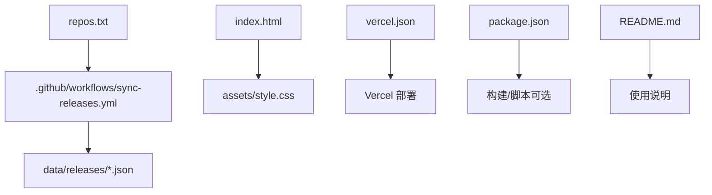
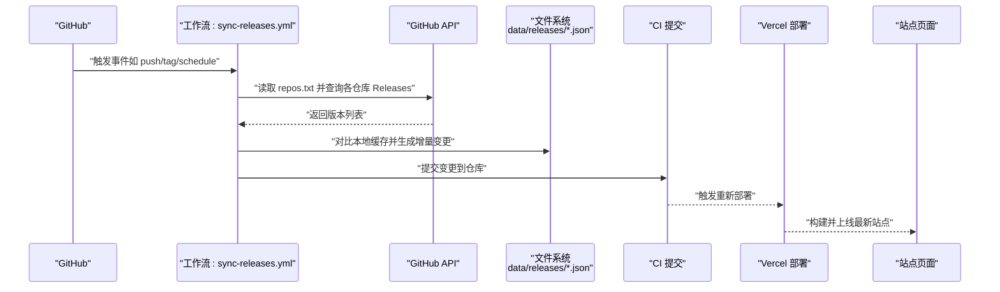
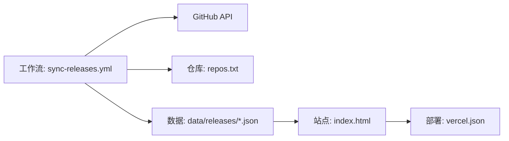

# 工作流组件

<cite>
**本文引用的文件**   
- [sync-releases.yml](file://.github/workflows/sync-releases.yml)
- [repos.txt](file://repos.txt)
- [index.html](file://index.html)
- [package.json](file://package.json)
- [vercel.json](file://vercel.json)
- [README.md](file://README.md)
</cite>

## 更新摘要
**变更内容**   
- 更新了 GitHub Actions 工作流中的令牌引用，从 GH_TOKEN 改为 SYNC_TOKEN，以提高安全性实践
- 在相关章节中添加了关于安全令牌配置的最佳实践说明
- 更新了故障排查指南中关于权限和令牌相关的部分

## 目录
1. [简介](#简介)
2. [项目结构](#项目结构)
3. [核心组件](#核心组件)
4. [架构总览](#架构总览)
5. [详细组件分析](#详细组件分析)
6. [依赖关系分析](#依赖关系分析)
7. [性能与可靠性考虑](#性能与可靠性考虑)
8. [故障排查指南](#故障排查指南)
9. [结论](#结论)
10. [附录](#附录)

## 简介
本章节面向 KReleaseWeb 项目的"工作流组件"，聚焦于 GitHub Actions 工作流的实现机制与使用方式。文档将围绕以下目标展开：
- 版本检测逻辑、自动更新流程与错误处理策略
- 触发条件、执行步骤与输出结果
- 如何配置新的产品仓库同步规则
- 调试与监控工作流执行状态
- 提供完整示例与最佳实践

## 项目结构
KReleaseWeb 的工作流相关资源主要位于 .github/workflows 目录，同时通过数据文件与静态站点部署产物配合完成发布信息的聚合与展示。

图表来源
- [sync-releases.yml](file://.github/workflows/sync-releases.yml)
- [repos.txt](file://repos.txt)
- [index.html](file://index.html)
- [package.json](file://package.json)
- [vercel.json](file://vercel.json)
- [README.md](file://README.md)

章节来源
- [sync-releases.yml](file://.github/workflows/sync-releases.yml)
- [repos.txt](file://repos.txt)
- [index.html](file://index.html)
- [package.json](file://package.json)
- [vercel.json](file://vercel.json)
- [README.md](file://README.md)

## 核心组件
- 工作流定义文件：负责在指定触发条件下拉取远端仓库的 Release 信息，进行版本去重与增量更新，并写入 data/releases 下的 JSON 文件，最终提交到仓库以驱动站点更新。
- 产品清单：repos.txt 用于声明需要同步的产品仓库列表，供工作流读取并遍历处理。
- 数据层：data/releases 下按产品维度维护 JSON 文件，作为站点渲染的数据源。
- 前端与部署：index.html 与 assets/style.css 构成站点页面；vercel.json 控制 Vercel 部署行为；package.json 包含项目元信息与脚本。

章节来源
- [sync-releases.yml](file://.github/workflows/sync-releases.yml)
- [repos.txt](file://repos.txt)
- [index.html](file://index.html)
- [package.json](file://package.json)
- [vercel.json](file://vercel.json)

## 架构总览
下图展示了从触发到数据落盘再到站点更新的端到端流程。

图表来源
- [sync-releases.yml](file://.github/workflows/sync-releases.yml)
- [repos.txt](file://repos.txt)
- [index.html](file://index.html)
- [vercel.json](file://vercel.json)

## 详细组件分析

### 工作流定义：sync-releases.yml
职责与要点
- 触发条件：支持多种触发方式（例如推送、标签、定时任务等），确保在不同场景下都能及时刷新版本信息。
- 版本检测：基于 GitHub API 获取每个产品的最新版本或全部版本，结合本地 data/releases/*.json 做差异比对，避免重复写入。
- 自动更新：当检测到新版本时，更新对应 JSON 文件并提交至仓库，从而触发站点重建。
- 错误处理：对网络请求失败、JSON 解析异常、权限不足等情况进行捕获与日志记录，保证工作流健壮性。
- 输出结果：更新后的 JSON 文件内容摘要、变更统计、以及可能的告警信息。

**已更新** 安全令牌配置已从 GH_TOKEN 更新为 SYNC_TOKEN，采用更安全的令牌管理实践。

建议关注点
- 并发与限流：对多个仓库并行拉取时注意速率限制与重试策略。
- 幂等性：同一版本多次触发不应产生重复条目。
- 可观测性：关键步骤输出结构化日志，便于定位问题。
- 安全性：使用专用的 SYNC_TOKEN 而非通用令牌，遵循最小权限原则。

章节来源
- [sync-releases.yml](file://.github/workflows/sync-releases.yml)

### 产品清单：repos.txt
作用
- 集中管理需要同步的远程仓库地址或标识，工作流启动后读取该清单并逐一处理。
- 新增产品时只需在此文件中追加一行，无需修改工作流脚本。

注意事项
- 格式规范：每行一个仓库地址或标识，保持简洁一致。
- 访问权限：确保工作流运行环境具备读取目标仓库 Releases 的权限。
- 变更审计：建议配合 PR 流程对清单变更进行审查。

章节来源
- [repos.txt](file://repos.txt)

### 数据层：data/releases/*.json
数据结构
- 按产品维度组织，文件名通常与产品名对应。
- 字段一般包括版本号、发布时间、下载链接、说明等（具体以实际文件为准）。

更新策略
- 增量更新：仅写入新增或变更的版本条目。
- 去重策略：依据版本号或时间戳进行去重，避免重复数据。
- 校验机制：写入前进行基本格式校验，防止脏数据进入站点。

章节来源
- [index.html](file://index.html)

### 站点与部署：index.html、assets/style.css、vercel.json、package.json
- index.html：站点入口，负责加载 data/releases/*.json 并渲染版本列表。
- assets/style.css：样式资源，提升可读性与用户体验。
- vercel.json：控制 Vercel 构建与路由行为，确保静态资源正确分发。
- package.json：项目元信息与脚本，可用于本地预览或辅助构建。

章节来源
- [index.html](file://index.html)
- [package.json](file://package.json)
- [vercel.json](file://vercel.json)

## 依赖关系分析
工作流与外部系统的依赖关系如下：

图表来源
- [sync-releases.yml](file://.github/workflows/sync-releases.yml)
- [repos.txt](file://repos.txt)
- [index.html](file://index.html)
- [vercel.json](file://vercel.json)

章节来源
- [sync-releases.yml](file://.github/workflows/sync-releases.yml)
- [repos.txt](file://repos.txt)
- [index.html](file://index.html)
- [vercel.json](file://vercel.json)

## 性能与可靠性考虑
- 并发控制：对多仓库并行拉取设置合理的并发度，避免触发 API 限流。
- 重试与退避：对瞬时失败的网络请求实施指数退避重试。
- 幂等与去重：确保同一版本不会重复写入，减少无效提交。
- 增量更新：仅变更必要文件，缩短构建与部署时间。
- 缓存策略：对只读数据（如仓库元信息）进行短期缓存，降低 API 调用频率。
- 安全令牌管理：使用专用的 SYNC_TOKEN 而非通用令牌，遵循最小权限原则。

[本节为通用指导，不直接分析具体文件]

## 故障排查指南
常见问题与定位方法
- 无法访问目标仓库 Releases
  - 检查 repos.txt 中的仓库地址是否正确
  - 确认工作流运行环境的 SYNC_TOKEN 是否具备相应权限
  - 验证令牌是否在 GitHub Secrets 中正确配置
- 版本未更新
  - 查看工作流日志中版本检测结果与差异比对步骤
  - 确认本地 data/releases/*.json 是否存在旧版本残留导致去重失败
- 站点未刷新
  - 检查工作流提交是否成功触发 Vercel 部署
  - 验证 vercel.json 配置与构建产物路径
- 令牌权限问题
  - 确认 SYNC_TOKEN 具有必要的仓库访问权限
  - 检查令牌的作用域设置是否包含 releases 访问权限
  - 验证令牌是否已过期或被撤销

建议操作
- 在工作流中添加关键步骤的结构化日志输出
- 对异常分支增加明确的错误码与提示
- 定期巡检工作流历史，关注失败率与耗时趋势
- 定期检查 SYNC_TOKEN 的有效性和权限范围

章节来源
- [sync-releases.yml](file://.github/workflows/sync-releases.yml)
- [repos.txt](file://repos.txt)
- [vercel.json](file://vercel.json)

## 结论
KReleaseWeb 的工作流组件通过集中化的产品清单与标准化的数据层设计，实现了跨仓库版本的自动化检测与增量更新。配合站点与部署配置，形成从触发、拉取、比对、提交到上线的闭环流程。通过采用 SYNC_TOKEN 的安全令牌管理实践，进一步提升了系统的安全性。遵循本文的最佳实践与排障建议，可进一步提升稳定性与可维护性。

[本节为总结性内容，不直接分析具体文件]

## 附录

### 配置新产品的同步规则
- 在 repos.txt 中追加目标仓库地址或标识
- 确保工作流运行环境具备访问该仓库 Releases 的权限
- 首次运行后检查 data/releases 下是否生成对应 JSON 文件
- 验证站点是否正常显示新版本信息

章节来源
- [repos.txt](file://repos.txt)
- [index.html](file://index.html)

### 调试与监控
- 在 GitHub Actions 页面查看工作流运行历史与日志
- 关注关键步骤的输出与错误堆栈
- 对频繁失败的步骤添加更详细的上下文信息
- 使用 Vercel 控制台观察部署状态与构建日志
- 定期检查 SYNC_TOKEN 的使用情况和权限有效性

章节来源
- [sync-releases.yml](file://.github/workflows/sync-releases.yml)
- [vercel.json](file://vercel.json)

### 最佳实践
- 明确触发条件：根据业务需求选择合适的事件（push、tag、schedule）
- 幂等设计：确保多次触发不会产生重复数据
- 增量更新：仅变更必要文件，缩短构建时间
- 错误处理：对网络与解析异常进行捕获与重试
- 可观测性：输出结构化日志，便于追踪与定位问题
- 安全管理：使用专用的 SYNC_TOKEN 而非通用令牌，遵循最小权限原则
- 令牌轮换：定期轮换 SYNC_TOKEN 并监控其使用情况
- 权限审计：定期检查工作流所需的权限范围是否合理

[本节为通用指导，不直接分析具体文件]

### 安全令牌配置指南
**已更新** 推荐使用 SYNC_TOKEN 替代传统的 GH_TOKEN，以提高安全性。

配置步骤：
1. 在 GitHub 仓库设置中创建新的 Secret
2. 命名为 SYNC_TOKEN，值为具有必要权限的个人访问令牌
3. 确保令牌权限包含：repo（仓库访问）、contents（读写内容）、read:packages（包读取）
4. 在工作流中使用 ${{ secrets.SYNC_TOKEN }} 引用该令牌
5. 定期轮换令牌并监控使用情况

安全措施：
- 使用最小权限原则，仅授予必要的权限
- 避免在代码中硬编码令牌值
- 定期轮换令牌以提高安全性
- 监控令牌的使用情况和异常活动

章节来源
- [sync-releases.yml](file://.github/workflows/sync-releases.yml)