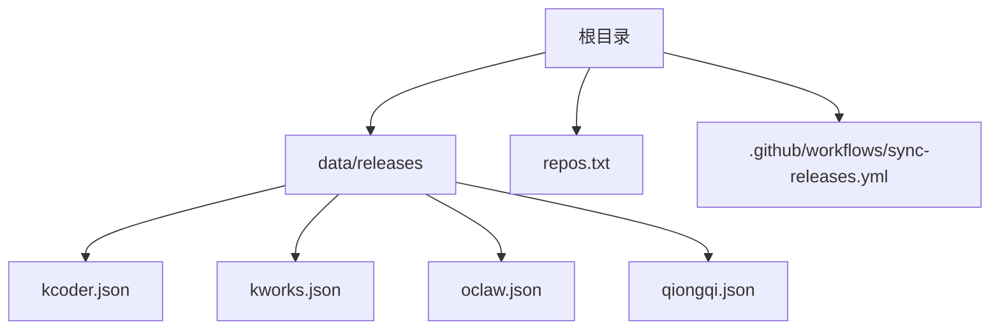
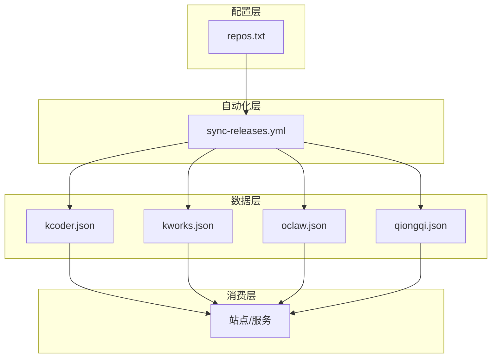
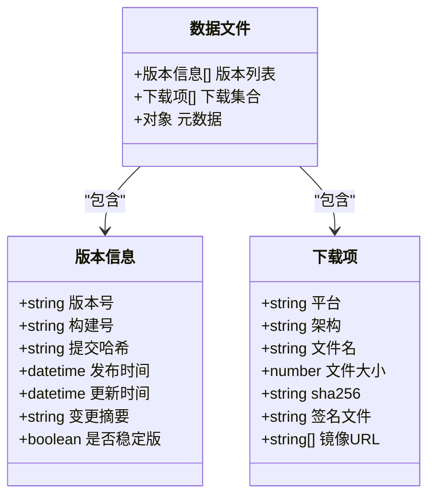
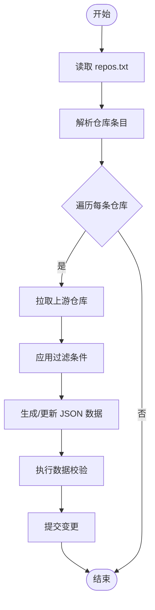
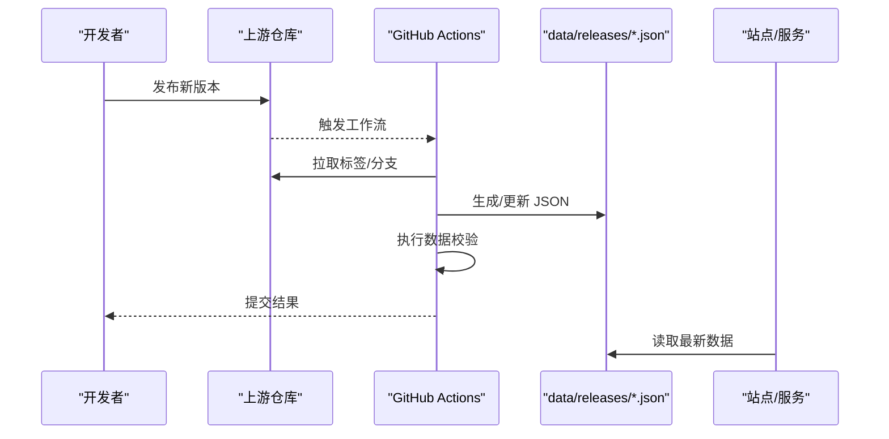
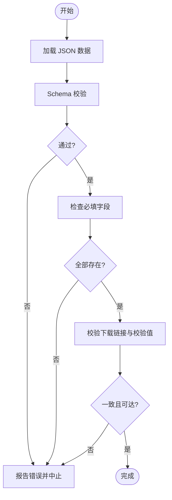
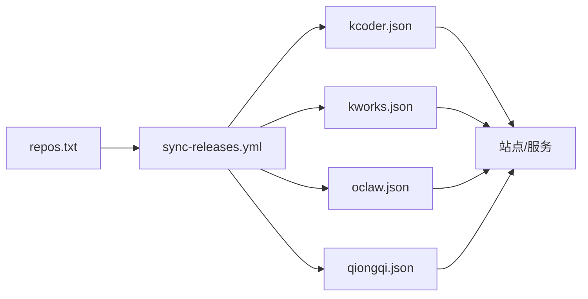

# 数据组件

<cite>
**本文引用的文件**   
- [repos.txt](file://repos.txt)
- [data/releases/kcoder.json](file://data/releases/kcoder.json)
- [data/releases/kworks.json](file://data/releases/kworks.json)
- [data/releases/oclaw.json](file://data/releases/oclaw.json)
- [data/releases/qiongqi.json](file://data/releases/qiongqi.json)
- [.github/workflows/sync-releases.yml](file://.github/workflows/sync-releases.yml)
</cite>

## 目录
1. [简介](#简介)
2. [项目结构](#项目结构)
3. [核心组件](#核心组件)
4. [架构总览](#架构总览)
5. [详细组件分析](#详细组件分析)
6. [依赖关系分析](#依赖关系分析)
7. [性能考虑](#性能考虑)
8. [故障排查指南](#故障排查指南)
9. [结论](#结论)
10. [附录](#附录)

## 简介
本章节面向 KReleaseWeb 项目的“数据组件”，聚焦于数据格式规范与文件组织，包括：
- JSON 数据文件的版本信息模型、下载链接管理、发布日期记录等数据结构
- repos.txt 配置的作用与格式要求
- 数据文件的创建、更新与维护流程
- 如何添加新产品或新版本的数据
- 数据验证规则与完整性检查方法

该文档旨在帮助开发者与维护者快速理解并正确维护发布数据，确保网站展示的一致性与准确性。

## 项目结构
KReleaseWeb 的数据组件主要位于 data/releases 目录，每个产品对应一个 JSON 文件；repos.txt 用于声明数据来源仓库清单；GitHub Actions 工作流负责自动化同步与校验。

图表来源
- [repos.txt](file://repos.txt)
- [data/releases/kcoder.json](file://data/releases/kcoder.json)
- [data/releases/kworks.json](file://data/releases/kworks.json)
- [data/releases/oclaw.json](file://data/releases/oclaw.json)
- [data/releases/qiongqi.json](file://data/releases/qiongqi.json)
- [.github/workflows/sync-releases.yml](file://.github/workflows/sync-releases.yml)

章节来源
- [repos.txt](file://repos.txt)
- [data/releases/kcoder.json](file://data/releases/kcoder.json)
- [data/releases/kworks.json](file://data/releases/kworks.json)
- [data/releases/oclaw.json](file://data/releases/oclaw.json)
- [data/releases/qiongqi.json](file://data/releases/qiongqi.json)
- [.github/workflows/sync-releases.yml](file://.github/workflows/sync-releases.yml)

## 核心组件
本节从“数据模型”和“配置清单”两个维度说明数据组件的核心组成。

- 数据模型（JSON）
  - 版本信息模型：包含版本号、构建标识、平台、架构、大小、哈希值、签名信息等字段
  - 下载链接管理：支持多平台/多架构的下载 URL、镜像源、直链与校验信息
  - 发布日期记录：发布时间、更新时间、变更日志摘要、是否稳定版等元数据
  - 扩展字段：可选的平台特定参数、兼容性说明、注意事项等

- 配置清单（repos.txt）
  - 作用：集中声明各产品的上游仓库地址与同步策略，供自动化流程读取
  - 格式要求：每行一条仓库条目，包含仓库 URL、分支/标签选择、过滤条件等
  - 维护建议：保持唯一性、避免重复、及时清理废弃仓库

章节来源
- [data/releases/kcoder.json](file://data/releases/kcoder.json)
- [data/releases/kworks.json](file://data/releases/kworks.json)
- [data/releases/oclaw.json](file://data/releases/oclaw.json)
- [data/releases/qiongqi.json](file://data/releases/qiongqi.json)
- [repos.txt](file://repos.txt)

## 架构总览
数据组件在整体系统中的角色如下：
- 数据层：data/releases/*.json 提供结构化发布数据
- 配置层：repos.txt 定义数据来源与同步策略
- 自动化层：GitHub Actions 工作流根据 repos.txt 拉取上游发布，生成或更新 JSON 数据
- 消费层：前端页面或其他服务读取 JSON 进行展示与分发

图表来源
- [repos.txt](file://repos.txt)
- [.github/workflows/sync-releases.yml](file://.github/workflows/sync-releases.yml)
- [data/releases/kcoder.json](file://data/releases/kcoder.json)
- [data/releases/kworks.json](file://data/releases/kworks.json)
- [data/releases/oclaw.json](file://data/releases/oclaw.json)
- [data/releases/qiongqi.json](file://data/releases/qiongqi.json)

## 详细组件分析

### JSON 数据文件格式规范
- 顶层结构
  - 通常包含版本列表、元数据、下载项集合等
  - 字段命名采用小驼峰或下划线风格，需保持一致
- 版本信息模型
  - 版本号：语义化版本（如 major.minor.patch），必要时附带预发布标识
  - 构建信息：构建号、提交哈希、编译时间等
  - 平台与架构：操作系统、CPU 架构、运行时依赖等
- 下载链接管理
  - 每个下载项包含：URL、文件名、大小、SHA256/MD5、签名文件、镜像地址
  - 支持多镜像与回退策略，提升可用性
- 发布日期记录
  - 发布时间：ISO 8601 格式
  - 更新时间：最近一次修订时间
  - 变更摘要：简要描述新增、修复、破坏性变更等
- 扩展字段
  - 平台特定参数、兼容性矩阵、已知问题、升级指引等

图表来源
- [data/releases/kcoder.json](file://data/releases/kcoder.json)
- [data/releases/kworks.json](file://data/releases/kworks.json)
- [data/releases/oclaw.json](file://data/releases/oclaw.json)
- [data/releases/qiongqi.json](file://data/releases/qiongqi.json)

章节来源
- [data/releases/kcoder.json](file://data/releases/kcoder.json)
- [data/releases/kworks.json](file://data/releases/kworks.json)
- [data/releases/oclaw.json](file://data/releases/oclaw.json)
- [data/releases/qiongqi.json](file://data/releases/qiongqi.json)

### repos.txt 配置文件
- 作用
  - 集中管理各产品的上游仓库地址与同步策略
  - 为自动化工作流提供输入，驱动数据生成与更新
- 格式要求
  - 每行一条仓库条目
  - 至少包含仓库 URL、目标分支或标签
  - 可选：过滤条件（按标签前缀、正则匹配）、产物路径、输出文件名映射
  - 注释行以 # 开头，空行将被忽略
- 维护建议
  - 保持条目唯一，避免重复仓库
  - 对废弃仓库及时移除或标记
  - 使用稳定的分支或标签，避免频繁变动导致同步失败

图表来源
- [repos.txt](file://repos.txt)
- [.github/workflows/sync-releases.yml](file://.github/workflows/sync-releases.yml)

章节来源
- [repos.txt](file://repos.txt)
- [.github/workflows/sync-releases.yml](file://.github/workflows/sync-releases.yml)

### 数据文件创建、更新与维护流程
- 创建新产品的数据文件
  - 在 data/releases 目录下新建对应产品的 JSON 文件
  - 在 repos.txt 中添加上游仓库条目
  - 触发工作流自动生成初始数据
- 更新现有版本
  - 在上游仓库发布新版本后，工作流自动拉取并更新 JSON
  - 如需手动修正，提交变更并触发校验
- 维护最佳实践
  - 保持字段一致性，遵循命名约定
  - 为每个版本提供完整的下载信息与校验值
  - 定期清理过期版本与无效链接

图表来源
- [.github/workflows/sync-releases.yml](file://.github/workflows/sync-releases.yml)
- [data/releases/kcoder.json](file://data/releases/kcoder.json)
- [data/releases/kworks.json](file://data/releases/kworks.json)
- [data/releases/oclaw.json](file://data/releases/oclaw.json)
- [data/releases/qiongqi.json](file://data/releases/qiongqi.json)

章节来源
- [.github/workflows/sync-releases.yml](file://.github/workflows/sync-releases.yml)
- [data/releases/kcoder.json](file://data/releases/kcoder.json)
- [data/releases/kworks.json](file://data/releases/kworks.json)
- [data/releases/oclaw.json](file://data/releases/oclaw.json)
- [data/releases/qiongqi.json](file://data/releases/qiongqi.json)

### 数据验证规则与完整性检查
- 必填字段
  - 版本号、发布时间、下载项 URL、文件大小、校验值（如 SHA256）
- 类型与格式
  - 日期采用 ISO 8601
  - 版本号符合语义化版本
  - 文件大小为非负整数
- 关联一致性
  - 每个下载项必须存在对应的校验值
  - 镜像 URL 列表非空时，主 URL 仍需有效
- 完整性检查
  - 工作流中执行 JSON Schema 校验
  - 校验所有下载链接可达性（可选）
  - 对比上游标签与本地数据差异，提示不一致

图表来源
- [.github/workflows/sync-releases.yml](file://.github/workflows/sync-releases.yml)
- [data/releases/kcoder.json](file://data/releases/kcoder.json)
- [data/releases/kworks.json](file://data/releases/kworks.json)
- [data/releases/oclaw.json](file://data/releases/oclaw.json)
- [data/releases/qiongqi.json](file://data/releases/qiongqi.json)

章节来源
- [.github/workflows/sync-releases.yml](file://.github/workflows/sync-releases.yml)
- [data/releases/kcoder.json](file://data/releases/kcoder.json)
- [data/releases/kworks.json](file://data/releases/kworks.json)
- [data/releases/oclaw.json](file://data/releases/oclaw.json)
- [data/releases/qiongqi.json](file://data/releases/qiongqi.json)

### 如何添加新产品版本数据
- 步骤概览
  - 在 data/releases 下创建新产品 JSON 文件
  - 在 repos.txt 中添加上游仓库条目
  - 提交变更并触发工作流
  - 检查工作流输出与数据校验结果
- 注意事项
  - 确保上游仓库可访问且标签/分支稳定
  - 为每个版本提供完整下载信息与校验值
  - 遵循命名约定与字段类型，避免后续校验失败

章节来源
- [repos.txt](file://repos.txt)
- [.github/workflows/sync-releases.yml](file://.github/workflows/sync-releases.yml)

## 依赖关系分析
数据组件之间的依赖关系如下：
- repos.txt 被工作流读取，作为数据生成的输入
- 工作流根据 repos.txt 拉取上游仓库并生成 JSON 数据
- JSON 数据被站点或服务消费，用于展示与分发

图表来源
- [repos.txt](file://repos.txt)
- [.github/workflows/sync-releases.yml](file://.github/workflows/sync-releases.yml)
- [data/releases/kcoder.json](file://data/releases/kcoder.json)
- [data/releases/kworks.json](file://data/releases/kworks.json)
- [data/releases/oclaw.json](file://data/releases/oclaw.json)
- [data/releases/qiongqi.json](file://data/releases/qiongqi.json)

章节来源
- [repos.txt](file://repos.txt)
- [.github/workflows/sync-releases.yml](file://.github/workflows/sync-releases.yml)
- [data/releases/kcoder.json](file://data/releases/kcoder.json)
- [data/releases/kworks.json](file://data/releases/kworks.json)
- [data/releases/oclaw.json](file://data/releases/oclaw.json)
- [data/releases/qiongqi.json](file://data/releases/qiongqi.json)

## 性能考虑
- 数据体积控制
  - 仅保留必要版本，归档历史版本到独立存储
  - 压缩大文件并提供分片下载
- 缓存策略
  - 对 JSON 数据启用 CDN 缓存
  - 对下载链接设置合理的 TTL
- 校验优化
  - 增量校验，仅处理变更版本
  - 并行校验多个下载项，减少等待时间

[本节为通用指导，不直接分析具体文件]

## 故障排查指南
- 常见问题
  - 工作流失败：检查 repos.txt 条目是否正确、上游仓库是否可访问
  - 数据校验失败：确认必填字段齐全、类型与格式正确
  - 下载链接不可用：检查 URL 有效性、镜像回退策略
- 定位方法
  - 查看工作流日志，定位错误位置
  - 使用 JSON 校验工具验证数据格式
  - 逐条检查下载项的可达性与校验值

章节来源
- [.github/workflows/sync-releases.yml](file://.github/workflows/sync-releases.yml)
- [data/releases/kcoder.json](file://data/releases/kcoder.json)
- [data/releases/kworks.json](file://data/releases/kworks.json)
- [data/releases/oclaw.json](file://data/releases/oclaw.json)
- [data/releases/qiongqi.json](file://data/releases/qiongqi.json)

## 结论
KReleaseWeb 的数据组件通过清晰的 JSON 数据模型与 repos.txt 配置，结合 GitHub Actions 自动化流程，实现了高效、可靠的发布数据管理与分发。遵循本文档的规范与实践，可有效降低维护成本，提升数据质量与系统稳定性。

[本节为总结性内容，不直接分析具体文件]

## 附录
- 术语表
  - 语义化版本：major.minor.patch 的版本编号方式
  - 校验值：用于验证文件完整性的哈希值（如 SHA256）
  - 镜像回退：当主下载源不可用时，尝试其他可用源
- 参考实现
  - 工作流示例：.github/workflows/sync-releases.yml
  - 数据文件示例：data/releases/*.json

[本节为补充信息，不直接分析具体文件]