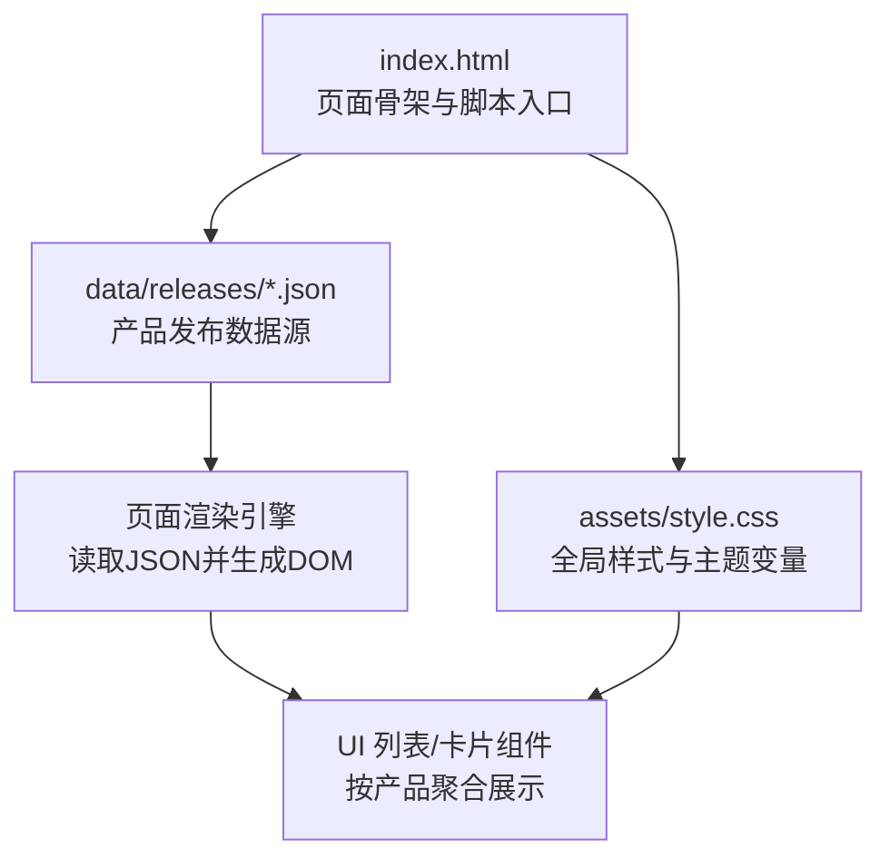
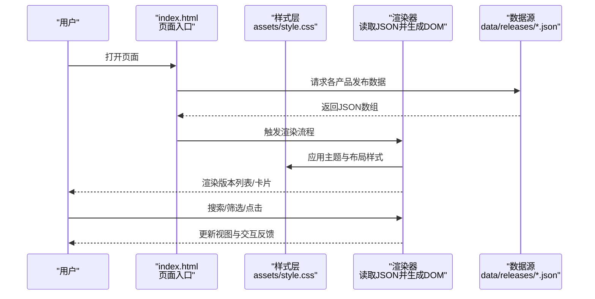
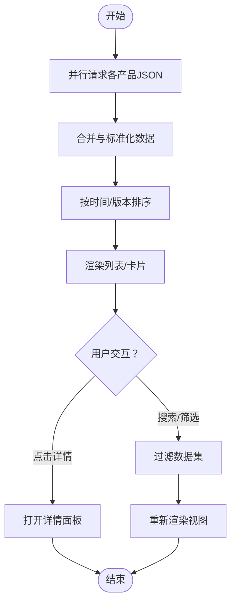
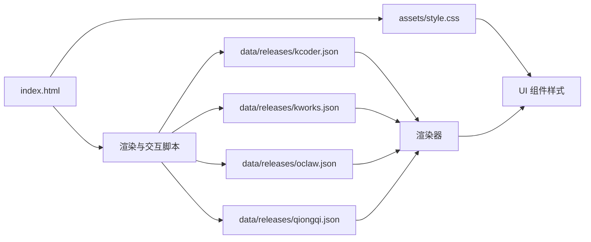

# 界面组件

<cite>
**本文引用的文件**   
- [index.html](file://index.html)
- [style.css](file://assets/style.css)
- [kcoder.json](file://data/releases/kcoder.json)
- [kworks.json](file://data/releases/kworks.json)
- [oclaw.json](file://data/releases/oclaw.json)
- [qiongqi.json](file://data/releases/qiongqi.json)
</cite>

## 目录
1. [简介](#简介)
2. [项目结构](#项目结构)
3. [核心组件](#核心组件)
4. [架构总览](#架构总览)
5. [详细组件分析](#详细组件分析)
6. [依赖关系分析](#依赖关系分析)
7. [性能考虑](#性能考虑)
8. [故障排查指南](#故障排查指南)
9. [结论](#结论)
10. [附录](#附录)

## 简介
本文件面向 KReleaseWeb 项目的界面组件，聚焦于 HTML 结构与 CSS 样式系统的设计与实现，涵盖响应式布局、版本信息展示逻辑、用户交互处理、页面渲染流程、数据绑定机制、样式定制方法，以及如何构建多产品版本的统一展示界面并扩展新的产品展示模块。文档旨在帮助开发者快速理解现有实现，并在不侵入业务逻辑的前提下进行主题化与功能扩展。

## 项目结构
KReleaseWeb 采用“静态资源 + 数据驱动”的轻量前端结构：
- index.html：页面骨架与脚本入口
- assets/style.css：全局样式与主题变量
- data/releases/*.json：各产品的发布数据源（如 kcoder、kworks、oclaw、qiongqi）

图表来源
- [index.html](file://index.html)
- [style.css](file://assets/style.css)
- [kcoder.json](file://data/releases/kcoder.json)
- [kworks.json](file://data/releases/kworks.json)
- [oclaw.json](file://data/releases/oclaw.json)
- [qiongqi.json](file://data/releases/qiongqi.json)

章节来源
- [index.html](file://index.html)
- [style.css](file://assets/style.css)
- [kcoder.json](file://data/releases/kcoder.json)
- [kworks.json](file://data/releases/kworks.json)
- [oclaw.json](file://data/releases/oclaw.json)
- [qiongqi.json](file://data/releases/qiongqi.json)

## 核心组件
- 页面容器与导航区：承载产品筛选、搜索框、分页或标签切换等交互入口
- 版本列表/卡片区域：以网格或列表形式呈现各产品的最新版本与历史版本
- 详情弹窗/抽屉：点击某版本后展示变更说明、下载链接、平台信息等
- 主题与样式层：通过 CSS 变量与媒体查询提供主题切换与响应式适配

关键职责
- 数据加载：从 data/releases/*.json 拉取并发布数据
- 数据绑定：将 JSON 映射为 DOM 节点，支持过滤、排序与分页
- 交互处理：监听搜索、筛选、点击事件，更新视图状态
- 样式定制：基于 CSS 变量与类名组合实现主题与布局切换

章节来源
- [index.html](file://index.html)
- [style.css](file://assets/style.css)
- [kcoder.json](file://data/releases/kcoder.json)
- [kworks.json](file://data/releases/kworks.json)
- [oclaw.json](file://data/releases/oclaw.json)
- [qiongqi.json](file://data/releases/qiongqi.json)

## 架构总览
整体采用“数据驱动 + 组件化渲染”的轻量架构：HTML 作为骨架，CSS 负责样式与主题，JavaScript 负责数据获取、解析与渲染。

图表来源
- [index.html](file://index.html)
- [style.css](file://assets/style.css)
- [kcoder.json](file://data/releases/kcoder.json)
- [kworks.json](file://data/releases/kworks.json)
- [oclaw.json](file://data/releases/oclaw.json)
- [qiongqi.json](file://data/releases/qiongqi.json)

## 详细组件分析

### 页面骨架与入口（index.html）
- 作用：定义页面结构、引入样式与脚本、挂载根容器
- 关键点：
  - 在头部引入全局样式与必要的元信息
  - 在主体中预留用于动态渲染的容器节点
  - 在底部引入脚本，初始化数据加载与渲染流程

章节来源
- [index.html](file://index.html)

### 样式系统与主题（assets/style.css）
- 作用：提供全局样式、组件样式、主题变量与响应式断点
- 关键点：
  - 使用 CSS 变量集中管理颜色、字号、间距、圆角等主题参数
  - 通过媒体查询实现移动端、平板、桌面端的自适应布局
  - 为不同产品或状态提供可复用的类名，便于主题扩展

章节来源
- [style.css](file://assets/style.css)

### 数据模型与数据源（data/releases/*.json）
- 作用：描述各产品的版本信息，供渲染器消费
- 典型字段（示例性说明，具体以实际 JSON 为准）：
  - 产品名称、版本号、发布日期、平台、下载链接、更新日志摘要等
- 多产品统一展示：
  - 每个产品一个 JSON 文件，命名规范清晰，便于批量加载与聚合
  - 渲染器根据产品维度分组，统一渲染到同一界面

章节来源
- [kcoder.json](file://data/releases/kcoder.json)
- [kworks.json](file://data/releases/kworks.json)
- [oclaw.json](file://data/releases/oclaw.json)
- [qiongqi.json](file://data/releases/qiongqi.json)

### 渲染流程与数据绑定
- 数据获取：并行请求多个 JSON，合并为统一的数据集
- 数据清洗：标准化字段、去重、排序（默认按发布时间倒序）
- 视图绑定：
  - 列表/卡片模板：根据数据结构生成节点
  - 过滤与搜索：按产品名称、关键字匹配
  - 分页/懒加载：控制首屏性能与滚动体验
- 交互更新：事件委托绑定，避免重复监听，提升性能

[此图为概念流程图，无需图表来源]

### 用户交互处理
- 搜索：输入关键词即时过滤，防抖优化
- 筛选：按产品、平台、版本类型（稳定/预览）筛选
- 详情：点击版本项弹出详情，展示完整变更说明与下载入口
- 主题切换：通过切换 CSS 变量或类名实现明暗主题

章节来源
- [index.html](file://index.html)
- [style.css](file://assets/style.css)

### 响应式布局实现
- 断点策略：小屏单列、中屏双列、大屏三列及以上
- 弹性布局：使用 Flex/Grid 实现自适应排列
- 字体与间距：随屏幕尺寸缩放，保证可读性与视觉层次

章节来源
- [style.css](file://assets/style.css)

### 多产品版本的统一展示与扩展
- 统一展示：
  - 所有产品共享同一渲染模板与样式体系
  - 通过产品维度分组，提供顶部导航或侧边栏切换
- 扩展新模块：
  - 新增 data/releases/<product>.json
  - 在入口配置中注册产品标识与数据来源
  - 复用现有模板与样式，无需改动核心渲染逻辑

章节来源
- [kcoder.json](file://data/releases/kcoder.json)
- [kworks.json](file://data/releases/kworks.json)
- [oclaw.json](file://data/releases/oclaw.json)
- [qiongqi.json](file://data/releases/qiongqi.json)
- [index.html](file://index.html)

### 样式定制与主题指南
- 主题变量：
  - 在样式文件中集中定义颜色、字号、阴影、圆角等变量
  - 通过切换根节点的类名或属性值切换主题
- 组件级样式：
  - 使用语义化类名，避免过度耦合
  - 为不同产品或状态提供可选修饰类
- 自定义建议：
  - 优先覆盖 CSS 变量而非重写规则
  - 保持响应式断点一致，避免布局错乱

章节来源
- [style.css](file://assets/style.css)

## 依赖关系分析
- 页面入口依赖样式与数据源
- 渲染器依赖数据模型与模板
- 交互逻辑依赖 DOM 事件与状态管理

图表来源
- [index.html](file://index.html)
- [style.css](file://assets/style.css)
- [kcoder.json](file://data/releases/kcoder.json)
- [kworks.json](file://data/releases/kworks.json)
- [oclaw.json](file://data/releases/oclaw.json)
- [qiongqi.json](file://data/releases/qiongqi.json)

章节来源
- [index.html](file://index.html)
- [style.css](file://assets/style.css)
- [kcoder.json](file://data/releases/kcoder.json)
- [kworks.json](file://data/releases/kworks.json)
- [oclaw.json](file://data/releases/oclaw.json)
- [qiongqi.json](file://data/releases/qiongqi.json)

## 性能考虑
- 并行请求：同时拉取多个 JSON，减少首屏等待
- 数据缓存：对已加载数据进行内存缓存，避免重复请求
- 虚拟列表/分页：大数据量时按需渲染，降低 DOM 压力
- 事件委托：统一监听父容器事件，减少监听器数量
- 样式优化：合理使用 CSS 变量与媒体查询，避免重排重绘

[本节为通用指导，无需章节来源]

## 故障排查指南
- 数据加载失败：
  - 检查 JSON 路径与网络可达性
  - 确认 JSON 格式符合预期字段
- 渲染异常：
  - 核对数据字段与模板绑定是否一致
  - 查看控制台错误栈定位问题
- 样式错乱：
  - 检查 CSS 变量是否被覆盖或未定义
  - 验证媒体查询断点是否与设备匹配
- 交互无响应：
  - 确认事件绑定是否在 DOM 就绪后执行
  - 检查事件冒泡与阻止行为

章节来源
- [index.html](file://index.html)
- [style.css](file://assets/style.css)

## 结论
KReleaseWeb 的界面组件采用简洁的数据驱动架构，通过统一的 HTML 骨架、可配置的 CSS 主题与标准化的 JSON 数据源，实现了多产品版本的统一展示与灵活扩展。遵循本文档的定制与扩展指南，可在不破坏既有结构的前提下完成主题化与功能增强。

[本节为总结，无需章节来源]

## 附录
- 术语说明：
  - 数据源：存放产品发布信息的 JSON 文件
  - 渲染器：负责将数据转换为 DOM 的逻辑
  - 主题变量：集中管理的样式参数集合
- 最佳实践：
  - 保持数据模型稳定，向后兼容
  - 使用语义化类名与模块化样式
  - 优先通过 CSS 变量进行主题定制

[本节为补充说明，无需章节来源]