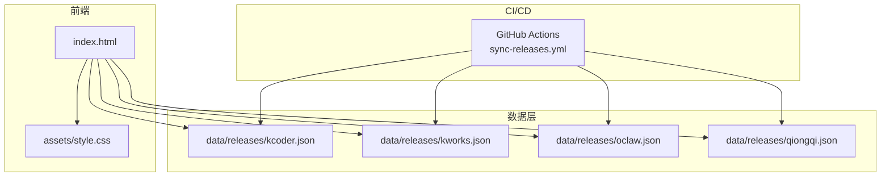
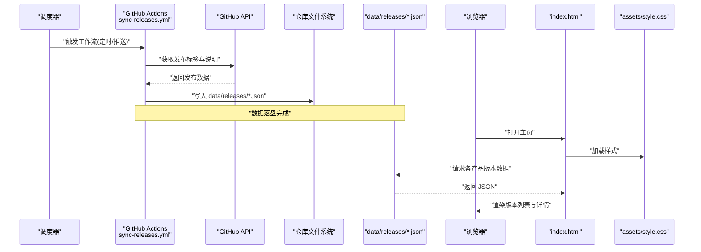
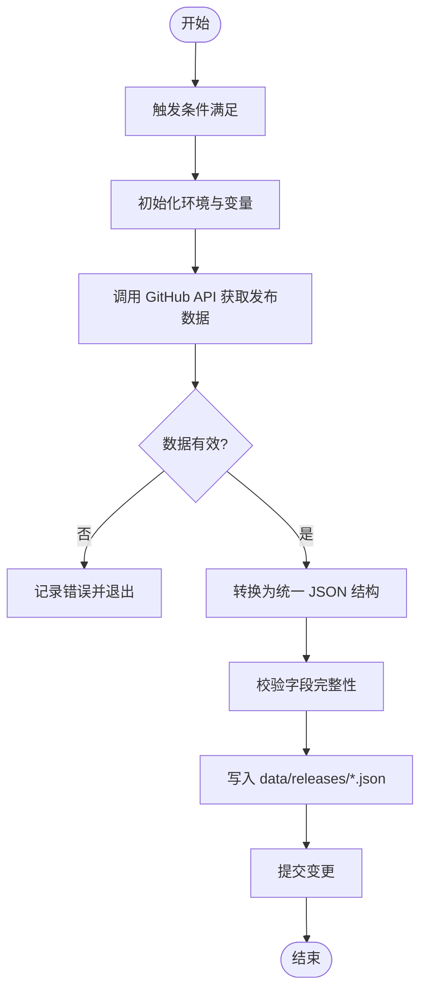
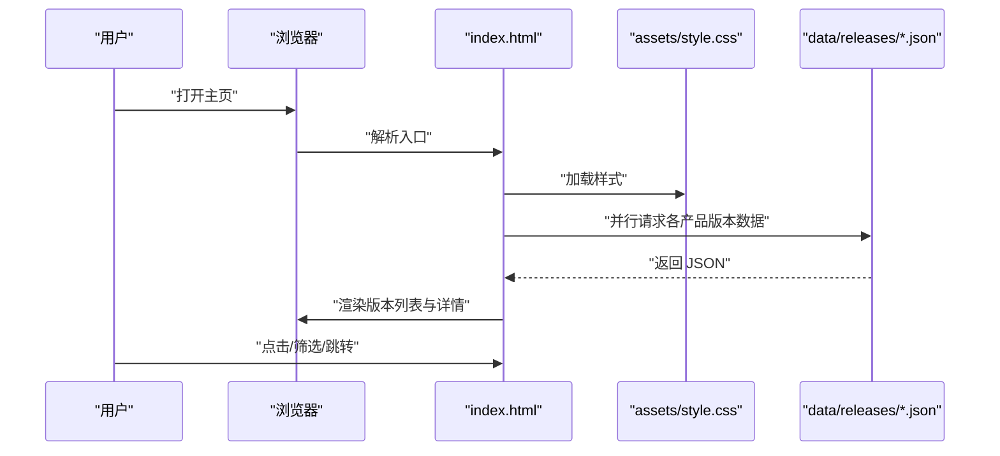
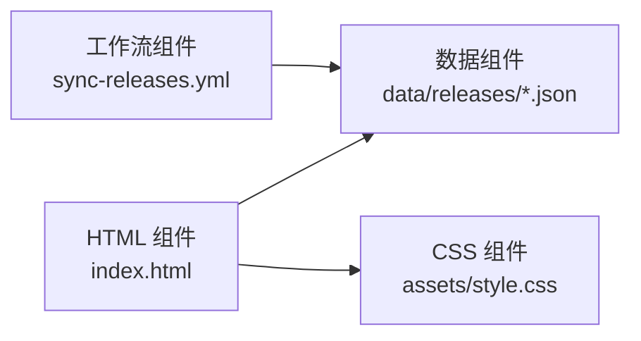

# 组件架构

<cite>
**本文引用的文件**   
- [index.html](file://index.html)
- [assets/style.css](file://assets/style.css)
- [data/releases/kcoder.json](file://data/releases/kcoder.json)
- [data/releases/kworks.json](file://data/releases/oclaw.json)
- [data/releases/qiongqi.json](file://data/releases/qiongqi.json)
- [.github/workflows/sync-releases.yml](file://.github/workflows/sync-releases.yml)
- [package.json](file://package.json)
- [vercel.json](file://vercel.json)
</cite>

## 目录
1. [简介](#简介)
2. [项目结构](#项目结构)
3. [核心组件](#核心组件)
4. [架构总览](#架构总览)
5. [详细组件分析](#详细组件分析)
6. [依赖关系分析](#依赖关系分析)
7. [性能考虑](#性能考虑)
8. [故障排查指南](#故障排查指南)
9. [结论](#结论)
10. [附录](#附录)

## 简介
本文件为 KReleaseWeb 项目的组件架构文档，聚焦以下四个核心组件：
- GitHub Actions 工作流组件：负责版本检测与自动更新（将远端发布数据同步到仓库的 JSON 数据文件）。
- HTML 界面组件：负责在浏览器中展示版本信息。
- CSS 样式组件：负责界面美化与布局。
- JSON 数据组件：负责版本数据的持久化存储与读取。

文档将详细说明各组件的职责、输入输出接口、依赖关系、通信机制（GitHub API 调用、文件系统操作、浏览器渲染）、生命周期管理与错误处理策略，并提供组件关系图与交互时序图，覆盖从“版本检测”到“页面展示”的完整流程。

## 项目结构
KReleaseWeb 采用静态站点模式部署，核心目录与职责如下：
- .github/workflows/sync-releases.yml：定义自动化工作流，拉取远端仓库的发布信息并写入 data/releases/*.json。
- index.html：前端入口，加载样式与脚本，渲染版本列表。
- assets/style.css：全局样式与主题。
- data/releases/*.json：按产品划分的版本数据文件，由工作流定期或触发式更新。
- vercel.json：部署配置（如路由、重定向等），用于托管平台解析。
- package.json：项目元信息与可能的脚本命令（若存在）。

图表来源
- [.github/workflows/sync-releases.yml:1-200](file://.github/workflows/sync-releases.yml#L1-L200)
- [index.html:1-200](file://index.html#L1-L200)
- [assets/style.css:1-200](file://assets/style.css#L1-L200)
- [data/releases/kcoder.json:1-200](file://data/releases/kcoder.json#L1-L200)
- [data/releases/kworks.json:1-200](file://data/releases/kworks.json#L1-L200)
- [data/releases/oclaw.json:1-200](file://data/releases/oclaw.json#L1-L200)
- [data/releases/qiongqi.json:1-200](file://data/releases/qiongqi.json#L1-L200)

章节来源
- [index.html:1-200](file://index.html#L1-L200)
- [assets/style.css:1-200](file://assets/style.css#L1-L200)
- [.github/workflows/sync-releases.yml:1-200](file://.github/workflows/sync-releases.yml#L1-L200)
- [vercel.json:1-200](file://vercel.json#L1-L200)
- [package.json:1-200](file://package.json#L1-L200)

## 核心组件
本节概述四大组件的职责与边界：
- GitHub Actions 工作流组件
  - 职责：定时或事件触发，查询目标仓库的发布标签与说明，生成标准化 JSON 并写入 data/releases/*.json。
  - 输入：目标仓库清单、认证令牌、分支与路径规则。
  - 输出：data/releases/*.json 数据文件。
  - 依赖：GitHub API、Git 工具链、仓库写权限。
- HTML 界面组件
  - 职责：作为单页入口，加载样式与脚本，发起对 data/releases/*.json 的请求，渲染版本列表与详情。
  - 输入：浏览器环境、网络可达性、JSON 数据文件。
  - 输出：DOM 结构与用户可交互的界面。
  - 依赖：浏览器 DOM、Fetch API、CSS。
- CSS 样式组件
  - 职责：提供主题、布局、响应式适配与视觉一致性。
  - 输入：HTML 结构类名与选择器约定。
  - 输出：样式规则与视觉效果。
  - 依赖：浏览器样式引擎。
- JSON 数据组件
  - 职责：以结构化格式保存每个产品的最新版本、历史版本、下载链接、说明等。
  - 输入：工作流生成的数据或手动维护的数据。
  - 输出：被前端读取的 JSON 资源。
  - 依赖：仓库文件系统、版本控制。

章节来源
- [.github/workflows/sync-releases.yml:1-200](file://.github/workflows/sync-releases.yml#L1-L200)
- [index.html:1-200](file://index.html#L1-L200)
- [assets/style.css:1-200](file://assets/style.css#L1-L200)
- [data/releases/kcoder.json:1-200](file://data/releases/kcoder.json#L1-L200)
- [data/releases/kworks.json:1-200](file://data/releases/kworks.json#L1-L200)
- [data/releases/oclaw.json:1-200](file://data/releases/oclaw.json#L1-L200)
- [data/releases/qiongqi.json:1-200](file://data/releases/qiongqi.json#L1-L200)

## 架构总览
下图展示了从“版本检测”到“页面展示”的整体流程，涵盖 CI/CD、数据层与前端渲染的关键步骤。

图表来源
- [.github/workflows/sync-releases.yml:1-200](file://.github/workflows/sync-releases.yml#L1-L200)
- [index.html:1-200](file://index.html#L1-L200)
- [assets/style.css:1-200](file://assets/style.css#L1-L200)
- [data/releases/kcoder.json:1-200](file://data/releases/kcoder.json#L1-L200)
- [data/releases/kworks.json:1-200](file://data/releases/kworks.json#L1-L200)
- [data/releases/oclaw.json:1-200](file://data/releases/oclaw.json#L1-L200)
- [data/releases/qiongqi.json:1-200](file://data/releases/qiongqi.json#L1-L200)

## 详细组件分析

### GitHub Actions 工作流组件
- 职责与范围
  - 监听触发条件（例如定时或推送事件）。
  - 使用 GitHub API 查询目标仓库的发布标签、说明与附件信息。
  - 将结果转换为统一结构的 JSON，写入 data/releases/*.json。
  - 提交变更并触发后续构建/部署。
- 输入与输出
  - 输入：目标仓库清单、访问令牌、分支与路径规则。
  - 输出：data/releases/*.json 数据文件。
- 关键实现要点
  - 并发与幂等：确保多次运行不会产生重复条目；支持增量更新。
  - 错误处理：API 限流、网络异常、权限不足时的重试与告警。
  - 安全：敏感信息通过环境变量注入，避免硬编码。
- 生命周期
  - 触发 -> 初始化环境 -> 拉取数据 -> 转换与校验 -> 写入文件 -> 提交并结束。
- 依赖关系
  - 外部：GitHub API、仓库写权限。
  - 内部：data/releases/*.json 数据契约。

图表来源
- [.github/workflows/sync-releases.yml:1-200](file://.github/workflows/sync-releases.yml#L1-L200)

章节来源
- [.github/workflows/sync-releases.yml:1-200](file://.github/workflows/sync-releases.yml#L1-L200)

### HTML 界面组件
- 职责与范围
  - 作为应用入口，加载样式与脚本。
  - 发起对 data/releases/*.json 的网络请求，解析并渲染版本列表与详情。
  - 提供基础交互（如筛选、排序、跳转下载链接）。
- 输入与输出
  - 输入：浏览器环境、网络可达性、JSON 数据文件。
  - 输出：DOM 树与用户可交互的界面。
- 关键实现要点
  - 数据加载：并行请求多个 JSON，聚合后渲染。
  - 容错：网络失败时显示降级提示或缓存数据。
  - 可访问性：语义化标签与键盘导航支持。
- 生命周期
  - 页面加载 -> 解析配置 -> 请求数据 -> 渲染视图 -> 绑定交互。
- 依赖关系
  - 外部：浏览器 Fetch API、CSS。
  - 内部：data/releases/*.json 数据契约。

图表来源
- [index.html:1-200](file://index.html#L1-L200)
- [assets/style.css:1-200](file://assets/style.css#L1-L200)
- [data/releases/kcoder.json:1-200](file://data/releases/kcoder.json#L1-L200)
- [data/releases/kworks.json:1-200](file://data/releases/kworks.json#L1-L200)
- [data/releases/oclaw.json:1-200](file://data/releases/oclaw.json#L1-L200)
- [data/releases/qiongqi.json:1-200](file://data/releases/qiongqi.json#L1-L200)

章节来源
- [index.html:1-200](file://index.html#L1-L200)

### CSS 样式组件
- 职责与范围
  - 定义全局主题、排版、间距与颜色体系。
  - 提供响应式布局与组件级样式。
- 输入与输出
  - 输入：HTML 结构类名与选择器约定。
  - 输出：样式规则与视觉效果。
- 关键实现要点
  - 模块化：按功能域组织样式，避免冲突。
  - 可维护性：使用变量与命名规范，便于扩展。
  - 兼容性：考虑主流浏览器的差异。
- 生命周期
  - 随页面加载而生效，无运行时状态。
- 依赖关系
  - 依赖 HTML 的结构约定。

章节来源
- [assets/style.css:1-200](file://assets/style.css#L1-L200)

### JSON 数据组件
- 职责与范围
  - 以统一结构保存每个产品的版本信息，包括版本号、发布日期、说明、下载链接等。
  - 供前端读取与渲染。
- 输入与输出
  - 输入：工作流生成的数据或人工维护的数据。
  - 输出：被前端读取的 JSON 资源。
- 关键实现要点
  - 数据契约：字段类型、必填项、枚举值需保持一致。
  - 版本化：保留历史版本，支持回滚与对比。
  - 校验：工作流侧进行基本校验，减少脏数据。
- 生命周期
  - 由工作流更新，前端按需读取。
- 依赖关系
  - 被工作流写入，被前端读取。

章节来源
- [data/releases/kcoder.json:1-200](file://data/releases/kcoder.json#L1-L200)
- [data/releases/kworks.json:1-200](file://data/releases/kworks.json#L1-L200)
- [data/releases/oclaw.json:1-200](file://data/releases/oclaw.json#L1-L200)
- [data/releases/qiongqi.json:1-200](file://data/releases/qiongqi.json#L1-L200)

## 依赖关系分析
- 组件耦合
  - 工作流组件与数据组件强耦合（写入 JSON）。
  - HTML 组件与数据组件弱耦合（仅依赖 JSON 契约）。
  - CSS 组件与 HTML 组件通过选择器约定耦合。
- 外部依赖
  - GitHub API（工作流组件）。
  - 浏览器 Fetch API（HTML 组件）。
  - 部署平台（Vercel）解析配置。
- 潜在循环依赖
  - 无直接循环依赖；数据单向流动：工作流 -> JSON -> 前端。

图表来源
- [.github/workflows/sync-releases.yml:1-200](file://.github/workflows/sync-releases.yml#L1-L200)
- [index.html:1-200](file://index.html#L1-L200)
- [assets/style.css:1-200](file://assets/style.css#L1-L200)
- [data/releases/kcoder.json:1-200](file://data/releases/kcoder.json#L1-L200)
- [data/releases/kworks.json:1-200](file://data/releases/kworks.json#L1-L200)
- [data/releases/oclaw.json:1-200](file://data/releases/oclaw.json#L1-L200)
- [data/releases/qiongqi.json:1-200](file://data/releases/qiongqi.json#L1-L200)

章节来源
- [.github/workflows/sync-releases.yml:1-200](file://.github/workflows/sync-releases.yml#L1-L200)
- [index.html:1-200](file://index.html#L1-L200)
- [assets/style.css:1-200](file://assets/style.css#L1-L200)
- [data/releases/kcoder.json:1-200](file://data/releases/kcoder.json#L1-L200)
- [data/releases/kworks.json:1-200](file://data/releases/kworks.json#L1-L200)
- [data/releases/oclaw.json:1-200](file://data/releases/oclaw.json#L1-L200)
- [data/releases/qiongqi.json:1-200](file://data/releases/qiongqi.json#L1-L200)

## 性能考虑
- 数据加载优化
  - 并行请求多个 JSON，缩短首屏时间。
  - 合理分页与懒加载，避免一次性渲染大量节点。
- 缓存策略
  - 利用浏览器缓存与 CDN 缓存，减少重复请求。
  - 前端可对 JSON 做短期内存缓存，提升交互流畅度。
- 渲染优化
  - 虚拟滚动或分片渲染，降低大列表的 DOM 压力。
  - 样式与脚本分离，减少阻塞。
- 部署优化
  - 使用 Vercel 等平台进行边缘缓存与快速分发。
  - 压缩与合并资源，减小体积。

[本节为通用指导，不直接分析具体文件]

## 故障排查指南
- 工作流失败
  - 现象：data/releases/*.json 未更新或为空。
  - 排查：检查触发条件、环境变量、仓库权限、API 限流与日志。
  - 建议：增加重试与告警，记录失败原因。
- 前端无法加载数据
  - 现象：页面空白或提示加载失败。
  - 排查：确认 JSON 路径与 CORS 设置，检查网络与缓存。
  - 建议：增加降级提示与离线缓存。
- 样式异常
  - 现象：布局错乱或主题不一致。
  - 排查：检查选择器是否匹配、样式加载顺序与浏览器兼容。
  - 建议：引入样式调试工具与断点测试。
- 数据不一致
  - 现象：前端显示与预期不符。
  - 排查：校验 JSON 字段完整性与类型，检查工作流转换逻辑。
  - 建议：在写入前进行数据校验与快照备份。

章节来源
- [.github/workflows/sync-releases.yml:1-200](file://.github/workflows/sync-releases.yml#L1-L200)
- [index.html:1-200](file://index.html#L1-L200)
- [assets/style.css:1-200](file://assets/style.css#L1-L200)
- [data/releases/kcoder.json:1-200](file://data/releases/kcoder.json#L1-L200)
- [data/releases/kworks.json:1-200](file://data/releases/kworks.json#L1-L200)
- [data/releases/oclaw.json:1-200](file://data/releases/oclaw.json#L1-L200)
- [data/releases/qiongqi.json:1-200](file://data/releases/qiongqi.json#L1-L200)

## 结论
KReleaseWeb 通过清晰的组件划分与单向数据流，实现了“版本检测—数据持久化—前端渲染”的闭环。工作流组件保证数据源的新鲜度，JSON 数据组件提供稳定契约，HTML 与 CSS 组件共同负责用户体验。建议在现有基础上进一步完善错误处理、监控与缓存策略，以提升系统的健壮性与性能。

[本节为总结性内容，不直接分析具体文件]

## 附录
- 部署配置参考
  - vercel.json：用于配置路由、重定向与构建参数。
  - package.json：项目元信息与脚本命令（若存在）。

章节来源
- [vercel.json:1-200](file://vercel.json#L1-L200)
- [package.json:1-200](file://package.json#L1-L200)