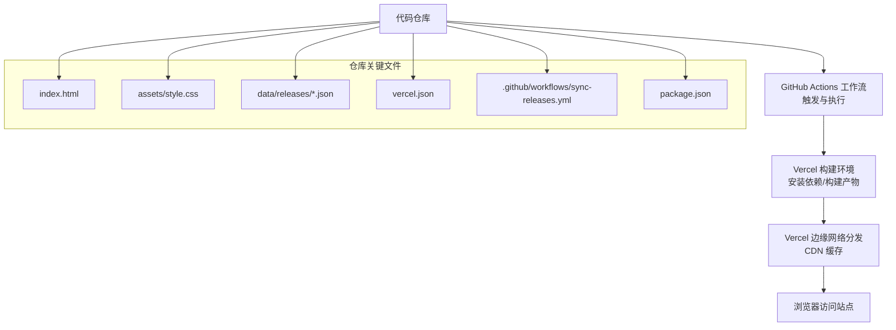
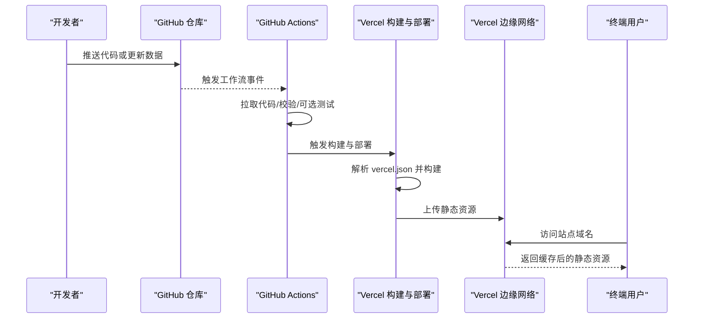
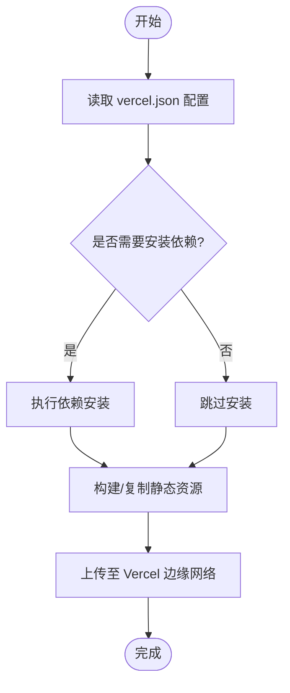
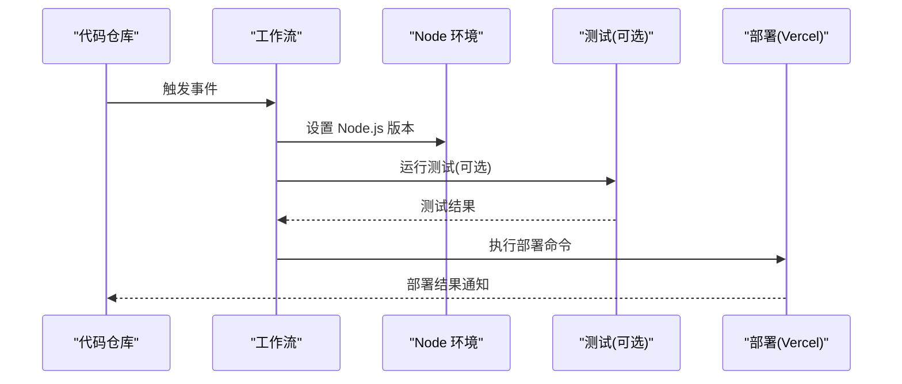
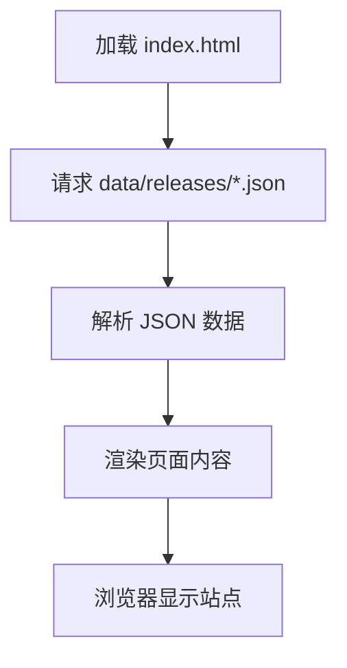
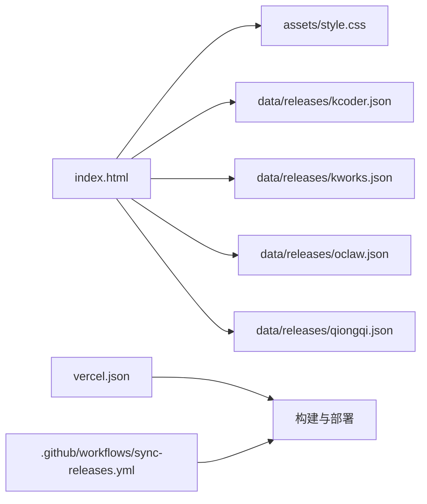

# 部署架构

<cite>
**本文引用的文件**   
- [README.md](file://README.md)
- [package.json](file://package.json)
- [vercel.json](file://vercel.json)
- [.github/workflows/sync-releases.yml](file://.github/workflows/sync-releases.yml)
- [index.html](file://index.html)
- [data/releases/kcoder.json](file://data/releases/kcoder.json)
- [data/releases/kworks.json](file://data/releases/kworks.json)
- [data/releases/oclaw.json](file://data/releases/oclaw.json)
- [data/releases/qiongqi.json](file://data/releases/qiongqi.json)
</cite>

## 目录
1. [简介](#简介)
2. [项目结构](#项目结构)
3. [核心组件](#核心组件)
4. [架构总览](#架构总览)
5. [详细组件分析](#详细组件分析)
6. [依赖分析](#依赖分析)
7. [性能考虑](#性能考虑)
8. [故障排除指南](#故障排除指南)
9. [结论](#结论)
10. [附录](#附录)

## 简介
本文件为 KReleaseWeb 项目的部署架构文档，聚焦于基于 Vercel 的静态网站部署方案。内容涵盖：
- 构建流程与环境配置
- 域名管理与平台特性使用
- GitHub Actions 工作流驱动的自动化流水线（触发、测试、发布、部署）
- 基础设施要求（Node.js 版本兼容、Vercel 特性、第三方服务集成）
- 环境变量与缓存策略
- 性能优化建议
- 从代码仓库到生产环境的完整部署链路图
- 故障排除与监控告警建议

## 项目结构
KReleaseWeb 是一个以数据驱动为主的静态站点，核心由 HTML、CSS、JSON 数据文件以及 Vercel 配置文件组成，并通过 GitHub Actions 实现持续集成与部署。

图表来源
- [index.html:1-200](file://index.html#L1-L200)
- [assets/style.css:1-200](file://assets/style.css#L1-L200)
- [data/releases/kcoder.json:1-200](file://data/releases/kcoder.json#L1-L200)
- [data/releases/kworks.json:1-200](file://data/releases/kworks.json#L1-L200)
- [data/releases/oclaw.json:1-200](file://data/releases/oclaw.json#L1-L200)
- [data/releases/qiongqi.json:1-200](file://data/releases/qiongqi.json#L1-L200)
- [vercel.json:1-200](file://vercel.json#L1-L200)
- [.github/workflows/sync-releases.yml:1-200](file://.github/workflows/sync-releases.yml#L1-L200)
- [package.json:1-200](file://package.json#L1-L200)

章节来源
- [README.md:1-200](file://README.md#L1-L200)
- [package.json:1-200](file://package.json#L1-L200)
- [vercel.json:1-200](file://vercel.json#L1-L200)
- [.github/workflows/sync-releases.yml:1-200](file://.github/workflows/sync-releases.yml#L1-L200)
- [index.html:1-200](file://index.html#L1-L200)
- [data/releases/kcoder.json:1-200](file://data/releases/kcoder.json#L1-L200)
- [data/releases/kworks.json:1-200](file://data/releases/kworks.json#L1-L200)
- [data/releases/oclaw.json:1-200](file://data/releases/oclaw.json#L1-L200)
- [data/releases/qiongqi.json:1-200](file://data/releases/qiongqi.json#L1-L200)

## 核心组件
- 静态站点入口与样式
  - index.html：站点主页面，负责加载资源与渲染数据。
  - assets/style.css：全局样式定义。
- 数据层
  - data/releases/*.json：各产品线的发布信息数据源，供前端读取展示。
- 平台配置
  - vercel.json：Vercel 构建与路由规则、缓存策略等配置。
- 自动化流水线
  - .github/workflows/sync-releases.yml：GitHub Actions 工作流，用于同步发布信息与触发部署。
- 工程元信息
  - package.json：项目元信息与可能的脚本命令（若存在）。

章节来源
- [index.html:1-200](file://index.html#L1-L200)
- [assets/style.css:1-200](file://assets/style.css#L1-L200)
- [data/releases/kcoder.json:1-200](file://data/releases/kcoder.json#L1-L200)
- [data/releases/kworks.json:1-200](file://data/releases/kworks.json#L1-L200)
- [data/releases/oclaw.json:1-200](file://data/releases/oclaw.json#L1-L200)
- [data/releases/qiongqi.json:1-200](file://data/releases/qiongqi.json#L1-L200)
- [vercel.json:1-200](file://vercel.json#L1-L200)
- [.github/workflows/sync-releases.yml:1-200](file://.github/workflows/sync-releases.yml#L1-L200)
- [package.json:1-200](file://package.json#L1-L200)

## 架构总览
下图展示了从代码提交到生产环境上线的端到端流程，包括触发条件、构建与部署、CDN 分发与访问路径。

图表来源
- [.github/workflows/sync-releases.yml:1-200](file://.github/workflows/sync-releases.yml#L1-L200)
- [vercel.json:1-200](file://vercel.json#L1-L200)
- [index.html:1-200](file://index.html#L1-L200)

## 详细组件分析

### 构建与部署（Vercel）
- 构建入口与规则
  - 通过 vercel.json 声明构建与路由行为，确保静态资源正确输出与缓存。
- 构建产物
  - 静态 HTML/CSS/JSON 资源，无需服务端运行时。
- 部署目标
  - Vercel 自动检测静态站点并生成预览/生产部署。

图表来源
- [vercel.json:1-200](file://vercel.json#L1-L200)

章节来源
- [vercel.json:1-200](file://vercel.json#L1-L200)

### 自动化流水线（GitHub Actions）
- 触发方式
  - 当仓库发生推送或特定事件时，工作流被触发。
- 主要步骤
  - 拉取代码、设置 Node.js 环境（如需要）、运行可选测试、调用 Vercel CLI 或 API 触发部署。
- 版本与发布
  - 可通过标签或分支策略控制发布；工作流可结合版本号进行标记与回滚。

图表来源
- [.github/workflows/sync-releases.yml:1-200](file://.github/workflows/sync-releases.yml#L1-L200)
- [package.json:1-200](file://package.json#L1-L200)

章节来源
- [.github/workflows/sync-releases.yml:1-200](file://.github/workflows/sync-releases.yml#L1-L200)
- [package.json:1-200](file://package.json#L1-L200)

### 数据与渲染（前端）
- 数据来源
  - data/releases/*.json 提供各产品线发布信息。
- 渲染逻辑
  - index.html 在浏览器中加载 JSON 数据并渲染页面。
- 样式与交互
  - assets/style.css 提供统一样式。

图表来源
- [index.html:1-200](file://index.html#L1-L200)
- [data/releases/kcoder.json:1-200](file://data/releases/kcoder.json#L1-L200)
- [data/releases/kworks.json:1-200](file://data/releases/kworks.json#L1-L200)
- [data/releases/oclaw.json:1-200](file://data/releases/oclaw.json#L1-L200)
- [data/releases/qiongqi.json:1-200](file://data/releases/qiongqi.json#L1-L200)
- [assets/style.css:1-200](file://assets/style.css#L1-L200)

章节来源
- [index.html:1-200](file://index.html#L1-L200)
- [data/releases/kcoder.json:1-200](file://data/releases/kcoder.json#L1-L200)
- [data/releases/kworks.json:1-200](file://data/releases/kworks.json#L1-L200)
- [data/releases/oclaw.json:1-200](file://data/releases/oclaw.json#L1-L200)
- [data/releases/qiongqi.json:1-200](file://data/releases/qiongqi.json#L1-L200)
- [assets/style.css:1-200](file://assets/style.css#L1-L200)

### 域名管理
- 自定义域名绑定
  - 在 Vercel 控制台为项目添加自定义域名，并按提示完成 DNS 解析记录。
- HTTPS 证书
  - Vercel 自动签发与管理 HTTPS 证书。
- 重定向与多域名
  - 通过 vercel.json 配置重定向规则，支持多域名与路径映射。

章节来源
- [vercel.json:1-200](file://vercel.json#L1-L200)

## 依赖分析
- 外部依赖
  - 无后端依赖，仅依赖浏览器与 Vercel 平台能力。
- 内部依赖关系
  - index.html 依赖 assets/style.css 与 data/releases/*.json。
  - vercel.json 影响构建与部署行为。
  - GitHub Actions 工作流依赖仓库结构与必要的环境变量（如 Vercel Token）。

图表来源
- [index.html:1-200](file://index.html#L1-L200)
- [assets/style.css:1-200](file://assets/style.css#L1-L200)
- [data/releases/kcoder.json:1-200](file://data/releases/kcoder.json#L1-L200)
- [data/releases/kworks.json:1-200](file://data/releases/kworks.json#L1-L200)
- [data/releases/oclaw.json:1-200](file://data/releases/oclaw.json#L1-L200)
- [data/releases/qiongqi.json:1-200](file://data/releases/qiongqi.json#L1-L200)
- [vercel.json:1-200](file://vercel.json#L1-L200)
- [.github/workflows/sync-releases.yml:1-200](file://.github/workflows/sync-releases.yml#L1-L200)

章节来源
- [index.html:1-200](file://index.html#L1-L200)
- [assets/style.css:1-200](file://assets/style.css#L1-L200)
- [data/releases/kcoder.json:1-200](file://data/releases/kcoder.json#L1-L200)
- [data/releases/kworks.json:1-200](file://data/releases/kworks.json#L1-L200)
- [data/releases/oclaw.json:1-200](file://data/releases/oclaw.json#L1-L200)
- [data/releases/qiongqi.json:1-200](file://data/releases/qiongqi.json#L1-L200)
- [vercel.json:1-200](file://vercel.json#L1-L200)
- [.github/workflows/sync-releases.yml:1-200](file://.github/workflows/sync-releases.yml#L1-L200)

## 性能考虑
- 静态资源缓存
  - 利用 Vercel 的 CDN 缓存与 HTTP 缓存头，提升首屏加载速度。
- 资源体积优化
  - 压缩图片与样式，按需加载数据，减少不必要的请求。
- 构建缓存
  - 合理配置 vercel.json 的缓存策略，避免重复构建。
- 边缘加速
  - 借助 Vercel 全球边缘节点就近分发静态资源。

[本节为通用指导，不直接分析具体文件]

## 故障排除指南
- 构建失败
  - 检查 vercel.json 配置是否正确，确认是否存在无效的路由或缓存规则。
  - 查看 Vercel 构建日志定位错误原因。
- 部署未生效
  - 确认 GitHub Actions 工作流是否成功执行，检查环境变量（如 Vercel Token）是否配置。
  - 清理浏览器缓存或使用无痕模式验证。
- 数据未更新
  - 确认 data/releases/*.json 已提交并触发工作流。
  - 检查前端请求路径与文件名是否匹配。
- 域名解析问题
  - 核对 DNS 记录是否按 Vercel 提示配置，等待传播时间。
  - 检查 HTTPS 证书状态与域名绑定。

章节来源
- [vercel.json:1-200](file://vercel.json#L1-L200)
- [.github/workflows/sync-releases.yml:1-200](file://.github/workflows/sync-releases.yml#L1-L200)
- [index.html:1-200](file://index.html#L1-L200)
- [data/releases/kcoder.json:1-200](file://data/releases/kcoder.json#L1-L200)
- [data/releases/kworks.json:1-200](file://data/releases/kworks.json#L1-L200)
- [data/releases/oclaw.json:1-200](file://data/releases/oclaw.json#L1-L200)
- [data/releases/qiongqi.json:1-200](file://data/releases/qiongqi.json#L1-L200)

## 结论
KReleaseWeb 采用极简的静态站点架构，依托 Vercel 的构建与边缘网络能力，配合 GitHub Actions 实现自动化流水线，能够快速、稳定地交付发布页。通过合理的缓存与性能优化策略，可获得良好的用户体验。建议在后续迭代中完善监控与告警机制，进一步提升可观测性与运维效率。

[本节为总结性内容，不直接分析具体文件]

## 附录
- 环境变量建议
  - 在 Vercel 项目中配置必要的令牌与密钥（例如 Vercel Token），并在 GitHub Secrets 中保存敏感信息。
- 监控与告警建议
  - 使用 Vercel Analytics 或第三方监控服务（如 UptimeRobot、Pingdom）对站点可用性进行监控。
  - 配置 GitHub Actions 通知渠道（邮件、Slack、企业微信等）以便及时获知构建与部署状态。

[本节为补充建议，不直接分析具体文件]