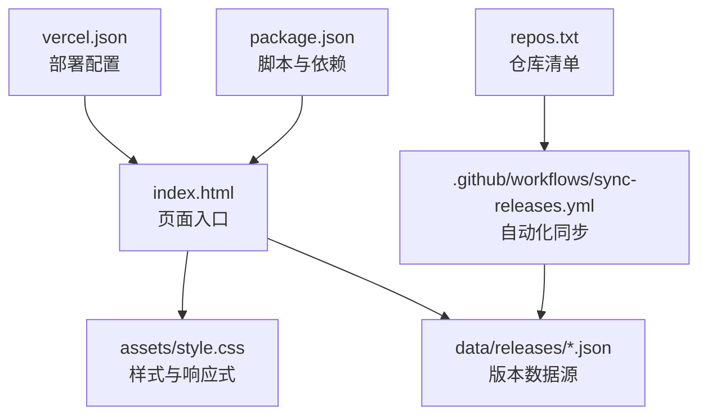
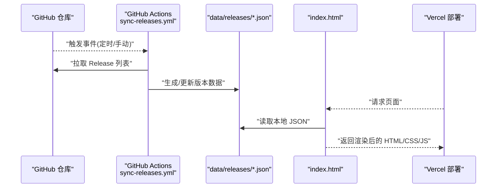
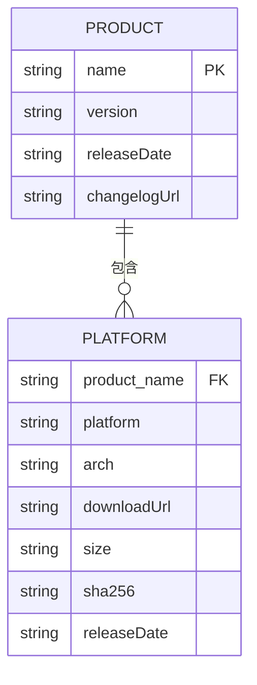
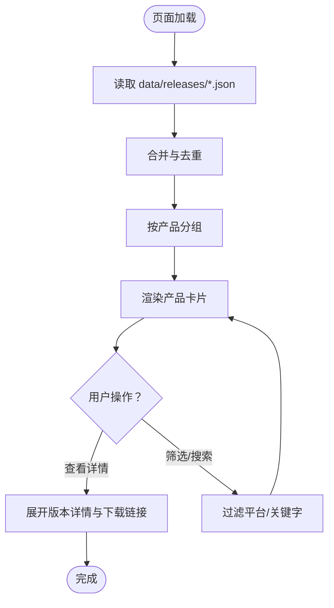
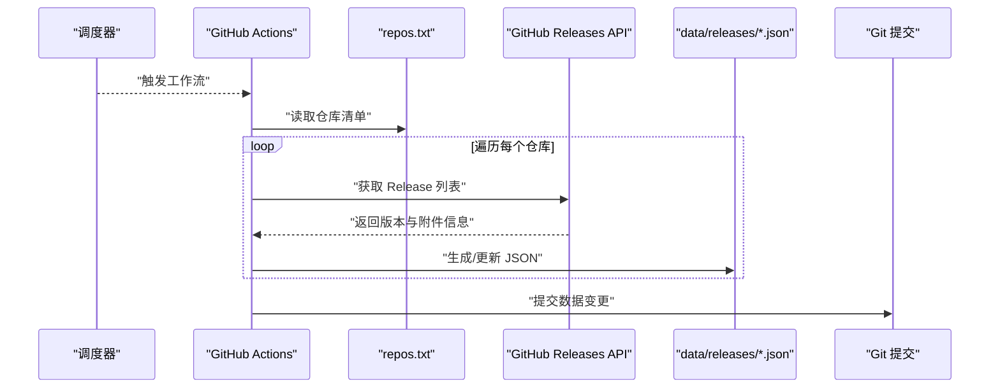
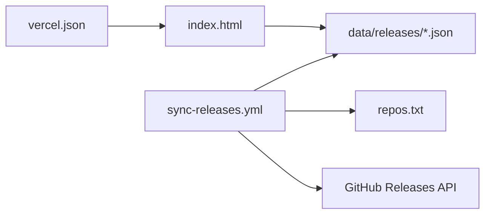

# 核心功能

<cite>
**本文引用的文件**   
- [index.html](file://index.html)
- [README.md](file://README.md)
- [package.json](file://package.json)
- [vercel.json](file://vercel.json)
- [.github/workflows/sync-releases.yml](file://.github/workflows/sync-releases.yml)
- [repos.txt](file://repos.txt)
- [data/releases/kcoder.json](file://data/releases/kcoder.json)
- [data/releases/kworks.json](file://data/releases/kworks.json)
- [data/releases/oclaw.json](file://data/releases/oclaw.json)
- [data/releases/qiongqi.json](file://data/releases/qiongqi.json)
- [assets/style.css](file://assets/style.css)
</cite>

## 目录
1. [简介](#简介)
2. [项目结构](#项目结构)
3. [核心组件](#核心组件)
4. [架构总览](#架构总览)
5. [详细组件分析](#详细组件分析)
6. [依赖关系分析](#依赖关系分析)
7. [性能考虑](#性能考虑)
8. [故障排查指南](#故障排查指南)
9. [结论](#结论)
10. [附录](#附录)

## 简介
KReleaseWeb 是一个轻量级的“多产品版本发布聚合展示”站点。其核心目标包括：
- 集中存储与展示多个产品的最新版本信息（版本号、发布时间、下载链接等）
- 提供版本详情查看机制与下载链接管理
- 通过 GitHub Actions 自动化同步上游仓库的 Release 数据，保持页面数据最新
- 以响应式界面呈现产品信息，便于在不同设备上浏览

该文档面向初学者与有经验的开发者，既提供高层概览，也深入到实现细节、调用关系与配置项说明。

## 项目结构
仓库采用“静态站点 + 数据驱动”的组织方式：
- 前端入口 index.html 负责加载样式与渲染逻辑
- 样式 assets/style.css 提供响应式布局与主题
- 数据 data/releases/*.json 存放各产品的版本清单
- 自动化 .github/workflows/sync-releases.yml 定时或触发更新数据
- 部署 vercel.json 指定构建与路由规则
- 包配置 package.json 定义脚本与依赖
- 仓库列表 repos.txt 用于自动化流程识别需要扫描的仓库

图表来源
- [index.html:1-200](file://index.html#L1-L200)
- [assets/style.css:1-200](file://assets/style.css#L1-L200)
- [.github/workflows/sync-releases.yml:1-200](file://.github/workflows/sync-releases.yml#L1-L200)
- [repos.txt:1-200](file://repos.txt#L1-L200)
- [vercel.json:1-200](file://vercel.json#L1-L200)
- [package.json:1-200](file://package.json#L1-L200)

章节来源
- [index.html:1-200](file://index.html#L1-L200)
- [assets/style.css:1-200](file://assets/style.css#L1-L200)
- [.github/workflows/sync-releases.yml:1-200](file://.github/workflows/sync-releases.yml#L1-L200)
- [repos.txt:1-200](file://repos.txt#L1-L200)
- [vercel.json:1-200](file://vercel.json#L1-L200)
- [package.json:1-200](file://package.json#L1-L200)

## 核心组件
- 版本数据模型（JSON）
  - 每个产品在 data/releases 下对应一个 JSON 文件，包含产品名称、版本列表、平台、下载链接、发布日期等字段。
  - 典型字段建议：name、version、platforms[]、downloadUrl、releaseDate、notes、changelogUrl 等。
- 页面渲染器（index.html）
  - 读取 data/releases/*.json，合并为统一视图模型，按产品分组渲染版本列表。
  - 支持点击展开查看版本详情与下载链接。
- 样式与响应式（assets/style.css）
  - 使用媒体查询适配不同屏幕尺寸，提供卡片式布局与网格排版。
- 自动化同步（GitHub Actions）
  - 基于 workflows/sync-releases.yml 定时或手动触发，拉取各仓库 Release 并生成/更新 data/releases/*.json。
- 部署配置（vercel.json）
  - 配置 SPA 路由回退与静态资源缓存策略，确保页面稳定访问。

章节来源
- [data/releases/kcoder.json:1-200](file://data/releases/kcoder.json#L1-L200)
- [data/releases/kworks.json:1-200](file://data/releases/kworks.json#L1-L200)
- [data/releases/oclaw.json:1-200](file://data/releases/oclaw.json#L1-L200)
- [data/releases/qiongqi.json:1-200](file://data/releases/qiongqi.json#L1-L200)
- [index.html:1-200](file://index.html#L1-L200)
- [assets/style.css:1-200](file://assets/style.css#L1-L200)
- [.github/workflows/sync-releases.yml:1-200](file://.github/workflows/sync-releases.yml#L1-L200)
- [vercel.json:1-200](file://vercel.json#L1-L200)

## 架构总览
系统由“数据层 + 渲染层 + 自动化层 + 部署层”构成：
- 数据层：data/releases/*.json 作为单一事实来源
- 渲染层：index.html 读取数据并渲染 UI
- 自动化层：GitHub Actions 定期抓取上游 Release 并写入数据层
- 部署层：Vercel 托管静态站点，提供 CDN 加速与缓存

图表来源
- [.github/workflows/sync-releases.yml:1-200](file://.github/workflows/sync-releases.yml#L1-L200)
- [index.html:1-200](file://index.html#L1-L200)
- [data/releases/kcoder.json:1-200](file://data/releases/kcoder.json#L1-L200)
- [vercel.json:1-200](file://vercel.json#L1-L200)

## 详细组件分析

### 版本数据模型与存储
- 存储位置：data/releases 目录下每个产品一个 JSON 文件
- 数据结构要点：
  - name：产品名称
  - version：当前最新版本号
  - platforms：平台数组（如 Windows、macOS、Linux），每项包含 platform、arch、downloadUrl、size、sha256、releaseDate 等
  - notes/changelogUrl：更新说明与变更日志链接
- 设计原则：
  - 单一事实来源：所有展示均来自 JSON，避免运行时动态请求外部 API
  - 可增量更新：自动化流程仅更新变更的产品文件
  - 可扩展性：新增产品只需在 data/releases 添加新 JSON 并在页面中注册

图表来源
- [data/releases/kcoder.json:1-200](file://data/releases/kcoder.json#L1-L200)
- [data/releases/kworks.json:1-200](file://data/releases/kworks.json#L1-L200)
- [data/releases/oclaw.json:1-200](file://data/releases/oclaw.json#L1-L200)
- [data/releases/qiongqi.json:1-200](file://data/releases/qiongqi.json#L1-L200)

章节来源
- [data/releases/kcoder.json:1-200](file://data/releases/kcoder.json#L1-L200)
- [data/releases/kworks.json:1-200](file://data/releases/kworks.json#L1-L200)
- [data/releases/oclaw.json:1-200](file://data/releases/oclaw.json#L1-L200)
- [data/releases/qiongqi.json:1-200](file://data/releases/qiongqi.json#L1-L200)

### 页面渲染与交互（index.html）
- 数据加载：
  - 启动时遍历 data/releases/*.json，合并为统一的数据集
  - 按产品分组，计算最新版本与平台分布
- 渲染逻辑：
  - 产品卡片：显示名称、最新版本、发布日期、平台标签
  - 版本详情：点击后展开平台列表与下载链接
  - 搜索/筛选：可按平台或关键字过滤
- 交互模式：
  - 无状态单页应用，所有数据来自本地 JSON
  - 可选懒加载与分页以提升大数据量下的性能

图表来源
- [index.html:1-200](file://index.html#L1-L200)
- [data/releases/kcoder.json:1-200](file://data/releases/kcoder.json#L1-L200)

章节来源
- [index.html:1-200](file://index.html#L1-L200)

### 样式与响应式设计（assets/style.css）
- 布局策略：
  - 使用 CSS Grid/Flexbox 实现卡片网格
  - 媒体查询适配移动端与桌面端
- 主题与可读性：
  - 统一的色彩与字体层级
  - 高对比度与无障碍优化
- 性能优化：
  - 最小化重复样式
  - 按需加载与缓存友好

章节来源
- [assets/style.css:1-200](file://assets/style.css#L1-L200)

### 自动化同步机制（GitHub Actions）
- 触发条件：
  - 定时任务（cron）或手动触发
- 执行步骤：
  - 拉取 repos.txt 中的仓库列表
  - 对每个仓库调用 GitHub Releases API 获取最新版本与附件
  - 解析并生成/更新 data/releases/*.json
  - 提交变更到仓库
- 错误处理：
  - 网络重试与失败告警
  - 校验 JSON 结构与必填字段

图表来源
- [.github/workflows/sync-releases.yml:1-200](file://.github/workflows/sync-releases.yml#L1-L200)
- [repos.txt:1-200](file://repos.txt#L1-L200)

章节来源
- [.github/workflows/sync-releases.yml:1-200](file://.github/workflows/sync-releases.yml#L1-L200)
- [repos.txt:1-200](file://repos.txt#L1-L200)

### 部署与路由（vercel.json）
- SPA 回退：
  - 将所有未知路径回退至 index.html，保证客户端路由正常工作
- 缓存策略：
  - 静态资源设置长期缓存
  - 数据 JSON 设置较短缓存时间，确保更新及时生效
- 环境变量：
  - 可在部署时注入敏感配置（如 API Token）

章节来源
- [vercel.json:1-200](file://vercel.json#L1-L200)

### 构建与脚本（package.json）
- 脚本命令：
  - 本地开发服务器、数据校验、格式化等
- 依赖管理：
  - 仅引入必要工具，保持轻量

章节来源
- [package.json:1-200](file://package.json#L1-L200)

## 依赖关系分析
- 模块耦合：
  - index.html 强依赖 data/releases/*.json 的结构
  - GitHub Actions 强依赖 repos.txt 与 GitHub Releases API
  - vercel.json 影响页面路由与缓存行为
- 外部依赖：
  - GitHub API（自动化同步）
  - Vercel 平台（部署与 CDN）

图表来源
- [index.html:1-200](file://index.html#L1-L200)
- [.github/workflows/sync-releases.yml:1-200](file://.github/workflows/sync-releases.yml#L1-L200)
- [repos.txt:1-200](file://repos.txt#L1-L200)
- [vercel.json:1-200](file://vercel.json#L1-L200)

章节来源
- [index.html:1-200](file://index.html#L1-L200)
- [.github/workflows/sync-releases.yml:1-200](file://.github/workflows/sync-releases.yml#L1-L200)
- [repos.txt:1-200](file://repos.txt#L1-L200)
- [vercel.json:1-200](file://vercel.json#L1-L200)

## 性能考虑
- 数据体积控制：
  - 仅保留必要的字段，压缩附件元数据
  - 分产品拆分 JSON，减少单次加载体积
- 渲染优化：
  - 虚拟滚动或分页展示长列表
  - 预计算最新版本与平台映射，避免重复计算
- 缓存策略：
  - 静态资源启用强缓存
  - 数据 JSON 使用短缓存并配合 ETag/Last-Modified
- 网络优化：
  - 使用 CDN 分发静态资源
  - 合并请求与批量加载

[本节为通用指导，不直接分析具体文件]

## 故障排查指南
- 常见问题
  - 页面无法加载数据：检查 data/releases/*.json 是否存在且格式正确
  - 自动化未更新：确认 GitHub Actions 是否被触发、repos.txt 是否有效、API Token 权限是否正确
  - 下载链接失效：核对 JSON 中 downloadUrl 与上游 Release 附件一致性
  - 路由异常：检查 vercel.json 的 SPA 回退配置
- 定位方法
  - 浏览器控制台查看网络请求与错误堆栈
  - GitHub Actions 运行日志定位同步失败原因
  - 使用 curl 验证 JSON 可达性与内容完整性

章节来源
- [index.html:1-200](file://index.html#L1-L200)
- [.github/workflows/sync-releases.yml:1-200](file://.github/workflows/sync-releases.yml#L1-L200)
- [vercel.json:1-200](file://vercel.json#L1-L200)

## 结论
KReleaseWeb 通过“数据驱动 + 自动化同步”的方式，实现了多产品版本信息的集中管理与高效展示。其架构简洁、扩展性强，适合中小型团队快速搭建发布聚合站点。建议在后续迭代中持续优化数据模型、渲染性能与错误监控，进一步提升用户体验与稳定性。

[本节为总结，不直接分析具体文件]

## 附录
- 配置选项与参数
  - repos.txt：每行一个仓库地址，供自动化流程扫描
  - data/releases/*.json：版本数据源，需遵循统一结构
  - vercel.json：SPA 回退与缓存策略
  - package.json：本地开发与脚本命令
- 使用模式
  - 新增产品：在 data/releases 添加新 JSON，并在页面中注册
  - 触发同步：手动触发 GitHub Actions 或等待定时任务
  - 部署更新：推送变更后由 Vercel 自动构建与发布

章节来源
- [repos.txt:1-200](file://repos.txt#L1-L200)
- [data/releases/kcoder.json:1-200](file://data/releases/kcoder.json#L1-L200)
- [data/releases/kworks.json:1-200](file://data/releases/kworks.json#L1-L200)
- [data/releases/oclaw.json:1-200](file://data/releases/oclaw.json#L1-L200)
- [data/releases/qiongqi.json:1-200](file://data/releases/qiongqi.json#L1-L200)
- [vercel.json:1-200](file://vercel.json#L1-L200)
- [package.json:1-200](file://package.json#L1-L200)