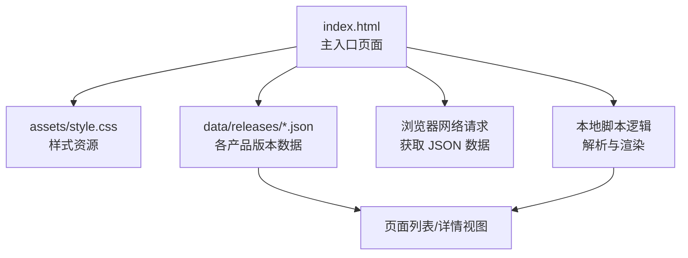
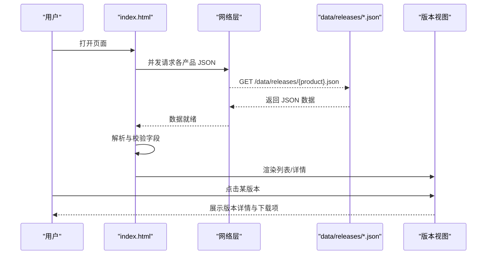
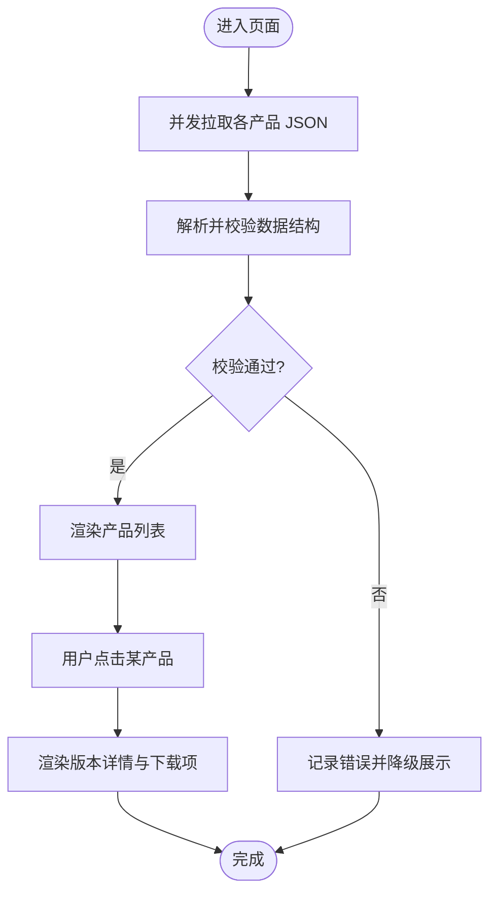
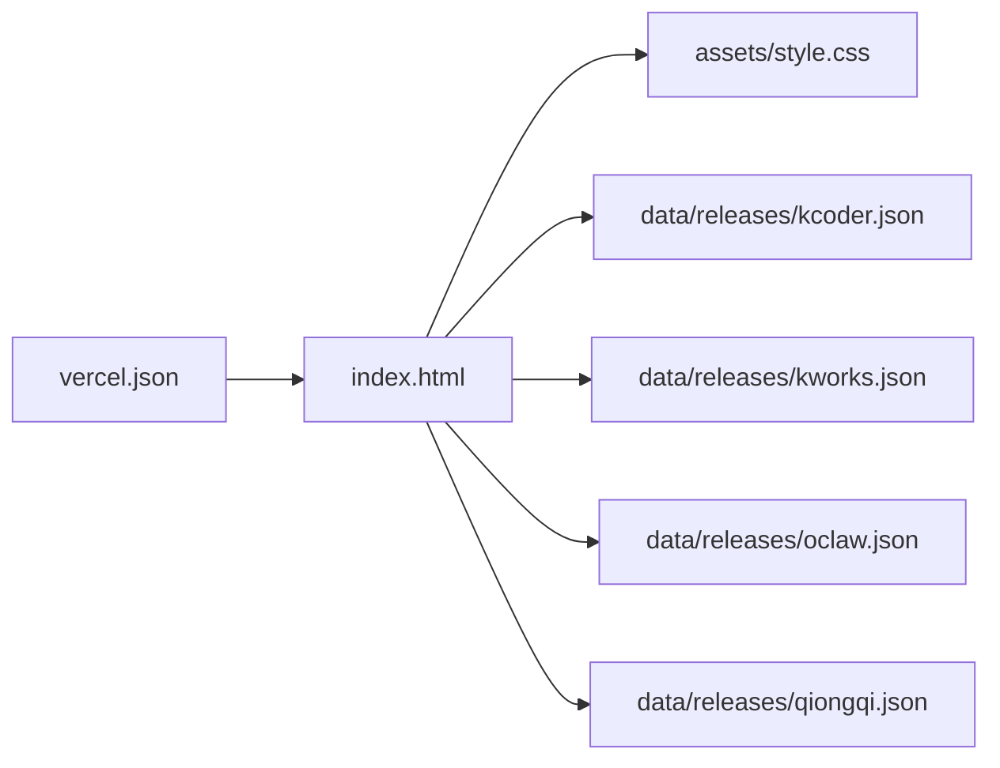

# 版本管理功能

<cite>
**本文引用的文件**   
- [index.html](file://index.html)
- [package.json](file://package.json)
- [vercel.json](file://vercel.json)
- [README.md](file://README.md)
- [data/releases/kcoder.json](file://data/releases/kcoder.json)
- [data/releases/kworks.json](file://data/releases/kworks.json)
- [data/releases/oclaw.json](file://data/releases/oclaw.json)
- [data/releases/qiongqi.json](file://data/releases/qiongqi.json)
- [assets/style.css](file://assets/style.css)
</cite>

## 目录
1. [简介](#简介)
2. [项目结构](#项目结构)
3. [核心组件](#核心组件)
4. [架构总览](#架构总览)
5. [详细组件分析](#详细组件分析)
6. [依赖关系分析](#依赖关系分析)
7. [性能考虑](#性能考虑)
8. [故障排查指南](#故障排查指南)
9. [结论](#结论)
10. [附录](#附录)

## 简介
本章节面向 KReleaseWeb 项目的“版本管理”能力，聚焦于如何集中存储与展示多个产品的最新版本信息。文档将说明：
- JSON 数据文件的结构与格式规范（位于 data/releases 目录）
- 版本详情查看机制的实现原理（数据解析、版本信息提取与展示逻辑）
- 下载链接管理系统（链接验证、多平台支持、下载统计思路）
- 添加新产品版本、更新版本信息与处理版本历史的实践路径
- 各产品配置文件之间的关系与数据同步机制
- 常见问题解决方案与性能优化建议

## 项目结构
KReleaseWeb 采用“前端静态站点 + 集中式 JSON 配置”的轻量架构。版本数据以 JSON 文件形式集中存放，页面在运行时加载并渲染。

图表来源
- [index.html](file://index.html)
- [assets/style.css](file://assets/style.css)
- [data/releases/kcoder.json](file://data/releases/kcoder.json)
- [data/releases/kworks.json](file://data/releases/kworks.json)
- [data/releases/oclaw.json](file://data/releases/oclaw.json)
- [data/releases/qiongqi.json](file://data/releases/qiongqi.json)

章节来源
- [index.html](file://index.html)
- [package.json](file://package.json)
- [vercel.json](file://vercel.json)
- [README.md](file://README.md)

## 核心组件
- 版本数据源：每个产品在 data/releases 下拥有独立的 JSON 配置文件，用于描述该产品的版本元数据与下载项。
- 页面渲染器：index.html 负责发起网络请求、解析 JSON、组装 DOM 并渲染到页面。
- 样式与交互：assets/style.css 提供基础样式；交互逻辑由 index.html 中的脚本驱动。
- 部署配置：vercel.json 控制构建与路由行为（如 SPA 回退等）。

章节来源
- [index.html](file://index.html)
- [assets/style.css](file://assets/style.css)
- [vercel.json](file://vercel.json)

## 架构总览
整体流程为“页面加载 → 并发拉取各产品 JSON → 解析与校验 → 聚合展示 → 用户点击查看详情”。

图表来源
- [index.html](file://index.html)
- [data/releases/kcoder.json](file://data/releases/kcoder.json)
- [data/releases/kworks.json](file://data/releases/kworks.json)
- [data/releases/oclaw.json](file://data/releases/oclaw.json)
- [data/releases/qiongqi.json](file://data/releases/qiongqi.json)

## 详细组件分析

### 版本数据模型（JSON 结构规范）
- 文件位置：data/releases 目录下，按产品命名，例如 kcoder.json、kworks.json、oclaw.json、qiongqi.json。
- 顶层结构建议包含：
  - 产品标识与名称
  - 最新版本号
  - 发布日期
  - 变更日志或说明
  - 下载项集合（每个下载项包含平台、文件名、大小、哈希校验值、直链地址等）
- 字段校验要点：
  - 版本号需符合语义化版本约定
  - 下载项必须包含唯一标识与可访问的直链
  - 可选字段（如平台标签、系统架构、是否推荐）应保持一致性

章节来源
- [data/releases/kcoder.json](file://data/releases/kcoder.json)
- [data/releases/kworks.json](file://data/releases/kworks.json)
- [data/releases/oclaw.json](file://data/releases/oclaw.json)
- [data/releases/qiongqi.json](file://data/releases/qiongqi.json)

### 版本详情查看机制（数据解析、提取与展示）
- 数据获取：页面启动后并行请求所有产品 JSON，避免串行阻塞。
- 数据解析：对每个 JSON 进行结构化解析，提取最新版本、下载项列表、平台信息等。
- 展示逻辑：
  - 列表页：按产品分组，显示最新版本号、发布时间、简要说明。
  - 详情页：点击某产品后展开其历史版本与下载项，支持按平台筛选。
- 错误处理：网络失败或 JSON 解析异常时，给出友好提示并降级展示。

图表来源
- [index.html](file://index.html)

章节来源
- [index.html](file://index.html)

### 下载链接管理系统（验证、多平台支持与统计）
- 链接验证：
  - 客户端侧可做轻量检查（URL 格式、协议白名单），但权威校验应在服务端或对象存储侧完成。
  - 建议在 JSON 中提供文件大小与哈希值，便于客户端在下载前后进行完整性校验。
- 多平台支持：
  - 下载项中包含平台标签（如 Windows、macOS、Linux）与架构（x64、arm64），前端据此过滤与排序。
- 下载统计：
  - 若直链指向 CDN 或对象存储，可通过其访问日志或事件上报收集下载量。
  - 也可在服务端增加代理层，统一埋点后再转发至真实下载地址。

章节来源
- [data/releases/kcoder.json](file://data/releases/kcoder.json)
- [data/releases/kworks.json](file://data/releases/kworks.json)
- [data/releases/oclaw.json](file://data/releases/oclaw.json)
- [data/releases/qiongqi.json](file://data/releases/qiongqi.json)

### 操作指南（示例路径）
- 添加新产品版本：
  - 在 data/releases 新增对应产品的 JSON 文件，遵循数据模型规范。
  - 在页面初始化逻辑中确保新文件被纳入并发拉取范围。
- 更新版本信息：
  - 修改对应 JSON 的最新版本与下载项，保持字段一致性。
  - 提交变更并触发部署。
- 处理版本历史：
  - 在 JSON 中维护历史版本数组，按时间倒序排列。
  - 前端根据历史数组渲染“历史版本”区域。

章节来源
- [data/releases/kcoder.json](file://data/releases/kcoder.json)
- [data/releases/kworks.json](file://data/releases/kworks.json)
- [data/releases/oclaw.json](file://data/releases/oclaw.json)
- [data/releases/qiongqi.json](file://data/releases/qiongqi.json)
- [index.html](file://index.html)

### 配置文件关系与数据同步机制
- 关系：
  - 每个产品一个 JSON 文件，彼此独立，互不引用。
  - 页面作为消费者，统一读取这些文件并聚合展示。
- 同步机制：
  - 通过版本控制系统（Git）管理 JSON 变更。
  - 部署平台（如 Vercel）监听仓库变更，自动构建与发布。
  - 如需跨仓库同步，可使用 GitHub Actions 或其他 CI 工具在推送时触发同步任务。

章节来源
- [vercel.json](file://vercel.json)
- [README.md](file://README.md)

## 依赖关系分析
- 外部依赖：
  - 无重型框架依赖，主要依赖浏览器原生能力与网络请求。
- 内部依赖：
  - index.html 依赖 assets/style.css 与 data/releases/*.json。
  - vercel.json 影响构建与路由行为。

图表来源
- [index.html](file://index.html)
- [assets/style.css](file://assets/style.css)
- [vercel.json](file://vercel.json)
- [data/releases/kcoder.json](file://data/releases/kcoder.json)
- [data/releases/kworks.json](file://data/releases/kworks.json)
- [data/releases/oclaw.json](file://data/releases/oclaw.json)
- [data/releases/qiongqi.json](file://data/releases/qiongqi.json)

章节来源
- [index.html](file://index.html)
- [assets/style.css](file://assets/style.css)
- [vercel.json](file://vercel.json)

## 性能考虑
- 并发请求：并行拉取各产品 JSON，减少首屏等待时间。
- 缓存策略：利用浏览器缓存与 CDN 缓存，设置合理的 Cache-Control。
- 增量更新：仅当 JSON 内容变化时再触发重新渲染，避免重复计算。
- 分页与懒加载：历史版本较多时，采用分页或滚动加载，降低 DOM 压力。
- 资源压缩：CSS 与 HTML 启用压缩，减小传输体积。

[本节为通用指导，无需代码来源]

## 故障排查指南
- 页面无法加载 JSON：
  - 检查网络请求状态码与 CORS 配置。
  - 确认 data/releases 下的文件路径与命名正确。
- JSON 解析失败：
  - 校验字段是否符合数据模型规范。
  - 关注特殊字符与转义问题。
- 下载链接不可用：
  - 使用 curl 或浏览器直接访问直链，确认可达性。
  - 核对文件大小与哈希值是否与 JSON 一致。
- 部署后未生效：
  - 检查 vercel.json 的路由与构建配置。
  - 确认 Git 分支与部署触发条件。

章节来源
- [vercel.json](file://vercel.json)
- [data/releases/kcoder.json](file://data/releases/kcoder.json)
- [data/releases/kworks.json](file://data/releases/kworks.json)
- [data/releases/oclaw.json](file://data/releases/oclaw.json)
- [data/releases/qiongqi.json](file://data/releases/qiongqi.json)
- [index.html](file://index.html)

## 结论
KReleaseWeb 的版本管理以“集中式 JSON + 前端渲染”为核心，具备结构简单、易于扩展的特点。通过规范化的数据模型与清晰的职责划分，能够快速接入新产品、维护版本历史，并提供良好的用户体验。结合缓存与懒加载等优化手段，可在大规模版本场景下保持稳定性能。

[本节为总结性内容，无需代码来源]

## 附录
- 术语表：
  - 最新版本：当前产品的主版本标识
  - 下载项：具体平台的安装包或压缩包及其元数据
  - 平台标签：Windows、macOS、Linux 等
  - 架构：x64、arm64 等
- 参考文件：
  - 主入口与样式：index.html、assets/style.css
  - 部署配置：vercel.json
  - 版本数据：data/releases/*.json

[本节为补充信息，无需代码来源]