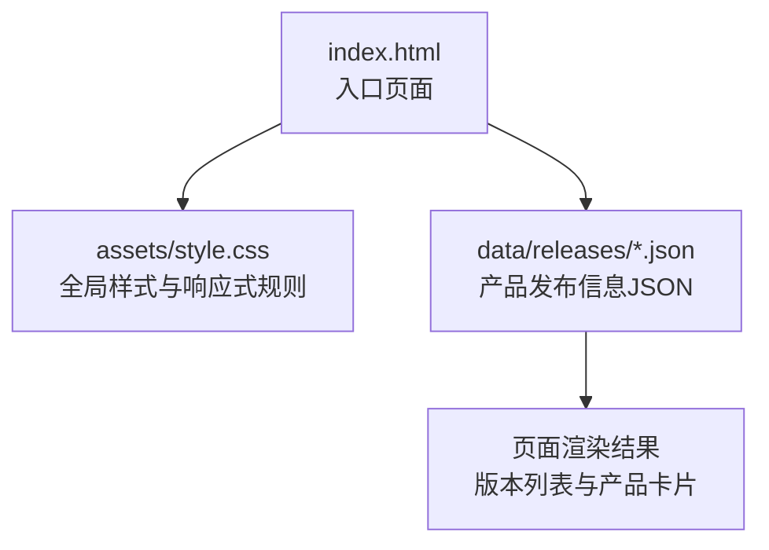
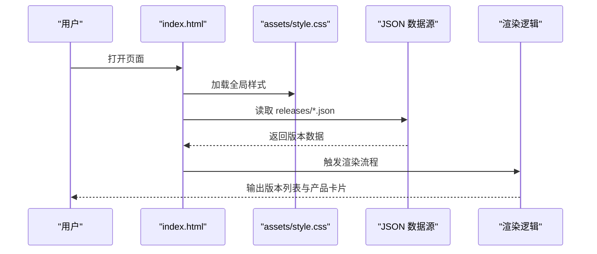
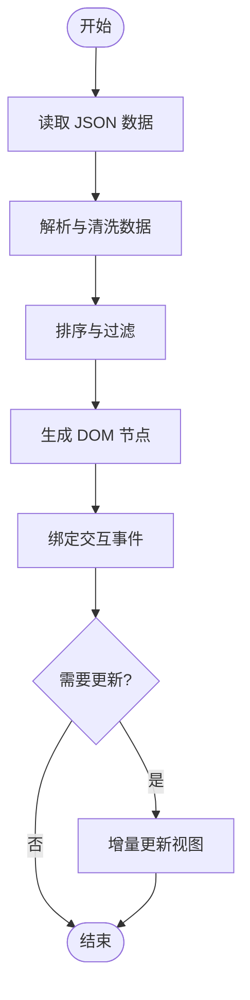
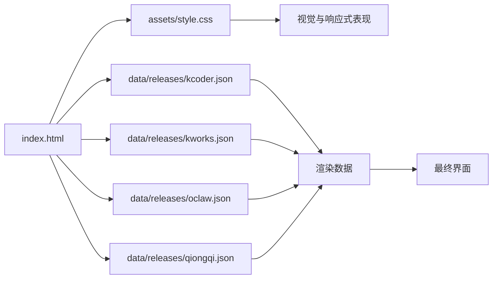

# 界面展示系统

<cite>
**本文引用的文件**   
- [index.html](file://index.html)
- [style.css](file://assets/style.css)
- [kcoder.json](file://data/releases/kcoder.json)
- [kworks.json](file://data/releases/kworks.json)
- [oclaw.json](file://data/releases/oclaw.json)
- [qiongqi.json](file://data/releases/qiongqi.json)
</cite>

## 目录
1. [简介](#简介)
2. [项目结构](#项目结构)
3. [核心组件](#核心组件)
4. [架构总览](#架构总览)
5. [详细组件分析](#详细组件分析)
6. [依赖分析](#依赖分析)
7. [性能考虑](#性能考虑)
8. [故障排查指南](#故障排查指南)
9. [结论](#结论)
10. [附录](#附录)

## 简介
本文件面向 KReleaseWeb 项目的“界面展示系统”，聚焦以下目标：
- 响应式设计实现原理：CSS 媒体查询、弹性布局与移动端适配策略
- 版本列表渲染逻辑：DOM 操作、数据绑定与动态更新机制
- 产品信息展示方式：卡片布局、交互效果与用户体验优化
- 样式定制与主题扩展方法
- 组件复用模式与代码组织结构
- 浏览器兼容性处理与性能优化技巧
- 自定义界面的最佳实践与常见问题解决方案

## 项目结构
界面展示系统由入口页面、全局样式与产品发布数据组成，采用“静态资源 + JSON 数据”的轻量架构。

图表来源
- [index.html](file://index.html)
- [style.css](file://assets/style.css)
- [kcoder.json](file://data/releases/kcoder.json)
- [kworks.json](file://data/releases/kworks.json)
- [oclaw.json](file://data/releases/oclaw.json)
- [qiongqi.json](file://data/releases/qiongqi.json)

章节来源
- [index.html](file://index.html)
- [style.css](file://assets/style.css)
- [kcoder.json](file://data/releases/kcoder.json)
- [kworks.json](file://data/releases/kworks.json)
- [oclaw.json](file://data/releases/oclaw.json)
- [qiongqi.json](file://data/releases/qiongqi.json)

## 核心组件
- 入口页面（index.html）
  - 负责加载全局样式与脚本，提供 DOM 容器用于渲染版本列表与产品卡片
  - 组织页面骨架与语义化结构，便于无障碍访问与 SEO
- 全局样式（assets/style.css）
  - 定义基础排版、颜色变量、间距与阴影等设计令牌
  - 通过媒体查询与弹性布局实现多端适配
  - 封装通用组件样式（如卡片、按钮、标签），支持主题扩展
- 产品发布信息（data/releases/*.json）
  - 以 JSON 形式维护各产品的版本元数据与下载链接
  - 作为数据源驱动前端渲染，避免硬编码

章节来源
- [index.html](file://index.html)
- [style.css](file://assets/style.css)
- [kcoder.json](file://data/releases/kcoder.json)
- [kworks.json](file://data/releases/kworks.json)
- [oclaw.json](file://data/releases/oclaw.json)
- [qiongqi.json](file://data/releases/qiongqi.json)

## 架构总览
整体为“单页 + 数据驱动”的轻量架构：HTML 提供结构与挂载点，CSS 统一视觉与响应式行为，JSON 数据在页面加载后注入并渲染为可交互的版本列表与产品卡片。

图表来源
- [index.html](file://index.html)
- [style.css](file://assets/style.css)
- [kcoder.json](file://data/releases/kcoder.json)
- [kworks.json](file://data/releases/kworks.json)
- [oclaw.json](file://data/releases/oclaw.json)
- [qiongqi.json](file://data/releases/qiongqi.json)

## 详细组件分析

### 响应式设计实现原理
- CSS 媒体查询
  - 基于断点切换布局与字号、间距，确保在小屏设备上保持可读性与可用性
  - 针对导航、网格与卡片在不同视口下的排列方式进行适配
- 弹性布局（Flexbox）
  - 使用主轴与交叉轴控制对齐与分布，实现自适应列数与行高
  - 在卡片列表中通过 flex-wrap 实现自动换行与等宽分布
- 移动端适配策略
  - 优先保证触控区域尺寸与点击热区
  - 减少复杂动画与重排，提升滚动流畅度
  - 使用相对单位与视口宽度进行缩放，避免固定像素导致的溢出

章节来源
- [style.css](file://assets/style.css)

### 版本列表渲染逻辑
- 数据获取与解析
  - 从 data/releases/*.json 中拉取各产品版本信息
  - 对数据进行排序、过滤与格式化（版本号、发布日期、说明等）
- DOM 操作与数据绑定
  - 创建列表项节点并填充文本与链接
  - 将数据字段映射到 DOM 属性或类名，便于样式控制与交互
- 动态更新机制
  - 监听数据变化或用户操作（筛选、搜索）后重新渲染
  - 使用增量更新策略，避免整表重建，提高性能

图表来源
- [kcoder.json](file://data/releases/kcoder.json)
- [kworks.json](file://data/releases/kworks.json)
- [oclaw.json](file://data/releases/oclaw.json)
- [qiongqi.json](file://data/releases/qiongqi.json)
- [index.html](file://index.html)

章节来源
- [index.html](file://index.html)
- [kcoder.json](file://data/releases/kcoder.json)
- [kworks.json](file://data/releases/kworks.json)
- [oclaw.json](file://data/releases/oclaw.json)
- [qiongqi.json](file://data/releases/qiongqi.json)

### 产品信息展示方式
- 卡片布局
  - 每个产品以卡片为单位呈现，包含标题、描述、版本信息与下载入口
  - 使用网格或弹性布局实现自适应列数与间距
- 交互效果
  - 悬停高亮、点击展开详情、复制下载链接等
  - 过渡动画简洁且可感知，避免过度动效影响性能
- 用户体验优化
  - 关键信息前置（版本、平台、大小）
  - 错误状态提示与空数据占位
  - 键盘可达性与焦点管理

章节来源
- [style.css](file://assets/style.css)
- [index.html](file://index.html)

### 样式定制方法与主题扩展指南
- 设计令牌
  - 将颜色、字体、圆角、阴影等抽象为变量，集中管理
- 主题开关
  - 通过根级类名或属性切换明暗主题
  - 利用 CSS 变量覆盖默认值，快速实现品牌色替换
- 组件样式模块化
  - 按功能拆分样式块（卡片、按钮、标签、列表）
  - 使用命名约定与层级隔离，避免样式冲突

章节来源
- [style.css](file://assets/style.css)

### 组件复用模式与代码组织结构
- 组件化思路
  - 将“版本列表项”“产品卡片”“筛选栏”等抽象为可复用单元
  - 通过模板与数据模型组合，降低重复代码
- 组织结构
  - HTML 负责结构与挂载点
  - CSS 负责样式与主题
  - JSON 负责数据与配置
  - 脚本负责数据流与交互（若存在）

章节来源
- [index.html](file://index.html)
- [style.css](file://assets/style.css)
- [kcoder.json](file://data/releases/kcoder.json)
- [kworks.json](file://data/releases/kworks.json)
- [oclaw.json](file://data/releases/oclaw.json)
- [qiongqi.json](file://data/releases/qiongqi.json)

### 浏览器兼容性处理
- 特性检测
  - 对现代 API 与 CSS 特性进行降级处理
- 前缀与回退
  - 为必要特性添加厂商前缀或使用兼容方案
- 渐进增强
  - 基础功能在所有浏览器可用，高级体验在支持环境下启用

章节来源
- [style.css](file://assets/style.css)
- [index.html](file://index.html)

### 性能优化技巧
- 减少重排与重绘
  - 批量更新 DOM，避免频繁读写样式
- 懒加载与分页
  - 长列表按需加载，首屏内容优先
- 缓存与预取
  - 对静态资源与 JSON 数据设置合理缓存策略
- 资源压缩与合并
  - 压缩 CSS/JS，合并请求，减少往返次数

章节来源
- [style.css](file://assets/style.css)
- [index.html](file://index.html)

### 自定义界面的最佳实践
- 明确设计令牌与边界
  - 通过变量与类名约束主题范围，避免全局污染
- 渐进式改造
  - 先覆盖局部样式，再逐步替换组件外观
- 可测试性
  - 为关键交互编写用例，确保变更不影响既有功能

[本节为概念性指导，不直接分析具体文件]

### 常见问题解决方案
- 列表未渲染
  - 检查 JSON 路径与字段是否匹配
  - 确认 DOM 容器是否存在且未被遮挡
- 样式错乱
  - 核对媒体查询断点与容器宽度
  - 检查类名冲突与优先级
- 移动端点击无效
  - 调整触控区域尺寸与 z-index
  - 验证事件冒泡与阻止默认行为

章节来源
- [index.html](file://index.html)
- [style.css](file://assets/style.css)

## 依赖分析
界面展示系统的依赖关系清晰：入口页面依赖全局样式与 JSON 数据；样式层独立于数据层；渲染逻辑仅依赖数据结构契约。

图表来源
- [index.html](file://index.html)
- [style.css](file://assets/style.css)
- [kcoder.json](file://data/releases/kcoder.json)
- [kworks.json](file://data/releases/kworks.json)
- [oclaw.json](file://data/releases/oclaw.json)
- [qiongqi.json](file://data/releases/qiongqi.json)

章节来源
- [index.html](file://index.html)
- [style.css](file://assets/style.css)
- [kcoder.json](file://data/releases/kcoder.json)
- [kworks.json](file://data/releases/kworks.json)
- [oclaw.json](file://data/releases/oclaw.json)
- [qiongqi.json](file://data/releases/qiongqi.json)

## 性能考虑
- 首屏优化
  - 优先渲染关键信息，延迟非关键模块
- 内存管理
  - 及时释放不再使用的节点引用
- 网络优化
  - 使用 CDN 与缓存头，缩短 TTFB
- 可观测性
  - 记录关键指标（渲染耗时、交互延迟），持续改进

[本节为通用指导，不直接分析具体文件]

## 故障排查指南
- 数据问题
  - 校验 JSON 格式与必填字段
  - 打印数据快照定位异常分支
- 样式问题
  - 使用开发者工具检查计算样式与层叠顺序
  - 临时禁用媒体查询定位断点问题
- 交互问题
  - 检查事件监听器是否正确绑定
  - 验证异步回调与错误分支

章节来源
- [index.html](file://index.html)
- [style.css](file://assets/style.css)

## 结论
KReleaseWeb 的界面展示系统以“HTML + CSS + JSON”的轻量架构实现高效、可扩展的产品发布展示。通过清晰的组件划分、响应式设计与数据驱动渲染，系统在多端一致性与可维护性方面具备良好基础。后续可在主题化、组件库与性能监控方面继续深化。

[本节为总结性内容，不直接分析具体文件]

## 附录
- 术语
  - 设计令牌：可复用的视觉与行为参数集合
  - 渐进增强：在基础功能之上逐步增加高级特性
- 参考
  - 媒体查询与 Flexbox 官方文档
  - Web 性能度量与优化建议

[本节为补充信息，不直接分析具体文件]