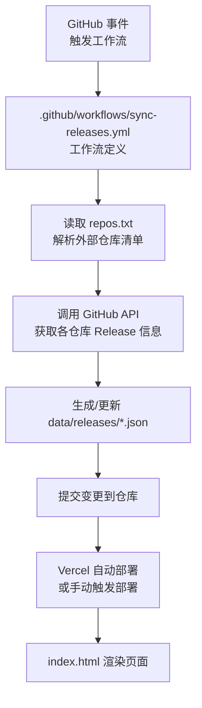
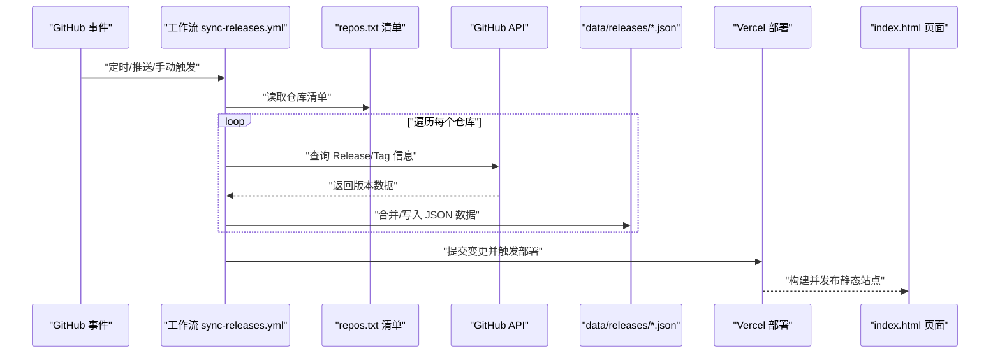
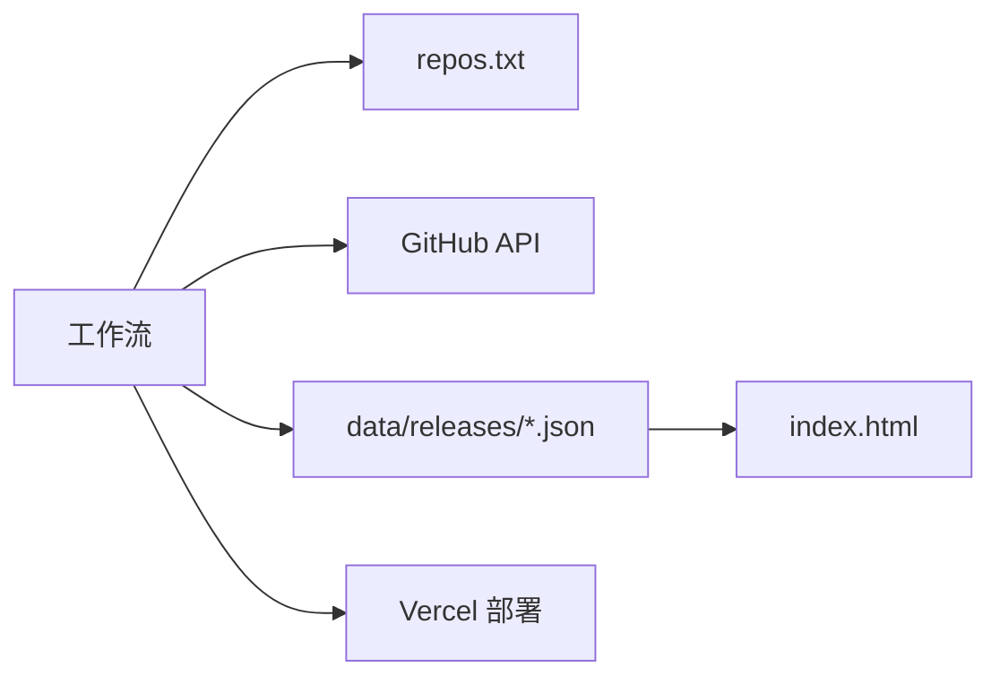

# 自动化同步机制

<cite>
**本文引用的文件**   
- [sync-releases.yml](file://.github/workflows/sync-releases.yml)
- [repos.txt](file://repos.txt)
- [index.html](file://index.html)
- [vercel.json](file://vercel.json)
- [package.json](file://package.json)
- [README.md](file://README.md)
</cite>

## 目录
1. [简介](#简介)
2. [项目结构](#项目结构)
3. [核心组件](#核心组件)
4. [架构总览](#架构总览)
5. [详细组件分析](#详细组件分析)
6. [依赖关系分析](#依赖关系分析)
7. [性能考虑](#性能考虑)
8. [故障排查指南](#故障排查指南)
9. [结论](#结论)
10. [附录](#附录)

## 简介
本文件面向 KReleaseWeb 项目的自动化同步机制，聚焦于基于 GitHub Actions 的版本检测与数据更新流程。文档将系统阐述工作流触发条件、执行步骤、错误处理策略；详解 repos.txt 配置文件的格式与作用，以及如何管理外部仓库列表；并完整描述从版本检测到数据更新再到静态网站部署的全生命周期。同时提供配置示例、定制方法以及针对网络异常、权限问题、版本冲突等常见问题的处理方案，并给出调试方法与监控策略，确保自动化流程稳定运行。

## 项目结构
KReleaseWeb 采用“配置驱动 + 工作流驱动”的轻量架构：
- 工作流定义位于 .github/workflows/，负责调度版本检测与数据更新任务。
- 外部仓库清单由 repos.txt 维护，作为数据源索引。
- 生成的数据落盘至 data/releases/，供前端渲染使用。
- 站点根目录包含 index.html 与 vercel.json，用于静态站点展示与部署配置。
- package.json 提供构建与脚本能力（如适用）。
- README.md 提供项目说明与使用说明。

图表来源
- [sync-releases.yml](file://.github/workflows/sync-releases.yml)
- [repos.txt](file://repos.txt)
- [index.html](file://index.html)
- [vercel.json](file://vercel.json)

章节来源
- [README.md](file://README.md)
- [package.json](file://package.json)
- [vercel.json](file://vercel.json)
- [index.html](file://index.html)

## 核心组件
- 工作流文件：定义触发条件、环境准备、并行任务、重试与失败通知等。
- 仓库清单：repos.txt 作为单一事实源，声明需要被同步的外部仓库及其元数据。
- 数据层：data/releases/*.json 为结构化产物，按仓库维度组织版本信息。
- 前端展示：index.html 消费 data/releases/*.json 进行页面渲染。
- 部署配置：vercel.json 控制 Vercel 构建与发布行为。
- 脚本与依赖：package.json 提供可选的本地开发/测试脚本。

章节来源
- [sync-releases.yml](file://.github/workflows/sync-releases.yml)
- [repos.txt](file://repos.txt)
- [index.html](file://index.html)
- [vercel.json](file://vercel.json)
- [package.json](file://package.json)

## 架构总览
下图展示了从事件触发到站点更新的端到端流程，包括关键节点与数据流向。

图表来源
- [sync-releases.yml](file://.github/workflows/sync-releases.yml)
- [repos.txt](file://repos.txt)
- [index.html](file://index.html)
- [vercel.json](file://vercel.json)

## 详细组件分析

### 工作流组件：版本检测与数据更新
- 触发条件
  - 支持定时触发（cron），保证周期性扫描。
  - 支持手动触发（workflow_dispatch），便于即时验证与排障。
  - 可选监听特定分支的推送事件，以在代码变更后刷新数据。
- 执行步骤
  - 初始化运行环境（Node/Python/Shell 等，视实现而定）。
  - 拉取当前仓库代码，加载 repos.txt。
  - 并发访问目标仓库的 Release/Tag 接口，收集最新版本信息。
  - 对比本地已有数据，增量更新 data/releases/*.json。
  - 提交变更并触发后续部署。
- 错误处理
  - 对网络超时、限流、鉴权失败等异常进行捕获与重试。
  - 记录详细日志，便于定位问题。
  - 失败时发送通知（如通过 Webhook 或邮件）。
- 幂等性与一致性
  - 写入前进行校验，避免脏写。
  - 使用原子替换策略，减少中间态影响。

章节来源
- [sync-releases.yml](file://.github/workflows/sync-releases.yml)

### 配置组件：repos.txt 清单
- 作用
  - 集中管理需要同步的外部仓库列表，作为数据源的权威来源。
  - 支持扩展字段，如显示名称、分类、过滤规则等。
- 格式建议
  - 每行一个条目，字段间以分隔符（如制表符或逗号）分隔。
  - 关键字段：仓库地址、别名/名称、是否启用、标签/版本过滤规则等。
  - 支持注释行，便于说明与维护。
- 管理方式
  - 通过 Pull Request 修改清单，经审核合并后生效。
  - 可结合 CI 校验清单格式，防止非法配置进入主干。

章节来源
- [repos.txt](file://repos.txt)

### 数据组件：data/releases/*.json
- 数据结构
  - 按仓库维度组织，包含版本号、发布时间、下载链接、平台信息等。
  - 建议包含去重键（如 tag_name）与时间戳，便于增量更新。
- 更新策略
  - 新增版本：追加记录。
  - 版本修正：根据主键覆盖更新。
  - 删除无效版本：清理历史无用条目。
- 校验与回滚
  - 写入后进行 JSON 合法性校验。
  - 保留最近若干快照，必要时快速回滚。

章节来源
- [index.html](file://index.html)

### 前端组件：index.html
- 数据消费
  - 动态加载 data/releases/*.json，渲染版本列表与详情。
  - 支持分页、搜索、筛选等交互。
- 兼容性
  - 兼容主流浏览器，按需引入 polyfill。
- 缓存策略
  - 利用浏览器缓存与 CDN 缓存提升加载速度。

章节来源
- [index.html](file://index.html)

### 部署组件：vercel.json
- 构建与发布
  - 指定构建命令与输出目录。
  - 配置环境变量与路由规则。
- 预览与生产
  - 区分预览环境与生产环境的部署策略。
- 自定义域名与 HTTPS
  - 在控制台配置域名与证书。

章节来源
- [vercel.json](file://vercel.json)

### 脚本与依赖：package.json
- 脚本能力
  - 提供本地验证、格式化、测试等脚本。
- 依赖管理
  - 锁定依赖版本，确保构建稳定性。

章节来源
- [package.json](file://package.json)

## 依赖关系分析
- 内部依赖
  - 工作流依赖 repos.txt 清单与 data/releases/*.json 数据。
  - 前端依赖 data/releases/*.json 的数据结构与命名约定。
- 外部依赖
  - GitHub API：用于获取 Release/Tag 信息。
  - Vercel：用于静态站点的构建与部署。
- 耦合与内聚
  - 清单与数据解耦，便于独立演进。
  - 工作流与前端通过数据契约协作，降低直接耦合。

图表来源
- [sync-releases.yml](file://.github/workflows/sync-releases.yml)
- [repos.txt](file://repos.txt)
- [index.html](file://index.html)
- [vercel.json](file://vercel.json)

章节来源
- [sync-releases.yml](file://.github/workflows/sync-releases.yml)
- [repos.txt](file://repos.txt)
- [index.html](file://index.html)
- [vercel.json](file://vercel.json)

## 性能考虑
- 并发与限流
  - 合理设置并发度，避免对 GitHub API 造成压力。
  - 实现指数退避与重试，应对临时性限流。
- 增量更新
  - 仅拉取较新版本的差异，减少数据传输量。
- 缓存策略
  - 在构建阶段缓存依赖与中间产物，缩短构建时间。
- 资源优化
  - 压缩与懒加载前端资源，提升首屏性能。

[本节为通用指导，不直接分析具体文件]

## 故障排查指南
- 常见问题
  - 网络异常：检查代理、DNS、防火墙与速率限制。
  - 权限问题：确认 Token 具备读取 Release 的权限，且未被撤销。
  - 版本冲突：核对主键唯一性与时间戳顺序，避免覆盖错误。
- 调试方法
  - 开启详细日志，记录请求与响应摘要。
  - 使用手动触发工作流进行复现与回归。
  - 在本地模拟 API 调用，隔离网络因素。
- 监控策略
  - 对工作流执行结果与耗时进行统计。
  - 设置告警阈值，异常时及时通知。
  - 定期巡检数据完整性与一致性。

章节来源
- [sync-releases.yml](file://.github/workflows/sync-releases.yml)

## 结论
KReleaseWeb 的自动化同步机制以工作流为核心，配合清单驱动与数据契约，实现了从版本检测到数据更新再到静态站点部署的闭环。通过合理的错误处理、幂等设计与监控告警，能够保障流程的稳定与可观测性。建议在持续演进中完善清单校验、数据校验与可视化监控，进一步提升系统的可靠性与可维护性。

[本节为总结性内容，不直接分析具体文件]

## 附录

### 配置示例与定制方法
- 工作流定制
  - 调整 cron 表达式以改变扫描频率。
  - 增加并行度以提升吞吐。
  - 添加失败重试与通知环节。
- 清单定制
  - 在 repos.txt 中添加新的仓库条目。
  - 为不同仓库设置不同的过滤规则与显示名称。
- 部署定制
  - 在 vercel.json 中配置环境变量与构建参数。
  - 针对不同分支设置不同的部署策略。

章节来源
- [sync-releases.yml](file://.github/workflows/sync-releases.yml)
- [repos.txt](file://repos.txt)
- [vercel.json](file://vercel.json)

### 术语表
- 工作流：在 GitHub Actions 中定义的自动化任务集合。
- 清单：repos.txt，集中管理外部仓库的配置。
- 数据契约：前后端之间约定的数据结构与命名规范。
- 幂等：多次执行产生相同结果的能力。

[本节为概念性内容，不直接分析具体文件]