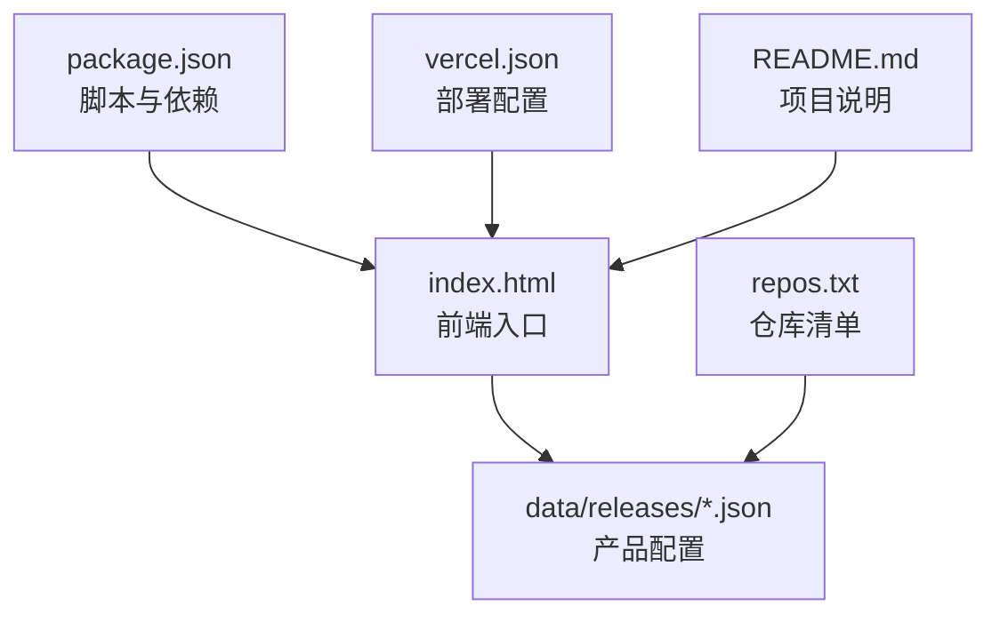
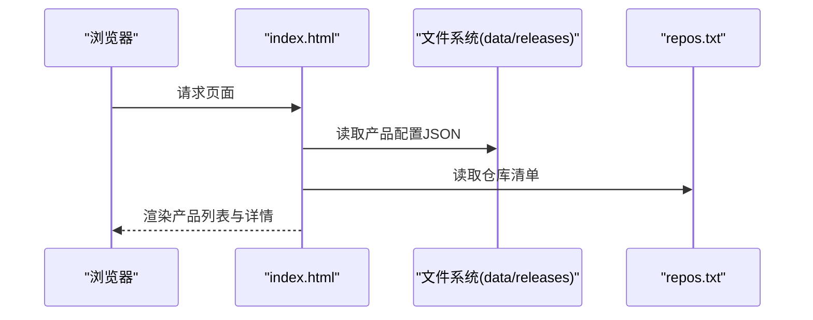
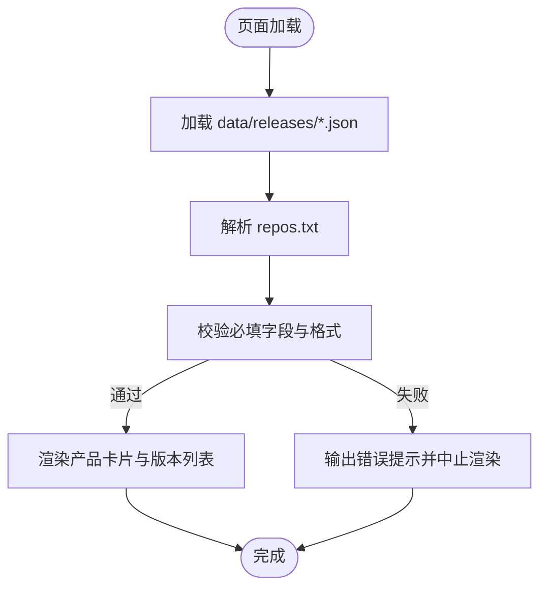
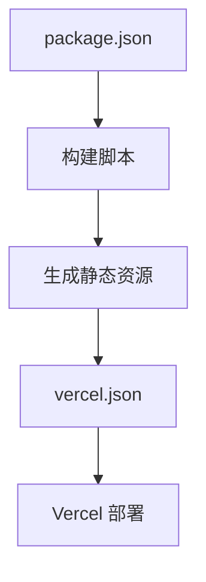
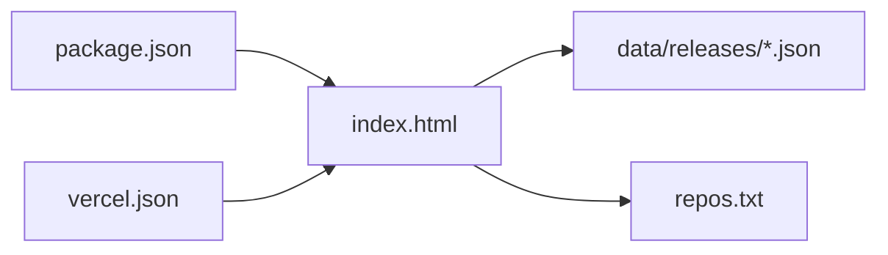

# 产品配置管理

<cite>
**本文引用的文件**   
- [README.md](file://README.md)
- [index.html](file://index.html)
- [package.json](file://package.json)
- [repos.txt](file://repos.txt)
- [vercel.json](file://vercel.json)
- [data/releases/kcoder.json](file://data/releases/kcoder.json)
- [data/releases/kworks.json](file://data/releases/kworks.json)
- [data/releases/oclaw.json](file://data/releases/oclaw.json)
- [data/releases/qiongqi.json](file://data/releases/qiongqi.json)
</cite>

## 目录
1. [简介](#简介)
2. [项目结构](#项目结构)
3. [核心组件](#核心组件)
4. [架构总览](#架构总览)
5. [详细组件分析](#详细组件分析)
6. [依赖关系分析](#依赖关系分析)
7. [性能考虑](#性能考虑)
8. [故障排查指南](#故障排查指南)
9. [结论](#结论)
10. [附录](#附录)

## 简介
本文件面向 KReleaseWeb 项目的维护者与贡献者，系统化说明“产品配置管理”的规范与流程。重点包括：
- 在 data/releases/ 目录下为新产品添加配置文件的完整步骤
- JSON 配置文件的字段定义、数据类型与约束条件
- 现有产品（kcoder、kworks、oclaw、qiongqi）的配置示例与模式总结
- 配置验证规则、必填与可选字段说明
- 常见错误排查方法与最佳实践建议

## 项目结构
KReleaseWeb 是一个静态站点型发布展示项目，核心数据位于 data/releases/ 目录下的各产品 JSON 配置文件；前端通过 index.html 加载并渲染这些配置；构建与部署由 package.json 与 vercel.json 驱动；repos.txt 用于声明仓库清单；README.md 提供项目概览。

图示来源
- [index.html:1-200](file://index.html#L1-L200)
- [package.json:1-100](file://package.json#L1-L100)
- [vercel.json:1-100](file://vercel.json#L1-L100)
- [repos.txt:1-100](file://repos.txt#L1-L100)
- [README.md:1-100](file://README.md#L1-L100)

章节来源
- [README.md:1-100](file://README.md#L1-L100)
- [index.html:1-200](file://index.html#L1-L200)
- [package.json:1-100](file://package.json#L1-L100)
- [repos.txt:1-100](file://repos.txt#L1-L100)
- [vercel.json:1-100](file://vercel.json#L1-L100)

## 核心组件
- 产品配置中心：data/releases/ 目录下的每个 *.json 文件代表一个产品的发布元数据与展示信息。
- 前端渲染器：index.html 负责读取并展示配置内容。
- 仓库清单：repos.txt 用于集中声明仓库地址或标识，便于统一管理与校验。
- 构建与部署：package.json 与 vercel.json 提供脚本与平台部署参数。

章节来源
- [index.html:1-200](file://index.html#L1-L200)
- [repos.txt:1-100](file://repos.txt#L1-L100)
- [package.json:1-100](file://package.json#L1-L100)
- [vercel.json:1-100](file://vercel.json#L1-L100)

## 架构总览
下图展示了从用户访问到页面渲染的关键路径，以及配置数据的来源与依赖关系。

图示来源
- [index.html:1-200](file://index.html#L1-L200)
- [repos.txt:1-100](file://repos.txt#L1-L100)

## 详细组件分析

### 产品配置模型（data/releases/*.json）
以下为通用配置模型的字段定义、类型与约束。该模型适用于所有产品配置文件，新增产品应遵循此规范。

- 基础信息
  - id: 字符串，唯一标识，建议使用小写英文字母与连字符，如 kcoder
  - name: 字符串，产品名称，显示用
  - description: 字符串，产品简述
  - logo: 字符串，Logo 图片 URL 或本地相对路径
  - homepage: 字符串，产品主页链接
  - repo: 字符串或对象，仓库地址或仓库映射（见仓库映射小节）
  - tags: 字符串数组，标签集合，用于筛选与展示
  - status: 枚举，状态值，如 active、beta、deprecated
  - created_at: 字符串，ISO 8601 时间戳，创建时间
  - updated_at: 字符串，ISO 8601 时间戳，更新时间

- 版本与发布
  - releases: 对象数组，每个元素包含：
    - version: 字符串，语义化版本号
    - date: 字符串，ISO 8601 时间戳
    - changelog: 字符串，更新日志
    - download_url: 字符串，下载链接
    - platform: 字符串或字符串数组，支持平台，如 windows、macos、linux
    - size: 数字，文件大小（字节）
    - checksum: 字符串，校验和（sha256）
    - notes: 字符串，备注说明

- 平台与渠道
  - platforms: 对象数组，每个元素包含：
    - name: 字符串，平台名称
    - icon: 字符串，图标 URL
    - url: 字符串，平台链接
    - enabled: 布尔值，是否启用

- 高级选项
  - features: 对象数组，特性列表
  - screenshots: 字符串数组，截图 URL
  - docs: 字符串，文档链接
  - contact: 字符串，联系方式
  - metadata: 任意对象，扩展元数据

字段约束与验证规则
- 必填字段：id、name、releases（至少包含一个版本条目）
- 唯一性：id 全局唯一，不得与其他产品重复
- 时间格式：created_at、updated_at、releases[].date 必须为 ISO 8601 格式
- 版本号：releases[].version 需符合语义化版本（主.次.修订）
- 链接有效性：homepage、repo.url、platforms[].url、screenshots[]、download_url 等应为有效 URL
- 平台枚举：platforms[].name 应在允许集合内（windows、macos、linux、web、android、ios）
- 大小与校验：size 为非负整数；checksum 若存在，需为 sha256 十六进制字符串
- 标签与状态：tags 非空数组；status 必须在允许集合内（active、beta、deprecated）

仓库映射（repo 为对象时）
- url: 字符串，仓库地址
- type: 字符串，仓库类型（github、gitlab、gitee）
- branch: 字符串，默认分支
- path: 字符串，源码根路径（可选）

章节来源
- [data/releases/kcoder.json:1-200](file://data/releases/kcoder.json#L1-L200)
- [data/releases/kworks.json:1-200](file://data/releases/kworks.json#L1-L200)
- [data/releases/oclaw.json:1-200](file://data/releases/oclaw.json#L1-L200)
- [data/releases/qiongqi.json:1-200](file://data/releases/qiongqi.json#L1-L200)

### 现有产品配置示例与模式
以下列出四个现有产品的配置文件路径，供参考其结构与字段使用方式。请根据实际文件内容对照上述模型进行理解。

- kcoder 产品配置
  - 文件路径：[data/releases/kcoder.json](file://data/releases/kcoder.json)
- kworks 产品配置
  - 文件路径：[data/releases/kworks.json](file://data/releases/kworks.json)
- oclaw 产品配置
  - 文件路径：[data/releases/oclaw.json](file://data/releases/oclaw.json)
- qiongqi 产品配置
  - 文件路径：[data/releases/qiongqi.json](file://data/releases/qiongqi.json)

不同场景下的配置模式
- 单平台桌面应用：仅包含单一 platform 与对应 download_url
- 多平台跨端应用：platforms 数组包含多个平台条目，releases 中按平台区分版本
- Web 应用：platforms 包含 web，且 homepage 指向在线地址
- 开源项目：repo 使用对象形式，指定 type、branch、path 等

章节来源
- [data/releases/kcoder.json:1-200](file://data/releases/kcoder.json#L1-L200)
- [data/releases/kworks.json:1-200](file://data/releases/kworks.json#L1-L200)
- [data/releases/oclaw.json:1-200](file://data/releases/oclaw.json#L1-L200)
- [data/releases/qiongqi.json:1-200](file://data/releases/qiongqi.json#L1-L200)

### 前端渲染与数据绑定（index.html）
index.html 作为前端入口，负责：
- 读取 data/releases/*.json 中的产品配置
- 解析 repos.txt 中的仓库清单
- 将配置数据渲染至页面，包括产品列表、版本信息与下载链接

图示来源
- [index.html:1-200](file://index.html#L1-L200)
- [repos.txt:1-100](file://repos.txt#L1-L100)

章节来源
- [index.html:1-200](file://index.html#L1-L200)
- [repos.txt:1-100](file://repos.txt#L1-L100)

### 构建与部署（package.json 与 vercel.json）
- package.json：定义脚本命令与依赖项，用于本地开发与构建
- vercel.json：定义 Vercel 平台的部署参数与路由规则

图示来源
- [package.json:1-100](file://package.json#L1-L100)
- [vercel.json:1-100](file://vercel.json#L1-L100)

章节来源
- [package.json:1-100](file://package.json#L1-L100)
- [vercel.json:1-100](file://vercel.json#L1-L100)

## 依赖关系分析
- 前端依赖：index.html 依赖 data/releases/*.json 与 repos.txt
- 构建依赖：package.json 提供脚本与依赖，驱动构建流程
- 部署依赖：vercel.json 控制部署行为与路由

图示来源
- [index.html:1-200](file://index.html#L1-L200)
- [package.json:1-100](file://package.json#L1-L100)
- [vercel.json:1-100](file://vercel.json#L1-L100)
- [repos.txt:1-100](file://repos.txt#L1-L100)

章节来源
- [index.html:1-200](file://index.html#L1-L200)
- [package.json:1-100](file://package.json#L1-L100)
- [vercel.json:1-100](file://vercel.json#L1-L100)
- [repos.txt:1-100](file://repos.txt#L1-L100)

## 性能考虑
- 配置体积控制：避免过大的 screenshots 与冗长 changelog，必要时拆分文档链接
- 懒加载策略：对图片与外部资源采用延迟加载
- 缓存策略：利用浏览器缓存与 CDN 缓存提升加载速度
- 索引优化：对常用字段建立前端索引以提升筛选与搜索性能

## 故障排查指南
常见问题与定位方法
- 页面空白或无产品列表
  - 检查 data/releases/*.json 是否存在语法错误
  - 确认必填字段 id、name、releases 是否齐全
  - 查看控制台是否有 JSON 解析异常
- 版本无法显示
  - 校验 releases[].version 是否符合语义化版本
  - 确认 release 日期是否为 ISO 8601 格式
- 下载链接无效
  - 验证 download_url 与 homepage 可正常访问
  - 检查网络权限与跨域限制
- 平台图标不显示
  - 确认 platforms[].icon 与 platforms[].url 有效
  - 检查图片资源路径是否正确
- 仓库清单不一致
  - 核对 repos.txt 与 repo 字段映射关系
  - 确保仓库地址与分支路径正确

章节来源
- [index.html:1-200](file://index.html#L1-L200)
- [repos.txt:1-100](file://repos.txt#L1-L100)

## 结论
通过统一的配置模型与严格的验证规则，KReleaseWeb 能够稳定地展示各产品的发布信息。遵循本文档的流程与最佳实践，可以高效地为新产品添加配置并确保质量。

## 附录

### 新产品配置流程（从零开始）
- 准备阶段
  - 确定产品 id、name、description、logo、homepage、tags、status
  - 收集版本信息：version、date、changelog、download_url、platform、size、checksum
  - 准备平台信息：platforms 数组与图标、链接
- 创建配置文件
  - 在 data/releases/ 下新建 <product>.json
  - 按照配置模型填写所有必填字段与可选字段
- 更新仓库清单
  - 在 repos.txt 中添加仓库地址或映射
- 本地验证
  - 启动本地服务，打开 index.html 检查渲染结果
  - 使用浏览器控制台查看是否有错误或警告
- 提交与部署
  - 提交变更到版本库
  - 触发构建与部署流程（参考 package.json 与 vercel.json）

章节来源
- [data/releases/kcoder.json:1-200](file://data/releases/kcoder.json#L1-L200)
- [data/releases/kworks.json:1-200](file://data/releases/kworks.json#L1-L200)
- [data/releases/oclaw.json:1-200](file://data/releases/oclaw.json#L1-L200)
- [data/releases/qiongqi.json:1-200](file://data/releases/qiongqi.json#L1-L200)
- [index.html:1-200](file://index.html#L1-L200)
- [repos.txt:1-100](file://repos.txt#L1-L100)
- [package.json:1-100](file://package.json#L1-L100)
- [vercel.json:1-100](file://vercel.json#L1-L100)

### 配置字段速查表
- 必填字段：id、name、releases
- 推荐字段：description、logo、homepage、tags、status、created_at、updated_at
- 版本字段：version、date、changelog、download_url、platform、size、checksum、notes
- 平台字段：name、icon、url、enabled
- 高级字段：features、screenshots、docs、contact、metadata

章节来源
- [data/releases/kcoder.json:1-200](file://data/releases/kcoder.json#L1-L200)
- [data/releases/kworks.json:1-200](file://data/releases/kworks.json#L1-L200)
- [data/releases/oclaw.json:1-200](file://data/releases/oclaw.json#L1-L200)
- [data/releases/qiongqi.json:1-200](file://data/releases/qiongqi.json#L1-L200)