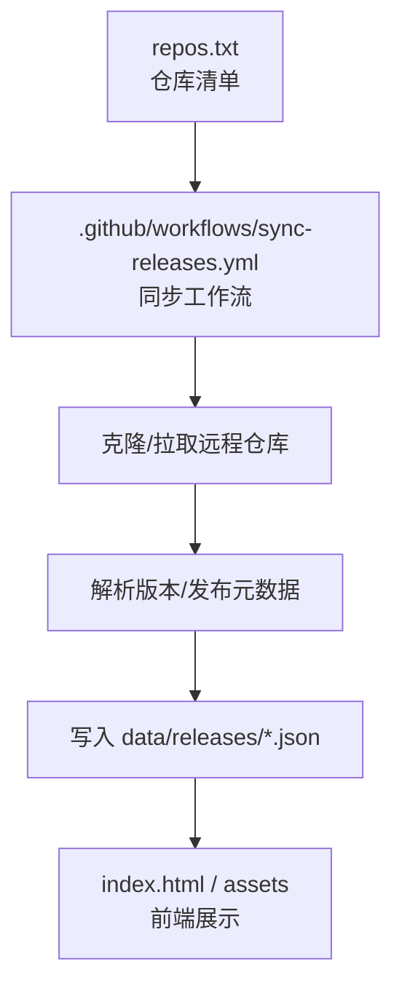
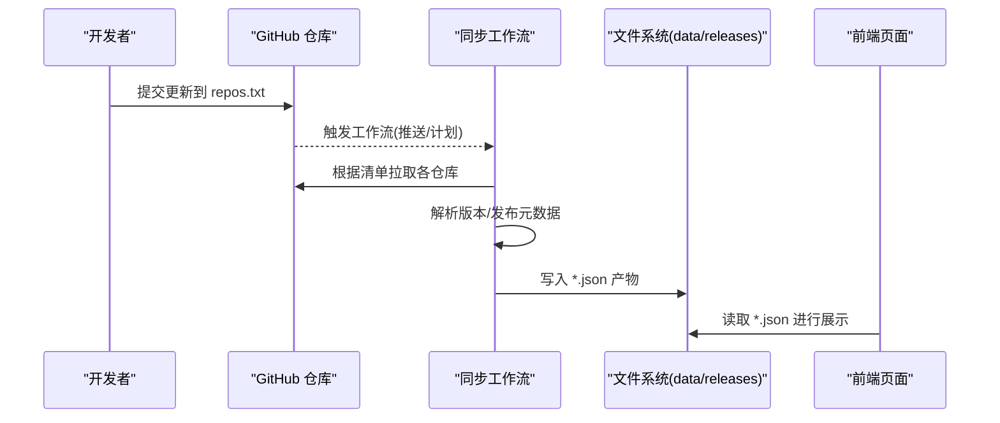
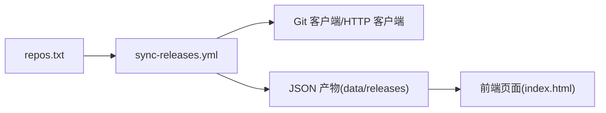

# 仓库列表配置

<cite>
**本文引用的文件**   
- [repos.txt](file://repos.txt)
- [sync-releases.yml](file://.github/workflows/sync-releases.yml)
- [README.md](file://README.md)
- [package.json](file://package.json)
</cite>

## 目录
1. [简介](#简介)
2. [项目结构](#项目结构)
3. [核心组件](#核心组件)
4. [架构总览](#架构总览)
5. [详细组件分析](#详细组件分析)
6. [依赖关系分析](#依赖关系分析)
7. [性能考虑](#性能考虑)
8. [故障排除指南](#故障排除指南)
9. [结论](#结论)
10. [附录](#附录)

## 简介
本文件面向 KReleaseWeb 项目的维护者，详细说明如何通过 repos.txt 管理外部源代码仓库的同步清单。文档涵盖以下主题：
- repos.txt 的定义格式、语法规范与命名约定
- 如何添加、删除或修改仓库条目
- 不同平台（GitHub、GitLab 等）的配置示例
- 权限与安全要求（访问令牌、最小权限原则）
- 配置验证方法与常见问题排查

## 项目结构
KReleaseWeb 使用 GitHub Actions 定时任务读取根目录下的 repos.txt，并据此拉取各仓库的发布/版本信息，生成数据文件至 data/releases 目录。关键文件如下：
- repos.txt：仓库清单配置文件
- .github/workflows/sync-releases.yml：同步工作流定义
- data/releases/*.json：由工作流生成的产物
- README.md、package.json：项目说明与脚本入口

图表来源
- [repos.txt](file://repos.txt)
- [sync-releases.yml](file://.github/workflows/sync-releases.yml)

章节来源
- [README.md](file://README.md)
- [package.json](file://package.json)

## 核心组件
- 仓库清单文件 repos.txt：集中声明需要同步的外部仓库地址及可选参数。
- 同步工作流 sync-releases.yml：在 GitHub Actions 中执行，按清单拉取仓库、解析并发布产物。
- 产物目录 data/releases：存放每个仓库的 JSON 产物，供前端渲染。

章节来源
- [repos.txt](file://repos.txt)
- [sync-releases.yml](file://.github/workflows/sync-releases.yml)

## 架构总览
下图展示了从仓库清单到最终产物的端到端流程。

图表来源
- [sync-releases.yml](file://.github/workflows/sync-releases.yml)
- [repos.txt](file://repos.txt)

## 详细组件分析

### repos.txt 配置规范
- 基本规则
  - 每行一个仓库条目
  - 支持注释行以 # 开头
  - 空行将被忽略
- 字段与分隔符
  - 使用空格或制表符作为字段分隔符
  - 建议采用固定列顺序：仓库地址、可选参数键值对
- 仓库地址
  - 支持 HTTPS 与 SSH 两种协议
  - 私有仓库建议使用包含凭据的 HTTPS 或使用 SSH 密钥
- 命名约定
  - 文件名与仓库名保持一致或采用小写短横线风格
  - 产物文件名由工作流根据仓库名推导，避免冲突
- 安全注意事项
  - 不要在清单中明文写入敏感信息
  - 使用 GitHub Secrets 注入访问令牌或私钥
  - 遵循最小权限原则，仅授予必要范围

章节来源
- [repos.txt](file://repos.txt)

### 工作流与解析逻辑
- 触发方式
  - 推送变更时触发
  - 可配置定时调度
- 主要步骤
  - 检出代码与工作区准备
  - 读取 repos.txt 逐条处理
  - 拉取远程仓库并解析版本/发布元数据
  - 将结果写入 data/releases 目录
- 环境变量与凭据
  - 通过 Secrets 注入访问令牌或私钥
  - 按需设置代理或网络超时参数

章节来源
- [sync-releases.yml](file://.github/workflows/sync-releases.yml)

### 配置示例（不同类型仓库）
以下为常见平台的配置要点与示例形式（不直接粘贴内容，请对照实际文件路径查看）：
- GitHub 公开仓库
  - 使用标准 HTTPS 地址
  - 无需额外凭据
- GitHub 私有仓库
  - 使用包含访问令牌的 HTTPS 地址
  - 或通过 SSH 私钥认证
- GitLab 公开仓库
  - 使用标准 HTTPS 地址
- GitLab 私有仓库
  - 使用包含个人访问令牌或部署令牌的 HTTPS 地址
  - 或通过 SSH 私钥认证

参考路径
- [repos.txt](file://repos.txt)

章节来源
- [repos.txt](file://repos.txt)

### 添加新仓库
操作步骤：
- 在 repos.txt 末尾新增一行，填写仓库地址与必要参数
- 提交变更并推送至主分支
- 确认工作流成功运行并在 data/releases 下生成对应 JSON 产物
- 刷新前端页面验证展示

参考路径
- [repos.txt](file://repos.txt)
- [sync-releases.yml](file://.github/workflows/sync-releases.yml)

章节来源
- [repos.txt](file://repos.txt)
- [sync-releases.yml](file://.github/workflows/sync-releases.yml)

### 删除或修改现有仓库
- 删除：移除 repos.txt 中对应行并提交
- 修改：调整地址或参数后提交
- 注意：若产物仍保留，需确保工作流重新运行以覆盖或删除旧产物

参考路径
- [repos.txt](file://repos.txt)
- [sync-releases.yml](file://.github/workflows/sync-releases.yml)

章节来源
- [repos.txt](file://repos.txt)
- [sync-releases.yml](file://.github/workflows/sync-releases.yml)

### 权限与安全要求
- 访问令牌
  - GitHub：创建 Personal Access Token，仅勾选必要范围（如 repo、read:packages）
  - GitLab：创建 Personal Access Token 或 Deploy Token，限制作用域
- 最小权限
  - 仅授予读取仓库所需权限，避免写入或管理权限
- 凭据管理
  - 使用 GitHub Secrets 存储令牌或私钥
  - 禁止在源码中硬编码凭据
- 网络与代理
  - 如需代理，在工作流中通过环境变量配置

参考路径
- [sync-releases.yml](file://.github/workflows/sync-releases.yml)

章节来源
- [sync-releases.yml](file://.github/workflows/sync-releases.yml)

### 配置验证方法
- 本地校验
  - 检查 repos.txt 的行数与格式是否符合规范
  - 使用文本编辑器开启显示空白字符，确认分隔符一致
- 工作流日志
  - 查看 Actions 运行日志中的错误堆栈与提示
  - 关注“拉取失败”“认证失败”“解析异常”等关键字
- 产物检查
  - 确认 data/releases 下是否生成对应 JSON 文件
  - 校验 JSON 结构与字段完整性

参考路径
- [repos.txt](file://repos.txt)
- [sync-releases.yml](file://.github/workflows/sync-releases.yml)

章节来源
- [repos.txt](file://repos.txt)
- [sync-releases.yml](file://.github/workflows/sync-releases.yml)

### 故障排除指南
- 网络连接问题
  - 现象：拉取超时或连接被拒绝
  - 排查：检查网络可达性、代理设置、域名解析
- 权限错误
  - 现象：401/403 未授权或无权限
  - 排查：确认令牌有效、作用域正确、仓库可见性
- 格式错误
  - 现象：解析失败或跳过某行
  - 排查：修正分隔符、去除多余空格、确保地址完整
- 缓存与重试
  - 清理工作区缓存并重试
  - 适当增加超时与重试次数

参考路径
- [sync-releases.yml](file://.github/workflows/sync-releases.yml)

章节来源
- [sync-releases.yml](file://.github/workflows/sync-releases.yml)

## 依赖关系分析
- 组件耦合
  - repos.txt 为输入源，工作流为处理中心，data/releases 为输出目标
- 外部依赖
  - GitHub/GitLab API 或 Git 协议访问
  - 网络连通性与凭据有效性
- 潜在循环依赖
  - 当前流程为单向流水线，不存在循环依赖

图表来源
- [repos.txt](file://repos.txt)
- [sync-releases.yml](file://.github/workflows/sync-releases.yml)

章节来源
- [repos.txt](file://repos.txt)
- [sync-releases.yml](file://.github/workflows/sync-releases.yml)

## 性能考虑
- 并行拉取
  - 对多个仓库并发拉取以提升效率
- 增量更新
  - 基于上次产物时间戳判断是否需要全量重建
- 缓存策略
  - 缓存依赖与构建产物，减少重复工作
- 资源限制
  - 合理设置超时与并发上限，避免触发平台限流

[本节为通用指导，不涉及具体文件分析]

## 故障排除指南
- 快速自检清单
  - repos.txt 格式是否正确
  - 仓库地址是否可访问
  - 访问令牌是否有效且具备必要权限
  - 工作流日志是否存在明确错误信息
- 定位步骤
  - 缩小范围：先单独测试单个仓库条目
  - 逐步启用调试：打印中间变量与环境信息
  - 复现与回归：在本地或隔离环境复现问题

章节来源
- [sync-releases.yml](file://.github/workflows/sync-releases.yml)

## 结论
通过统一维护 repos.txt，KReleaseWeb 能够稳定地聚合多平台仓库的版本与发布信息。配合严格的安全策略与完善的排障流程，可在保证安全的前提下提升交付效率。

[本节为总结性内容，不涉及具体文件分析]

## 附录
- 术语
  - 访问令牌：用于身份鉴权的短期或长期凭证
  - 作用域：令牌可访问的资源范围
  - 产物：工作流生成的 JSON 数据文件
- 参考路径
  - [repos.txt](file://repos.txt)
  - [sync-releases.yml](file://.github/workflows/sync-releases.yml)