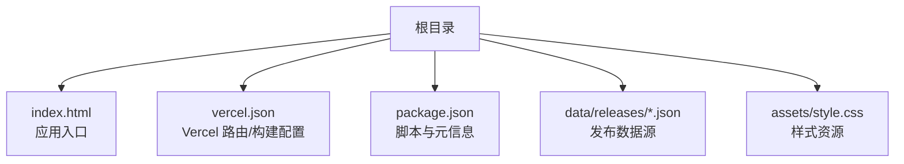
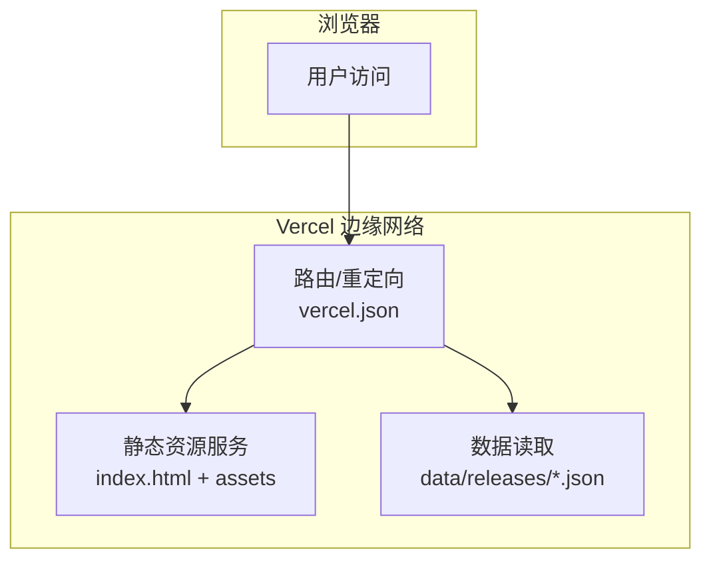

# 部署环境配置

<cite>
**本文引用的文件**   
- [vercel.json](file://vercel.json)
- [package.json](file://package.json)
- [index.html](file://index.html)
- [README.md](file://README.md)
</cite>

## 目录
1. [简介](#简介)
2. [项目结构](#项目结构)
3. [核心组件](#核心组件)
4. [架构总览](#架构总览)
5. [详细组件分析](#详细组件分析)
6. [依赖分析](#依赖分析)
7. [性能考虑](#性能考虑)
8. [故障排除指南](#故障排除指南)
9. [结论](#结论)
10. [附录](#附录)

## 简介
本文件面向 KReleaseWeb 项目的部署与运维，聚焦于在 Vercel 平台上的完整配置与最佳实践。内容涵盖：
- vercel.json 的路由、重定向与构建设置
- package.json 脚本命令的使用说明（开发、构建、部署）
- Vercel 环境变量、自定义域名与性能优化参数
- 本地开发环境搭建步骤（依赖安装、启动、热重载）
- 多环境配置管理（开发、测试、生产）与环境变量注入方法
- 部署故障排除（构建失败、运行时错误、性能问题诊断）

## 项目结构
仓库采用静态站点组织方式，根目录包含入口页面与关键配置文件；数据资源以 JSON 形式存放于 data/releases 目录中，便于按需加载或预渲染。

图表来源
- [index.html:1-200](file://index.html#L1-L200)
- [vercel.json:1-200](file://vercel.json#L1-L200)
- [package.json:1-200](file://package.json#L1-L200)

章节来源
- [README.md:1-200](file://README.md#L1-L200)

## 核心组件
- vercel.json：定义 Vercel 平台的路由规则、重定向策略以及构建输出与缓存行为。
- package.json：定义脚本命令（如开发服务器、构建、部署），并声明项目元信息与依赖。
- index.html：前端入口，通常用于挂载应用与引入资源。
- data/releases/*.json：作为数据源，供前端读取或构建期注入。

章节来源
- [vercel.json:1-200](file://vercel.json#L1-L200)
- [package.json:1-200](file://package.json#L1-L200)
- [index.html:1-200](file://index.html#L1-L200)

## 架构总览
KReleaseWeb 为静态站点，部署到 Vercel 后通过 CDN 分发。vercel.json 控制请求路由与重定向，确保 API 路径、旧链接兼容与 SPA 回退等场景正确工作。package.json 提供脚本命令，统一开发与构建流程。

图表来源
- [vercel.json:1-200](file://vercel.json#L1-L200)
- [index.html:1-200](file://index.html#L1-L200)

## 详细组件分析

### vercel.json 配置详解
- 路由与重定向
  - 支持基于路径的 301/302 重定向，可用于迁移旧链接、规范 URL 或引导至新版本页面。
  - 支持通配符与正则匹配，实现灵活的路由转发与重写。
  - 可针对特定响应头进行设置，例如缓存控制、跨域与安全头。
- 构建与输出
  - 指定构建命令与输出目录，使 Vercel 能正确识别产物并进行缓存。
  - 可配置构建缓存键，提升重复构建速度。
- 环境变量注入
  - 可在构建阶段注入环境变量，供构建脚本或前端代码使用。
- 性能优化
  - 启用 Gzip/Brotli 压缩与 HTTP 缓存策略，减少带宽与提升首屏速度。
  - 对静态资源设置长期缓存，配合版本号或哈希避免缓存污染。

章节来源
- [vercel.json:1-200](file://vercel.json#L1-L200)

### package.json 脚本命令
- 开发服务器
  - 提供本地开发命令，启动轻量 HTTP 服务并支持热重载，便于快速迭代。
- 构建命令
  - 执行构建流程，生成静态产物到指定目录，供 Vercel 部署。
- 部署脚本
  - 封装 Vercel CLI 调用，支持预览/生产环境的差异化部署。
- 依赖管理
  - 声明运行与开发依赖，确保构建与运行环境一致。

章节来源
- [package.json:1-200](file://package.json#L1-L200)

### 环境变量与多环境配置
- 环境变量来源
  - 构建期：通过 vercel.json 的构建环境变量或 Vercel 项目设置注入。
  - 运行期：通过 Vercel 环境变量面板配置，按环境（开发/测试/生产）隔离。
- 命名约定
  - 建议采用前缀区分用途，如 APP_、API_、CDN_ 等，避免冲突。
- 注入方式
  - 构建期：在构建脚本中读取并写入产物或常量文件。
  - 运行期：前端通过全局对象或配置模块获取，避免硬编码。
- 安全建议
  - 敏感信息仅放入 Vercel 环境变量，不提交至版本库。
  - 对公开配置使用白名单校验，防止泄露内部细节。

章节来源
- [vercel.json:1-200](file://vercel.json#L1-L200)
- [package.json:1-200](file://package.json#L1-L200)

### 自定义域名与 HTTPS
- 绑定域名
  - 在 Vercel 项目中添加自定义域名，平台自动签发并续期 HTTPS 证书。
- 重定向与规范
  - 通过 vercel.json 将 www 与非 www、HTTP 到 HTTPS 进行规范化跳转。
- 缓存与性能
  - 结合 CDN 缓存策略与资源指纹，提升全球访问性能。

章节来源
- [vercel.json:1-200](file://vercel.json#L1-L200)

### 本地开发环境搭建
- 前置条件
  - Node.js 与包管理器（npm/yarn/pnpm）。
- 安装依赖
  - 执行包管理器安装命令，拉取开发与运行依赖。
- 启动开发服务器
  - 使用 package.json 提供的开发脚本启动本地服务，默认监听端口可通过环境变量覆盖。
- 热重载
  - 修改源码后自动刷新浏览器，提高开发效率。
- 环境变量
  - 创建 .env 文件并在开发脚本中加载，避免与生产环境混淆。

章节来源
- [package.json:1-200](file://package.json#L1-L200)

### 构建与部署流程
- 本地构建
  - 执行构建脚本，产出静态资源到指定目录。
- 预览部署
  - 使用 Vercel CLI 或 GitHub Actions 触发预览分支部署，便于评审与联调。
- 生产部署
  - 合并主干后触发生产部署，自动完成构建、缓存与发布。
- 回滚策略
  - 借助 Vercel 的版本历史快速回滚到上一个稳定版本。

章节来源
- [package.json:1-200](file://package.json#L1-L200)
- [vercel.json:1-200](file://vercel.json#L1-L200)

## 依赖分析
- 外部依赖
  - 构建工具链（如打包器、压缩器）与可选的开发辅助工具。
- 运行时依赖
  - 若为纯静态站点，则无运行时依赖；若有服务端函数，需关注函数依赖与冷启动时间。
- 依赖锁定
  - 提交 lock 文件以确保构建一致性，避免“在我机器上正常”的问题。

章节来源
- [package.json:1-200](file://package.json#L1-L200)

## 性能考虑
- 资源体积
  - 启用压缩（Gzip/Brotli）、图片懒加载与按需加载，降低首屏负载。
- 缓存策略
  - 静态资源使用长期缓存与指纹文件名；HTML 使用短缓存或协商缓存。
- CDN 与边缘
  - 利用 Vercel 的全球边缘网络就近分发，减少延迟。
- 构建优化
  - 增量构建与缓存命中，缩短 CI/CD 时间。
- 监控与度量
  - 接入性能指标采集（如 LCP、FID、CLS），持续优化用户体验。

[本节为通用指导，无需列出具体文件来源]

## 故障排除指南
- 构建失败
  - 检查构建命令与输出目录是否与 vercel.json 一致。
  - 查看构建日志中的依赖解析错误与版本冲突。
  - 确认环境变量是否缺失或格式不正确。
- 运行时错误
  - 验证环境变量在目标环境已正确配置且未被误删。
  - 检查路由与重定向规则是否覆盖了必要路径。
  - 排查跨域与安全头配置是否满足业务需求。
- 性能问题
  - 分析资源大小与加载顺序，定位瓶颈资源。
  - 调整缓存策略与压缩选项，观察命中率与带宽变化。
  - 使用浏览器开发者工具与 Vercel 分析面板定位慢请求。

章节来源
- [vercel.json:1-200](file://vercel.json#L1-L200)
- [package.json:1-200](file://package.json#L1-L200)

## 结论
通过合理配置 vercel.json 与 package.json，并结合 Vercel 的环境变量与域名能力，KReleaseWeb 可实现高效、稳定的构建与部署。遵循本文的多环境管理与性能优化建议，可显著提升交付质量与用户体验。

[本节为总结性内容，无需列出具体文件来源]

## 附录
- 常用命令参考
  - 安装依赖：使用包管理器执行安装命令。
  - 启动开发：执行开发脚本，打开本地地址进行调试。
  - 构建产物：执行构建脚本，检查输出目录是否符合预期。
  - 部署预览：使用 Vercel CLI 或集成平台触发预览部署。
- 环境变量清单
  - 开发：本地 .env 文件，仅用于本地调试。
  - 测试：Vercel 项目中的 Preview 环境变量。
  - 生产：Vercel 项目中的 Production 环境变量。

[本节为补充信息，无需列出具体文件来源]