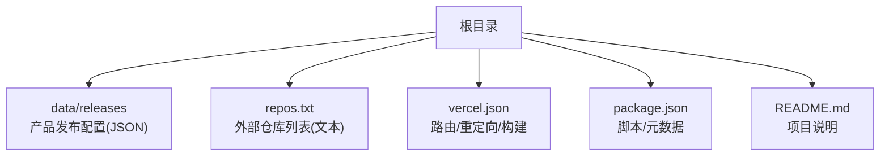
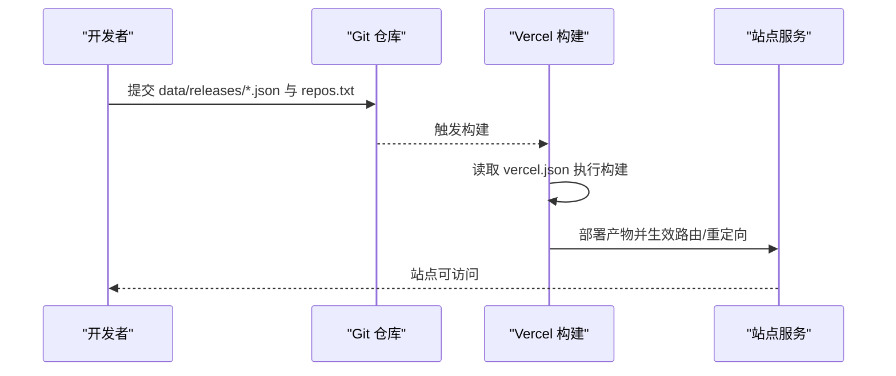
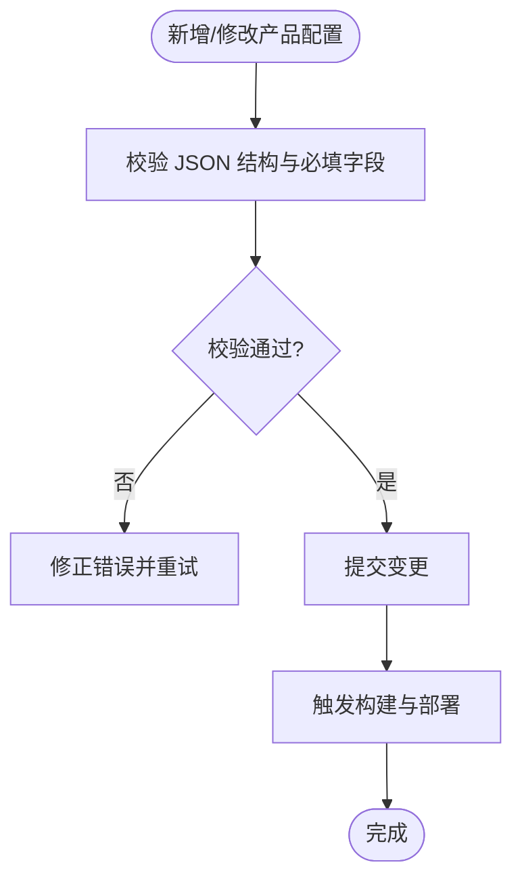
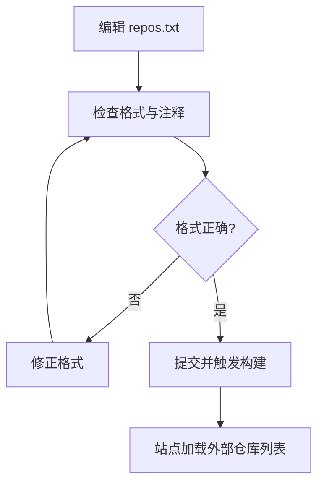
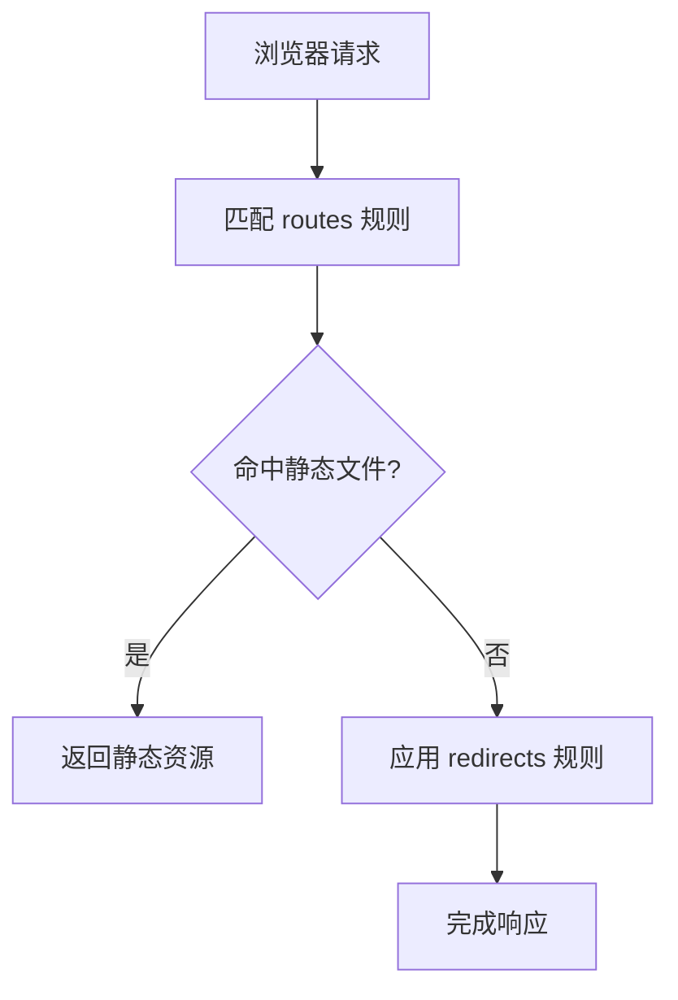
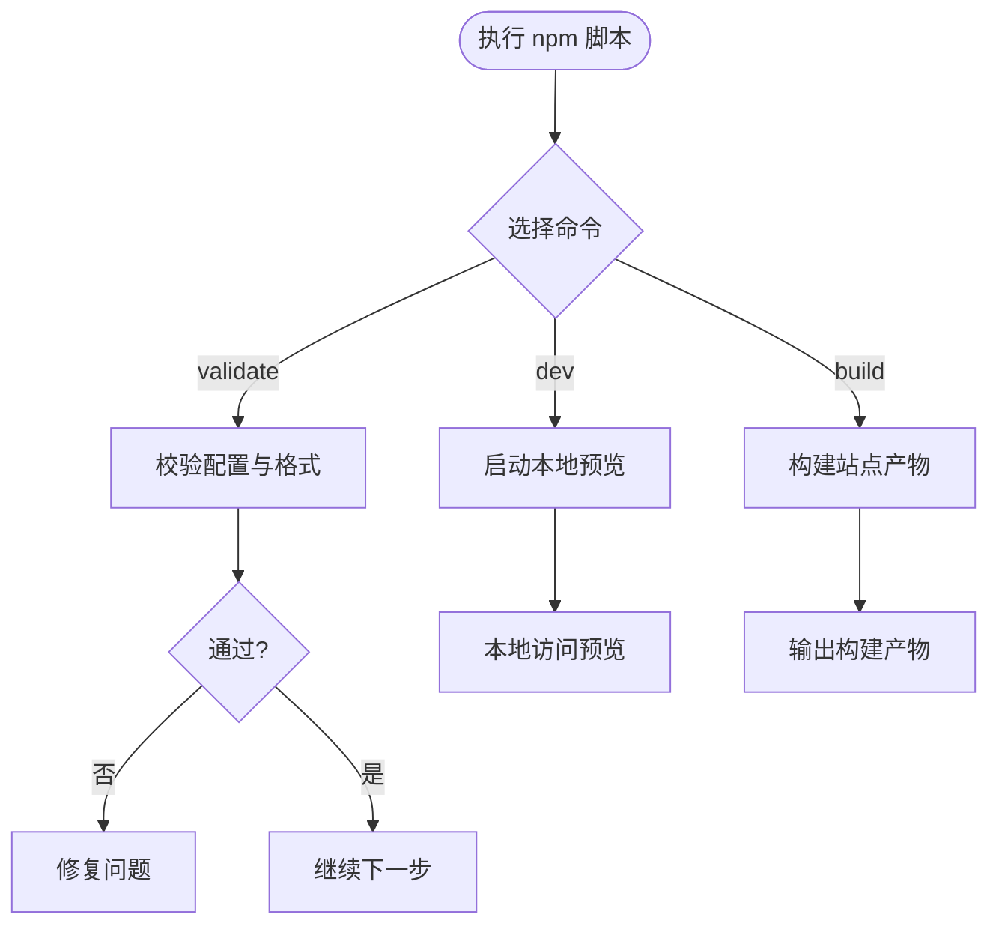
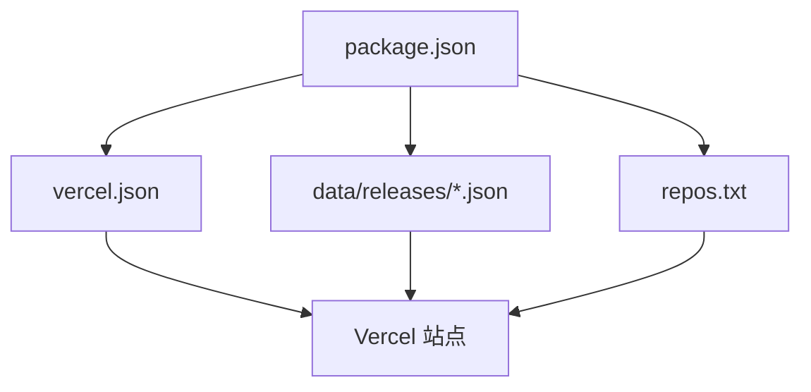

# 配置指南

<cite>
**本文引用的文件**   
- [README.md](file://README.md)
- [package.json](file://package.json)
- [vercel.json](file://vercel.json)
- [repos.txt](file://repos.txt)
- [data/releases/kcoder.json](file://data/releases/kcoder.json)
- [data/releases/kworks.json](file://data/releases/kworks.json)
- [data/releases/oclaw.json](file://data/releases/oclaw.json)
- [data/releases/qiongqi.json](file://data/releases/qiongqi.json)
</cite>

## 目录
1. [简介](#简介)
2. [项目结构](#项目结构)
3. [核心组件](#核心组件)
4. [架构总览](#架构总览)
5. [详细组件分析](#详细组件分析)
6. [依赖关系分析](#依赖关系分析)
7. [性能考虑](#性能考虑)
8. [故障排查指南](#故障排查指南)
9. [结论](#结论)
10. [附录](#附录)

## 简介
本指南面向 KReleaseWeb 项目的维护者与使用者，聚焦“产品配置管理”与“部署环境配置”。文档将系统说明：
- 如何在 data/releases/ 目录下为新产品添加 JSON 配置文件，以及字段定义与校验方法
- 如何管理与维护外部仓库列表 repos.txt
- 如何通过 vercel.json 配置路由、重定向与构建设置
- 如何使用 package.json 中的脚本命令与元数据
- 提供完整的新产品接入流程、现有配置修改与维护最佳实践

## 项目结构
KReleaseWeb 采用“配置即产品”的轻量组织方式。关键目录与文件职责如下：
- data/releases：存放各产品的发布清单与元信息（JSON）
- repos.txt：集中管理外部仓库来源（文本列表）
- vercel.json：Vercel 平台的路由、重定向与构建配置
- package.json：项目元数据与脚本命令
- README.md：项目说明与使用说明

**图表来源**
- [data/releases/kcoder.json](file://data/releases/kcoder.json)
- [data/releases/kworks.json](file://data/releases/kworks.json)
- [data/releases/oclaw.json](file://data/releases/oclaw.json)
- [data/releases/qiongqi.json](file://data/releases/qiongqi.json)
- [repos.txt](file://repos.txt)
- [vercel.json](file://vercel.json)
- [package.json](file://package.json)
- [README.md](file://README.md)

**章节来源**
- [README.md](file://README.md)
- [package.json](file://package.json)
- [vercel.json](file://vercel.json)
- [repos.txt](file://repos.txt)
- [data/releases/kcoder.json](file://data/releases/kcoder.json)
- [data/releases/kworks.json](file://data/releases/kworks.json)
- [data/releases/oclaw.json](file://data/releases/oclaw.json)
- [data/releases/qiongqi.json](file://data/releases/qiongqi.json)

## 核心组件
本节概述四大配置组件的职责与相互关系：
- 产品发布配置（data/releases/*.json）：描述单个产品的版本、渠道、平台、下载链接等
- 外部仓库列表（repos.txt）：声明外部仓库地址或标识，供聚合展示或拉取使用
- 部署配置（vercel.json）：控制前端静态站点在 Vercel 上的路由、重定向与构建行为
- 项目脚本与元数据（package.json）：提供本地开发、验证与打包脚本，以及项目基本信息

**章节来源**
- [data/releases/kcoder.json](file://data/releases/kcoder.json)
- [data/releases/kworks.json](file://data/releases/kworks.json)
- [data/releases/oclaw.json](file://data/releases/oclaw.json)
- [data/releases/qiongqi.json](file://data/releases/qiongqi.json)
- [repos.txt](file://repos.txt)
- [vercel.json](file://vercel.json)
- [package.json](file://package.json)

## 架构总览
从配置到部署的整体流程如下：
- 开发者在 data/releases/ 新增或更新产品 JSON
- 通过 repos.txt 维护外部仓库来源
- 使用 package.json 脚本进行本地校验与预览
- 提交代码后，Vercel 依据 vercel.json 完成构建与路由分发

**图表来源**
- [vercel.json](file://vercel.json)
- [package.json](file://package.json)
- [data/releases/kcoder.json](file://data/releases/kcoder.json)
- [repos.txt](file://repos.txt)

## 详细组件分析

### 产品发布配置（data/releases/*.json）
- 作用：每个产品一个 JSON 文件，集中描述该产品的发布信息（如版本、平台、渠道、下载地址、说明等）
- 建议字段（按常见需求归纳）：
  - 产品标识：用于唯一识别产品（如 product_id、name、version）
  - 渠道与平台：如 channel（stable/beta/dev）、platform（windows/mac/linux/android/ios/web）
  - 资源信息：download_url、checksum、size、release_notes
  - 可见性与排序：visible、sort_order、tags
  - 扩展字段：自定义键值对，便于后续功能扩展
- 命名规范：文件名应与产品标识一致，避免特殊字符与空格
- 校验建议：
  - 使用 JSON Schema 或简单脚本校验必填字段与类型
  - 在 CI 中增加 lint 步骤，失败则阻断部署
- 示例参考路径：
  - [data/releases/kcoder.json](file://data/releases/kcoder.json)
  - [data/releases/kworks.json](file://data/releases/kworks.json)
  - [data/releases/oclaw.json](file://data/releases/oclaw.json)
  - [data/releases/qiongqi.json](file://data/releases/qiongqi.json)

**图表来源**
- [data/releases/kcoder.json](file://data/releases/kcoder.json)
- [data/releases/kworks.json](file://data/releases/kworks.json)
- [data/releases/oclaw.json](file://data/releases/oclaw.json)
- [data/releases/qiongqi.json](file://data/releases/qiongqi.json)

**章节来源**
- [data/releases/kcoder.json](file://data/releases/kcoder.json)
- [data/releases/kworks.json](file://data/releases/kworks.json)
- [data/releases/oclaw.json](file://data/releases/oclaw.json)
- [data/releases/qiongqi.json](file://data/releases/qiongqi.json)

### 外部仓库列表（repos.txt）
- 作用：集中管理外部仓库的定义，供站点聚合展示或自动化拉取
- 格式建议：
  - 每行一条记录，支持注释（以 # 开头）
  - 字段分隔符建议使用制表符或逗号，保持统一
  - 推荐字段：仓库名称、仓库地址、标签/分类、是否启用
- 管理方式：
  - 新增/删除仓库时同步更新此文件
  - 定期清理无效或废弃仓库
  - 在 CI 中校验行数与格式，防止脏数据进入主分支

**图表来源**
- [repos.txt](file://repos.txt)

**章节来源**
- [repos.txt](file://repos.txt)

### 部署环境配置（vercel.json）
- 作用：定义 Vercel 构建与运行时的路由、重定向与构建参数
- 常见配置项：
  - routes：定义 URL 到文件或查询参数的映射
  - redirects：实现 301/302 重定向规则
  - headers：设置响应头（如缓存策略、CORS）
  - build：指定构建命令与环境变量
- 注意事项：
  - 路由顺序优先匹配先出现的规则
  - 重定向需避免循环
  - 静态资源应开启合理缓存

**图表来源**
- [vercel.json](file://vercel.json)

**章节来源**
- [vercel.json](file://vercel.json)

### 项目脚本与元数据（package.json）
- 作用：
  - 脚本命令：本地校验、格式化、预览、打包等
  - 元数据：项目名称、版本、作者、许可证、仓库地址等
- 常用脚本建议：
  - validate：校验 data/releases/*.json 与 repos.txt
  - dev：启动本地预览服务
  - build：生成站点产物
  - lint：代码与配置风格检查
- 元数据建议：
  - name、version、description、author、license、repository
  - scripts 中明确入口与依赖

**图表来源**
- [package.json](file://package.json)

**章节来源**
- [package.json](file://package.json)

## 依赖关系分析
- 低耦合：各配置相对独立，便于单独维护
- 关键依赖：
  - 站点构建依赖 vercel.json 的路由与重定向
  - 产品页面渲染依赖 data/releases/*.json 的数据完整性
  - 外部仓库展示依赖 repos.txt 的格式与可用性
  - 本地开发与 CI 依赖 package.json 的脚本一致性

**图表来源**
- [package.json](file://package.json)
- [vercel.json](file://vercel.json)
- [data/releases/kcoder.json](file://data/releases/kcoder.json)
- [data/releases/kworks.json](file://data/releases/kworks.json)
- [data/releases/oclaw.json](file://data/releases/oclaw.json)
- [data/releases/qiongqi.json](file://data/releases/qiongqi.json)
- [repos.txt](file://repos.txt)

**章节来源**
- [package.json](file://package.json)
- [vercel.json](file://vercel.json)
- [data/releases/kcoder.json](file://data/releases/kcoder.json)
- [data/releases/kworks.json](file://data/releases/kworks.json)
- [data/releases/oclaw.json](file://data/releases/oclaw.json)
- [data/releases/qiongqi.json](file://data/releases/qiongqi.json)
- [repos.txt](file://repos.txt)

## 性能考虑
- 配置体积：data/releases/*.json 应保持精简，避免冗余字段
- 网络请求：外部仓库列表尽量分页或按需加载
- 缓存策略：静态资源与 API 响应设置合适的缓存头
- 构建优化：仅构建必要产物，减少不必要的依赖

[本节为通用指导，不直接分析具体文件]

## 故障排查指南
- JSON 配置错误
  - 现象：站点无法加载产品数据或构建失败
  - 排查：使用 JSON 校验工具检查语法；确认必填字段存在且类型正确
  - 参考路径：[data/releases/kcoder.json](file://data/releases/kcoder.json)、[data/releases/kworks.json](file://data/releases/kworks.json)、[data/releases/oclaw.json](file://data/releases/oclaw.json)、[data/releases/qiongqi.json](file://data/releases/qiongqi.json)
- 外部仓库列表异常
  - 现象：外部仓库未显示或显示错误
  - 排查：检查 repos.txt 格式与注释；确保地址可达
  - 参考路径：[repos.txt](file://repos.txt)
- 路由与重定向问题
  - 现象：URL 无法访问或跳转异常
  - 排查：核对 vercel.json 的 routes 与 redirects 顺序与条件；避免循环重定向
  - 参考路径：[vercel.json](file://vercel.json)
- 脚本命令失效
  - 现象：本地校验或构建失败
  - 排查：检查 package.json 的 scripts 与依赖；确认 Node 版本兼容
  - 参考路径：[package.json](file://package.json)

**章节来源**
- [data/releases/kcoder.json](file://data/releases/kcoder.json)
- [data/releases/kworks.json](file://data/releases/kworks.json)
- [data/releases/oclaw.json](file://data/releases/oclaw.json)
- [data/releases/qiongqi.json](file://data/releases/qiongqi.json)
- [repos.txt](file://repos.txt)
- [vercel.json](file://vercel.json)
- [package.json](file://package.json)

## 结论
通过统一的配置体系与清晰的维护流程，KReleaseWeb 能够高效地支撑多产品发布与外部仓库聚合。建议在团队内建立配置规范与校验机制，确保变更可控、质量稳定。

[本节为总结性内容，不直接分析具体文件]

## 附录

### 新产品接入完整流程
- 准备阶段
  - 确定产品标识与版本策略
  - 规划渠道与平台矩阵
- 创建配置
  - 在 data/releases/ 下新增产品 JSON 文件
  - 在 repos.txt 中添加外部仓库条目（如需）
- 本地校验
  - 使用 package.json 提供的脚本进行校验与预览
- 提交与部署
  - 提交变更至仓库，触发 Vercel 构建
  - 验证站点路由与重定向是否符合预期
- 上线后维护
  - 持续更新版本与下载链接
  - 定期清理无效仓库与过时配置

**章节来源**
- [data/releases/kcoder.json](file://data/releases/kcoder.json)
- [data/releases/kworks.json](file://data/releases/kworks.json)
- [data/releases/oclaw.json](file://data/releases/oclaw.json)
- [data/releases/qiongqi.json](file://data/releases/qiongqi.json)
- [repos.txt](file://repos.txt)
- [vercel.json](file://vercel.json)
- [package.json](file://package.json)

### 现有配置修改与维护指南
- 修改产品配置
  - 定位对应 JSON 文件，遵循字段规范更新
  - 使用脚本校验后再提交
- 调整外部仓库
  - 在 repos.txt 中增删改条目，保持格式一致
- 更新部署规则
  - 在 vercel.json 中调整路由与重定向，注意顺序与冲突
- 维护脚本与元数据
  - 在 package.json 中更新脚本与项目信息，保证本地与 CI 一致

**章节来源**
- [data/releases/kcoder.json](file://data/releases/kcoder.json)
- [data/releases/kworks.json](file://data/releases/kworks.json)
- [data/releases/oclaw.json](file://data/releases/oclaw.json)
- [data/releases/qiongqi.json](file://data/releases/qiongqi.json)
- [repos.txt](file://repos.txt)
- [vercel.json](file://vercel.json)
- [package.json](file://package.json)