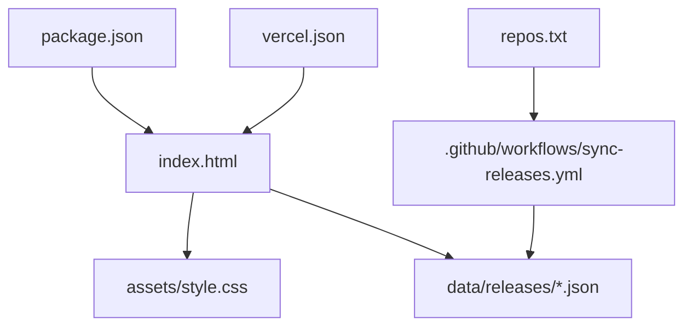
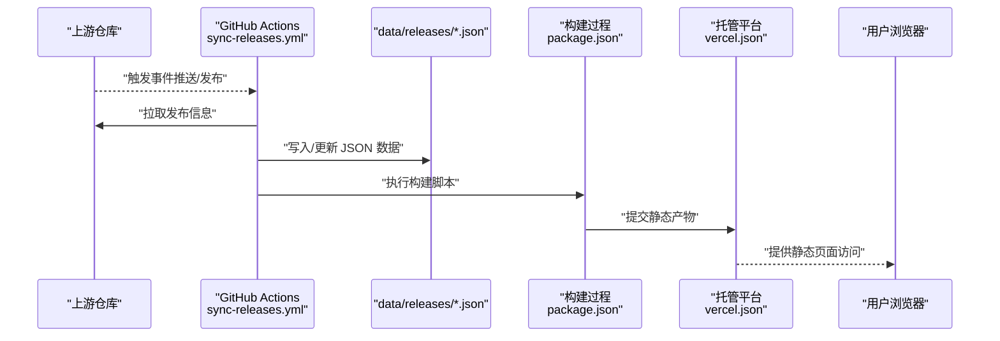
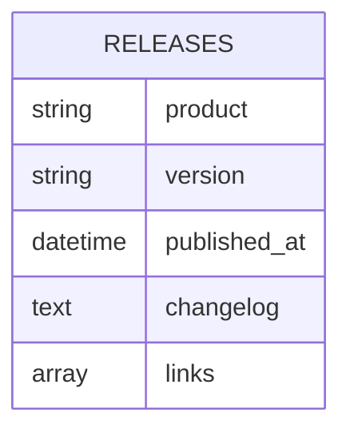
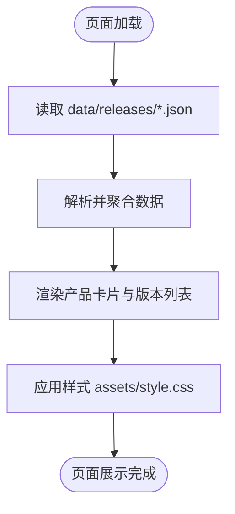
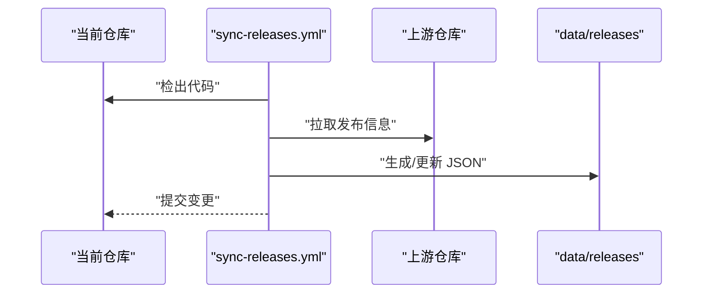
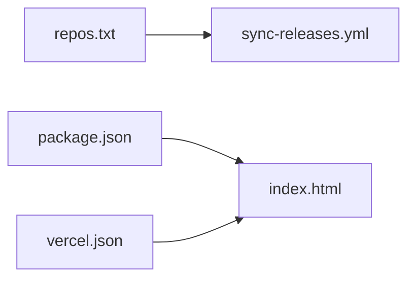
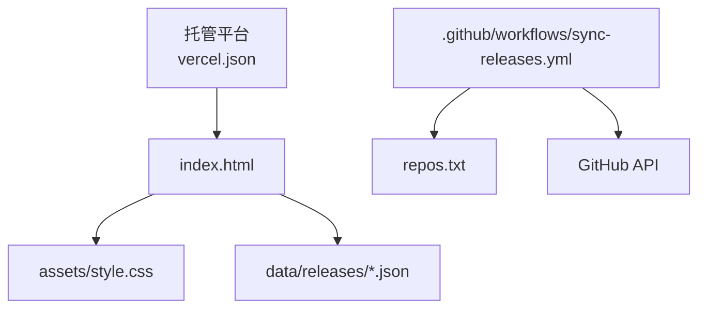

# 项目概述

<cite>
**本文引用的文件**   
- [README.md](file://README.md)
- [index.html](file://index.html)
- [package.json](file://package.json)
- [repos.txt](file://repos.txt)
- [.github/workflows/sync-releases.yml](file://.github/workflows/sync-releases.yml)
- [vercel.json](file://vercel.json)
- [assets/style.css](file://assets/style.css)
- [data/releases/kcoder.json](file://data/releases/kcoder.json)
- [data/releases/kworks.json](file://data/releases/kworks.json)
- [data/releases/oclaw.json](file://data/releases/oclaw.json)
- [data/releases/qiongqi.json](file://data/releases/qiongqi.json)
</cite>

## 目录
1. [简介](#简介)
2. [项目结构](#项目结构)
3. [核心组件](#核心组件)
4. [架构总览](#架构总览)
5. [详细组件分析](#详细组件分析)
6. [依赖分析](#依赖分析)
7. [性能考虑](#性能考虑)
8. [故障排查指南](#故障排查指南)
9. [结论](#结论)
10. [附录：快速开始](#附录快速开始)

## 简介
KReleaseWeb 是一个用于管理和展示多个软件产品版本发布信息的静态网站平台。其核心价值主张在于：
- 多产品版本管理：集中维护多个产品的发布数据，统一对外展示。
- 自动化同步机制：通过 GitHub Actions 定期或触发式拉取上游仓库的发布信息，保持站点数据与上游一致。
- 简洁的界面展示：以轻量、易用的前端页面呈现各产品的版本信息，便于用户快速查阅。

技术架构选择静态站点的原因与优势：
- 部署简单：无需后端服务，可直接托管到静态站点托管平台（如 Vercel）。
- 高可用与低成本：静态资源易于缓存、CDN 友好，具备更好的可扩展性与稳定性。
- 安全与可审计：减少运行时攻击面，变更可通过代码与 CI 流程进行审查。

整体工作流程概览：
- 上游仓库检测到新版本发布后，GitHub Actions 被触发。
- 工作流从上游仓库拉取发布信息并写入本项目的 data 目录。
- 构建阶段将 data 中的 JSON 渲染为 index.html 等静态页面。
- 最终由托管平台提供访问入口，用户通过浏览器查看最新版本信息。

## 项目结构
本项目采用“数据驱动 + 静态渲染”的组织方式：
- 数据层：data/releases 下按产品维度存放 JSON 数据，作为单一事实来源。
- 表现层：index.html 与 assets/style.css 负责页面结构与样式。
- 配置与编排：package.json 定义脚本与依赖；.github/workflows/sync-releases.yml 定义自动化同步流程；vercel.json 指定托管平台行为。
- 仓库清单：repos.txt 用于声明需要同步的上游仓库列表。

图表来源
- [index.html:1-200](file://index.html#L1-L200)
- [assets/style.css:1-200](file://assets/style.css#L1-L200)
- [.github/workflows/sync-releases.yml:1-200](file://.github/workflows/sync-releases.yml#L1-L200)
- [repos.txt:1-200](file://repos.txt#L1-L200)
- [package.json:1-200](file://package.json#L1-L200)
- [vercel.json:1-200](file://vercel.json#L1-L200)

章节来源
- [README.md:1-200](file://README.md#L1-L200)
- [index.html:1-200](file://index.html#L1-L200)
- [assets/style.css:1-200](file://assets/style.css#L1-L200)
- [package.json:1-200](file://package.json#L1-L200)
- [repos.txt:1-200](file://repos.txt#L1-L200)
- [.github/workflows/sync-releases.yml:1-200](file://.github/workflows/sync-releases.yml#L1-L200)
- [vercel.json:1-200](file://vercel.json#L1-L200)

## 核心组件
- 数据模型（releases）：每个产品对应一个 JSON 文件，包含版本号、发布时间、更新说明等字段，作为渲染页面的唯一数据源。
- 页面渲染器（index.html）：读取 data/releases 下的 JSON 数据，动态生成产品卡片与版本列表。
- 样式模块（assets/style.css）：提供统一的视觉风格与响应式布局。
- 自动化流水线（sync-releases.yml）：监听上游仓库事件，拉取并发布最新发布信息至 data 目录。
- 仓库清单（repos.txt）：集中管理需要同步的上游仓库地址与命名空间。
- 构建与托管配置（package.json、vercel.json）：定义构建脚本与托管平台路由、环境变量等。

章节来源
- [data/releases/kcoder.json:1-200](file://data/releases/kcoder.json#L1-L200)
- [data/releases/kworks.json:1-200](file://data/releases/kworks.json#L1-L200)
- [data/releases/oclaw.json:1-200](file://data/releases/oclaw.json#L1-L200)
- [data/releases/qiongqi.json:1-200](file://data/releases/qiongqi.json#L1-L200)
- [index.html:1-200](file://index.html#L1-L200)
- [assets/style.css:1-200](file://assets/style.css#L1-L200)
- [.github/workflows/sync-releases.yml:1-200](file://.github/workflows/sync-releases.yml#L1-L200)
- [repos.txt:1-200](file://repos.txt#L1-L200)
- [package.json:1-200](file://package.json#L1-L200)
- [vercel.json:1-200](file://vercel.json#L1-L200)

## 架构总览
下图展示了从上游仓库检测到数据更新，再到静态站点展示的端到端流程。

图表来源
- [.github/workflows/sync-releases.yml:1-200](file://.github/workflows/sync-releases.yml#L1-L200)
- [package.json:1-200](file://package.json#L1-L200)
- [vercel.json:1-200](file://vercel.json#L1-L200)

## 详细组件分析

### 数据模型与存储（data/releases）
- 设计要点：
  - 每个产品一个 JSON 文件，便于独立维护与增量更新。
  - 字段建议包含：产品名称、版本号、发布日期、更新日志、下载链接等。
- 复杂度与扩展性：
  - 新增产品只需在 repos.txt 中登记并在 data/releases 下创建对应 JSON。
  - 数据结构稳定后可通过类型校验提升健壮性。

图表来源
- [data/releases/kcoder.json:1-200](file://data/releases/kcoder.json#L1-L200)
- [data/releases/kworks.json:1-200](file://data/releases/kworks.json#L1-L200)
- [data/releases/oclaw.json:1-200](file://data/releases/oclaw.json#L1-L200)
- [data/releases/qiongqi.json:1-200](file://data/releases/qiongqi.json#L1-L200)

章节来源
- [data/releases/kcoder.json:1-200](file://data/releases/kcoder.json#L1-L200)
- [data/releases/kworks.json:1-200](file://data/releases/kworks.json#L1-L200)
- [data/releases/oclaw.json:1-200](file://data/releases/oclaw.json#L1-L200)
- [data/releases/qiongqi.json:1-200](file://data/releases/qiongqi.json#L1-L200)

### 页面渲染与样式（index.html 与 assets/style.css）
- 渲染逻辑：
  - 页面加载时读取 data/releases 下的 JSON 数据。
  - 根据数据生成产品卡片与版本列表，支持排序与筛选。
- 样式策略：
  - 使用独立的 CSS 文件，保证结构与样式解耦。
  - 提供基础响应式布局，适配不同屏幕尺寸。

图表来源
- [index.html:1-200](file://index.html#L1-L200)
- [assets/style.css:1-200](file://assets/style.css#L1-L200)

章节来源
- [index.html:1-200](file://index.html#L1-L200)
- [assets/style.css:1-200](file://assets/style.css#L1-L200)

### 自动化同步流水线（.github/workflows/sync-releases.yml）
- 触发条件：
  - 基于上游仓库的事件（如推送或发布标签）触发。
- 主要步骤：
  - 检出当前仓库与上游仓库。
  - 拉取发布信息并转换为 data/releases 下的 JSON。
  - 提交更新并触发后续构建。

图表来源
- [.github/workflows/sync-releases.yml:1-200](file://.github/workflows/sync-releases.yml#L1-L200)

章节来源
- [.github/workflows/sync-releases.yml:1-200](file://.github/workflows/sync-releases.yml#L1-L200)

### 仓库清单与配置（repos.txt、package.json、vercel.json）
- repos.txt：
  - 集中管理需要同步的上游仓库地址与命名空间，便于批量处理。
- package.json：
  - 定义构建脚本与依赖，确保本地与 CI 环境一致性。
- vercel.json：
  - 配置托管平台的路由、重定向与环境变量，保障部署正确性。

图表来源
- [repos.txt:1-200](file://repos.txt#L1-L200)
- [package.json:1-200](file://package.json#L1-L200)
- [vercel.json:1-200](file://vercel.json#L1-L200)

章节来源
- [repos.txt:1-200](file://repos.txt#L1-L200)
- [package.json:1-200](file://package.json#L1-L200)
- [vercel.json:1-200](file://vercel.json#L1-L200)

## 依赖分析
- 内部依赖：
  - index.html 依赖 assets/style.css 与 data/releases/*.json。
  - sync-releases.yml 依赖 repos.txt 提供的仓库清单。
- 外部依赖：
  - GitHub API 用于拉取上游发布信息。
  - 托管平台（Vercel）用于构建与分发静态资源。

图表来源
- [index.html:1-200](file://index.html#L1-L200)
- [assets/style.css:1-200](file://assets/style.css#L1-L200)
- [.github/workflows/sync-releases.yml:1-200](file://.github/workflows/sync-releases.yml#L1-L200)
- [repos.txt:1-200](file://repos.txt#L1-L200)
- [vercel.json:1-200](file://vercel.json#L1-L200)

章节来源
- [index.html:1-200](file://index.html#L1-L200)
- [assets/style.css:1-200](file://assets/style.css#L1-L200)
- [.github/workflows/sync-releases.yml:1-200](file://.github/workflows/sync-releases.yml#L1-L200)
- [repos.txt:1-200](file://repos.txt#L1-L200)
- [vercel.json:1-200](file://vercel.json#L1-L200)

## 性能考虑
- 静态资源缓存：利用托管平台的 CDN 能力，对 HTML/CSS/JSON 设置合理缓存策略。
- 数据体积控制：仅保留必要的发布信息字段，避免冗余数据影响加载速度。
- 渲染优化：按需加载与懒渲染，减少首屏渲染压力。
- 构建缓存：复用依赖与中间产物，缩短构建时间。

[本节为通用指导，不直接分析具体文件]

## 故障排查指南
- 同步失败：
  - 检查 .github/workflows/sync-releases.yml 的权限与令牌配置。
  - 确认 repos.txt 中的仓库地址与命名空间是否正确。
- 数据未更新：
  - 验证上游仓库是否触发了预期事件。
  - 检查 data/releases 下对应 JSON 文件的写入权限与路径。
- 页面显示异常：
  - 核对 index.html 的数据读取逻辑与 JSON 字段结构是否匹配。
  - 检查 assets/style.css 是否存在语法错误或资源路径问题。
- 部署失败：
  - 查看 vercel.json 的配置项是否符合托管平台要求。
  - 检查 package.json 的构建脚本是否能正常执行。

章节来源
- [.github/workflows/sync-releases.yml:1-200](file://.github/workflows/sync-releases.yml#L1-L200)
- [repos.txt:1-200](file://repos.txt#L1-L200)
- [index.html:1-200](file://index.html#L1-L200)
- [assets/style.css:1-200](file://assets/style.css#L1-L200)
- [vercel.json:1-200](file://vercel.json#L1-L200)
- [package.json:1-200](file://package.json#L1-L200)

## 结论
KReleaseWeb 通过“数据驱动 + 静态渲染 + 自动化同步”的方式，实现了多产品版本信息的集中管理与高效展示。该方案具备部署简单、成本低廉、安全性高等优点，适合团队或个人用于发布信息的统一门户。

[本节为总结性内容，不直接分析具体文件]

## 附录：快速开始
- 前置准备：
  - 安装 Node.js 与 Git。
  - 拥有 GitHub 账号与托管平台（如 Vercel）账号。
- 克隆与初始化：
  - 克隆本仓库到本地。
  - 在 repos.txt 中添加需要同步的上游仓库清单。
- 本地运行：
  - 安装依赖并执行构建脚本（参考 package.json）。
  - 打开 index.html 预览效果。
- 配置自动化：
  - 启用 .github/workflows/sync-releases.yml。
  - 根据需要配置环境变量与令牌。
- 部署上线：
  - 将仓库连接到托管平台（参考 vercel.json）。
  - 触发首次构建并验证页面展示。

章节来源
- [package.json:1-200](file://package.json#L1-L200)
- [repos.txt:1-200](file://repos.txt#L1-L200)
- [.github/workflows/sync-releases.yml:1-200](file://.github/workflows/sync-releases.yml#L1-L200)
- [vercel.json:1-200](file://vercel.json#L1-L200)
- [index.html:1-200](file://index.html#L1-L200)